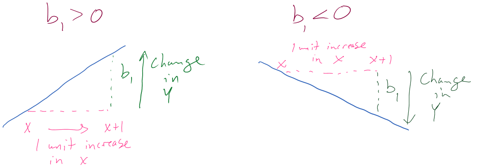
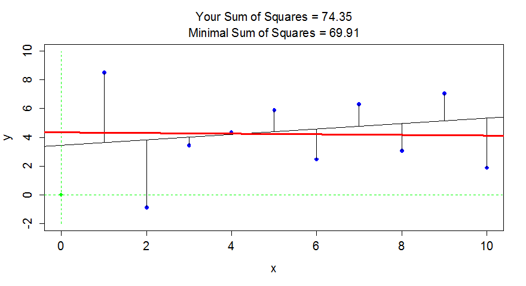

---
output:
  pdf_document: 
    keep_tex: yes
  html_document: default
header-includes:
- \usepackage{amsmath}
- \usepackage{color}
- \usepackage{cancel}
---

# Correlation and Simple Linear Regression {#chapter6}

```{r echo=F,warning=F,message=F}
set.seed(5678)
library(pander)
require(readr)
require(curl)
require(mosaic)
library(knitr)
knitr::opts_chunk$set(cache = F,fig.height=3.5,fig.width=6,fig.pos='ht',
                      message=F,warning=F)
options(show.signif.stars = FALSE)
```


```{r echo=F}
#Color Format
colFmt = function(x, color){
  outputFormat = opts_knit$get("rmarkdown.pandoc.to")
  if(outputFormat == 'latex')
    paste("\\textcolor{",color,"}{",x,"}",sep="")
  else if(outputFormat == 'html')
    paste("<font color='",color,"'>",x,"</font>",sep="")
  else
    x
}
```

## Relationships between two quantitative variables	{#section6-1}

The independence test in Chapter \@ref(chapter5) provided a technique for assessing evidence of a
relationship between two categorical variables. The terms ***relationship*** and ***association***
are synonyms that, in statistics, imply that particular values on one variable tend to occur more often with
some other values of the other variable or that knowing
something about the level of one variable provides information about the
patterns of values on the other variable. These terms are not specific to the
"form" of the relationship -- any pattern (strong or weak, negative or positive, 
easily explained or complicated) satisfy the definition. There are two other
aspects to using these terms in a statistical context. First, they are not
directional -- an association between $x$ and $y$ is the same as saying there is an
association between $y$ and $x$. Second, they are not causal unless the levels of
one of the variables are randomly assigned in an experimental context. We add
to this terminology the idea of correlation between variables $x$ and $y$. 
***Correlation***, in most statistical contexts, is a measure of the specific type 
of relationship between the variables: the **linear relationship between two 
quantitative variables**^[There are measures 
of correlation between categorical variables but when
statisticians say correlation they mean correlation of quantitative variables. 
If they are discussing correlations of other types, they will make that clear.]. 
So as we start to review these ideas from your previous statistics course, 
remember that associations and relationships are more general than correlations
and it is possible to have no correlation where there is a strong relationship
between variables. "Correlation" is used colloquially as a synonym for
relationship but we will work to reserve it for its more specialized usage here
to refer to the linear relationship.

\indent Assessing and then modeling relationships between quantitative variables drives
the rest of the chapters, 
so we should get started with some motivating examples to start to think about
what relationships between quantitative variables "look like"... To motivate
these methods, we will start with a study of the effects of beer consumption on
blood alcohol levels (*BAC*, in grams of alcohol per deciliter of blood). A group 
of $n=16$ student volunteers at The Ohio State University drank a
randomly assigned number of beers^[Some of the details of this study have been lost, 
so we will assume that the
subjects were randomly assigned and that a beer means a can of beer and that
the beer was of regular strength. We don't know if any of that is actually true. 
I have been asking the Dean of Students to repeat this study as an educational
activity at MSU with no success yet.]. 
Thirty minutes later, a police officer measured their *BAC*. Your instincts, especially
as well-educated college students with some chemistry knowledge, should inform
you about the direction of this relationship -- that there is a ***positive 
relationship*** between ``Beers`` and ``BAC``. In other words,  **higher values of
one variable are associated with higher values of the other**. Similarly, 
lower values of one are associated with lower values of the other. 
In fact there are online calculators that tell you how much your *BAC* increases
for each extra beer consumed (for example:
http://www.craftbeer.com/beer-studies/blood-alcohol-content-calculator
if you plug in 1 beer). The increase
in $y$ (``BAC``) for a 1 unit increase in $x$ (here, 1 more beer) is an example of a 
***slope coefficient*** that is applicable if the relationship between the 
variables is linear and something that will be
fundamental in what is called a ***simple linear regression model***. In a
simple linear regression model (simple means that there is only one explanatory
variable) the slope is the expected change in the mean response for a one unit
increase in the explanatory variable. You could also use the *BAC* calculator and
the models that we are going to develop to pick a total number of beers you
will consume and get a predicted *BAC*, which employs the entire equation we will estimate.

\indent Before we get to the specifics of this model and how we measure correlation, we 
should graphically explore the relationship between ``Beers`` and ``BAC`` in a scatterplot. 
Figure \@ref(fig:Figure6-1) shows a ***scatterplot*** of the results that display 
the expected positive relationship. Scatterplots display the response pairs for 
the two quantitative variables with the
explanatory variable on the x-axis and the response variable on the y-axis. The
relationship between ``Beers`` and ``BAC`` appears to be relatively linear but
there is possibly more variability than one might expect. For example, for
students consuming 5 beers, their *BAC*s range from 0.05 to 0.10. If you look
at the online *BAC* calculators, you will see that other factors such as weight,
sex, and beer percent alcohol can impact
the results. We might also be interested in previous alcohol consumption. In
Chapter \@ref(chapter8), we will learn how to estimate the relationship between 
``Beers`` and ``BAC`` after correcting or controlling for those "other variables" using 
***multiple linear regression***, where we incorporate more than one
quantitative explanatory variable into the linear model (somewhat like in the
2-Way ANOVA). Some of this variability might be hard or impossible to explain
regardless of the other variables available and is considered unexplained variation
and goes into the residual errors in our models, just like in the ANOVA models. 
To make scatterplots as in Figure \@ref(fig:Figure6-1), you can simply^[I added 
``pch=16, col=30`` to fill in the default circles and make the points in something 
other than black, an entirely unnecessary addition here.] use 
``plot(y~x, data=...)``.

```{r echo=F}
set.seed(5678)
```

(ref:fig6-1) Scatterplot of *Beers* consumed versus *BAC*.

```{r Figure6-1,fig.cap="(ref:fig6-1)",warning=F,message=F}
require(readr)
BB <- read_csv("http://www.math.montana.edu/courses/s217/documents/beersbac.csv")
plot(BAC~Beers, data=BB, pch=16, col=30)
```

\newpage

There are a few general things to look for in scatterplots:

1. **Assess the** $\underline{\textbf{direction of the relationship}}$ -- is it 
positive or negative? 

2. **Consider the** $\underline{\textbf{strength of the relationship}}$. 
The general idea of assessing strength visually is about how hard or easy it is 
to see the pattern. If it is hard to see a pattern, then it is weak. If it is easy to
see, then it is strong. 

3. **Consider the** $\underline{\textbf{linearity of the relationship}}$. Does it 
appear to curve or does it follow a relatively straight line? Curving relationships are
called ***curvilinear*** or ***nonlinear*** and can be strong or
weak just like linear relationships -- it is all about how tightly the
points follow the pattern you identify. 

4. **Check for** $\underline{\textbf{unusual observations -- outliers}}$ -- by looking 
for points that don't follow the overall pattern. Being large in $x$ or $y$
doesn't mean that the point is an outlier. Being unusual relative to the overall
pattern makes a point an outlier in this setting.

5. **Check for** $\underline{\textbf{changing variability}}$ in one variable based 
on values of the other variable. This will tie into a constant variance assumption 
later in the regression models.

6. **Finally, look for** $\underline{\textbf{distinct groups}}$ in the scatterplot.
This might suggest that observations from two populations, say males and females, 
were combined but the relationship between the two quantitative variables
might be different for the two groups.
 
\indent Going back to Figure \@ref(fig:Figure6-1) it appears that there is a 
moderately strong linear
relationship between ``Beers`` and ``BAC`` -- not weak but with some variability
around what appears to be a fairly clear to see straight-line relationship. There might even be a
hint of a nonlinear relationship in the higher beer values. There are no clear
outliers because the observation at 9 beers seems to be following the overall
pattern fairly closely. There is little evidence of non-constant variance
mainly because of the limited size of the data set -- we'll check this with
better plots later. And there are no clearly distinct groups in this plot, possibly
because the # of beers was randomly assigned. These data have one more
interesting feature to be noted -- that subjects managed to consume 8 or 9
beers. This seems to be a large number. I have never been able to trace this
data set to the original study so it is hard to know if (1) they had this study
approved by a human subjects research review board to make sure it was "safe", 
(2) every subject in the study was able to consume their randomly assigned
amount, and (3) whether subjects were asked to show up to the study with *BAC*s
of 0. We also don't know the exact alcohol concentration of the beer consumed or
volume. So while this is a fun example to start these methods with, a better version of this data set would be nice...

\indent In making scatterplots, there is always a choice of a variable for the 
x-axis and the y-axis. It is our
convention to put explanatory or independent variables (the ones used to
explain or predict the responses) on the x-axis. In studies where the subjects are
randomly assigned to levels of a variable, this is very clearly an explanatory
variable, and we can go as far as making causal inferences with it. In
observational studies, it can be less clear which variable explains which. In
these cases, make the most reasonable choice based on the observed variables but
remember that, when the direction of relationship is unclear, you could have
switched the axes and thus the implication of which variable is explanatory.
   
## Estimating the correlation coefficient	{#section6-2}


In terms of quantifying relationships between variables, we start with 
the correlation coefficient, a
measure that is the same regardless of your choice of variables as
explanatory or response. We measure the strength and direction of
linear relationships between two quantitative variables using 
***Pearson's r*** or ***Pearson's Product Moment Correlation Coefficient***.
For those who really like acronyms, Wikipedia even suggests calling it 
the PPMCC. However, 
its use is so ubiquitous that the lower case ***r*** or just "correlation
coefficient" are often sufficient to identify that you have used the PPMCC. 
Some of the extra distinctions arise because there are other ways of measuring
correlations in other situations (for example between two categorical
variables), but we will not consider them here. 

\newpage

\indent The correlation coefficient, ***r***, is calculated as

$$r=\frac{1}{n-1}\sum^n_{i=1}\left(\frac{x_i-\bar{x}}{s_x}\right)
\left(\frac{y_i-\bar{y}}{s_y}\right),$$ 

where $s_x$ and $s_y$ are the standard deviations of $x$ and $y$. This 
formula can also be written as

$$r=\frac{1}{n-1}\sum^n_{i=1}z_{x_i}z_{y_i}$$

where $z_{x_i}$ is the z-score (observation minus mean divided by 
standard deviation) for the $i^{th}$ observation on $x$ and $z_{y_i}$
is the z-score for the $i^{th}$ observation on $y$. We won't directly
use this formula, but its contents inform the behavior of ***r***.
First, because it is a sum divided by ($n-1$) it is a bit like
an average -- it combines information across all observations and, like the
mean, is sensitive to outliers. Second, it is a dimension-less measure, meaning
that it has no units attached to it. It is based on z-scores which have units
of standard deviations of $x$ or $y$ so the original units of measurement are
cancelled out going into this calculation. This also means that changing the
original units of measurement, say from Fahrenheit to Celsius or from miles to
km for one or the other variable will have no impact on the correlation. Less
obviously, the formula guarantees that ***r*** is between -1 and 1. It will
attain -1 for a perfect negative linear relationship, 1 for a perfect positive
linear relationship, and 0 for no linear relationship. We are being careful
here to say ***linear relationship*** because you can have a strong nonlinear
relationship with a correlation of 0. For example, consider 
Figure \@ref(fig:Figure6-2). 

(ref:fig6-2) Scatterplot of an amusing (and strong) relationship that has $r=0$.

```{r Figure6-2,fig.cap="(ref:fig6-2)",echo=F,warning=F,message=F}
x<-seq(from=0,to=20,length.out=20)
y<-(x-mean(x))^2
x<-c(x,5,15)
y<-c(y,220,220)
plot(x,y,col='skyblue',main="r=0",pch=16)
```

 
\indent There are some conditions for trusting the results that the 
correlation coefficient provides:

1. Two quantitative variables measured. 

    * This might seem silly, but categorical variables can be coded 
    numerically and a meaningless correlation can be estimated if you 
    are not careful what you correlate. 
    
2. The relationship between the variables is relatively linear.

    * If the relationship is nonlinear, the correlation is meaningless since it only measures linear relationships 
    and can be misleading if applied to a nonlinear relationship.
    
3. There should be no outliers.

    * The correlation is very sensitive (technically ***not resistant***) 
    to the impacts of certain types of outliers and you should generally 
    avoid reporting the correlation when they are present.
    
    * One option in the presence of outliers is to report the correlation 
    with and without outliers to see how they influence the estimated 
    correlation. 

\indent The correlation coefficient is dimensionless but larger magnitude values
(closer to -1 OR 1) mean stronger linear relationships. A rough interpretation
scale based on experiences working with correlations follows, but this varies
between fields and types of research and variables measured. It depends on the
levels of correlation researchers become used to obtaining, so can even vary
within fields. Use this scale until you develop your own experience:

* $\left|\boldsymbol{r}\right|<0.3$: weak linear relationship,

* $0.3 < \left|\boldsymbol{r}\right|<0.7$: moderate linear relationship, 

* $0.7 < \left|\boldsymbol{r}\right|<0.7$: strong linear relationship, and

* $0.9 < \left|\boldsymbol{r}\right|<1.0$: very strong linear relationship.  

And again note that this scale only relates to the **linear** aspect of
the relationship between the variables. 

\indent When we have linear relationships between two quantitative variables, 
$x$ and $y$, we can obtain estimated correlations from the ``cor``
function either using ``y~x`` or by running the ``cor`` function^[This 
interface with the ``cor`` function only works after you load the 
``mosaic`` package.] on the entire data set. When you run the ``cor``
function on a data set it produces a ***correlation matrix*** which 
contains a matrix of correlations where you can triangulate the 
variables being correlated by the row and column names, noting
that the correlation between a variable and itself is 1. A matrix of
correlations is useful for comparing more than two variables, discussed below. 

```{r}
require(mosaic)
cor(BAC~Beers, data=BB)
cor(BB)
```

Based on either version of using the function, we find that the correlation
between ``Beers`` and ``BAC`` is estimated to be 0.89. This suggests a 
strong linear relationship between the
two variables. Examples are about the only way to build up enough experience to
become skillful in using the correlation coefficient. Some additional
complications arise in more complicated studies as the next example
demonstrates. 

\indent @Gude2009 explored the relationship 
between average summer
temperature (degrees F) and area burned (natural log of hectares^[The 
natural log ($\log_e$ or $\ln$) is used in statistics so much that the
function in R ``log`` actually takes the natural log and if you want a 
$\log_{10}$ you have to use the function ``log10``. When statisticians 
say log we mean natural log.] = log(hectares)) by wildfires in Montana 
from 1985 to 2007. The ***log-transformation*** is often used to reduce 
the impacts of really large observations with
non-negative (strictly greater than 0) variables
(more on ***transformations*** and their impacts on regression models 
in Chapter \@ref(chapter7)). Based on your experiences with the wildfire season in Montana and before 
analyzing the data, I'm sure
you would assume that summer temperature explains the area burned by wildfires. 
But could it be that more fires are related to having warmer summers? That
second direction is unlikely on a state-wide scale but could apply at a
particular weather station that is near a fire. There is another option -- some
other variable is affecting both variables. For example, drier summers might 
be the real explanatory variable that is related to having both warm summers and lots
of fires. These variables are also being measured over time making them examples
of ***time series***. In
this situation, if there are changes over time, they might be attributed to
climate change. So there are really three relationships to explore with the
variables measured here (remembering that the full story might require
measuring even more!): log-area burned versus temperature, temperature versus
year, and log-area burned versus year. 

\indent With more than two variables, we can use the ``cor`` function on all the 
variables and end up getting a matrix of correlations or, simply, the
***correlation matrix***. If you triangulate the row and column labels, that cell provides the correlation between that pair of variables. For example, in the first row (``Year``) 
and the last column (``loghectares``), you can find that the correlation
coefficient is ***r***=0.362. Note the symmetry in the matrix around the 
diagonal of 1's -- this further illustrates that correlation between 
$x$ and $y$ does not depend on which variable is viewed as the "response".
The estimated correlation
between ``Temperature`` and ``Year`` is -0.004 and the correlation between
``loghectares`` (*log-hectares burned*) and ``Temperature`` is 0.81. So 
``Temperature`` has almost no linear
change over time. And there is a strong linear relationship between 
``loghectares`` and ``Temperature``. So it appears that temperatures may 
be related to log-area burned but that the trend over time in both is less 
clear (at least the linear trends). 

```{r}
mtfires <- read_csv("http://www.math.montana.edu/courses/s217/documents/climateR2.csv")
# natural log transformation of area burned
mtfires$loghectares <- log(mtfires$hectares) 

#Cuts the original hectares data so only log-scale version in tibble
mtfiresR <- mtfires[,-3] 
cor(mtfiresR)
```

\indent The correlation matrix alone is misleading -- we need to explore scatterplots 
to check for nonlinear
relationships, outliers, and clustering of observations that may be distorting
the numerical measure of the linear relationship. The ``pairs.panels``
function from the ``psych`` package [@R-psych] combines the numerical 
correlation information and scatterplots in one display. There are
some options to turn off for the moment but it is an easy function to use to
get lots of information in one place. As in the correlation matrix, you
triangulate the variables for the pairwise relationship. The upper right
panel of Figure \@ref(fig:Figure6-3) displays a correlation of 0.36 for 
``Year`` and ``loghectares`` and the lower left panel contains the 
scatterplot with ``Year`` on the x-axis and ``loghectares`` on the y-axis.
The correlation between ``Year`` and ``Temperature`` is really small, both
in magnitude and in display, but appears to be nonlinear (it goes down between
1985 and 1995 and then goes back up), so the correlation coefficient doesn't
mean much here since it just measures the overall linear relationship. We might
say that this is a moderate strength (moderately "clear") curvilinear
relationship. In terms of the underlying climate process, it suggests a
decrease in summer temperatures between 1985 and 1995 and then an increase in
the second half of the data set. 


(ref:fig6-3) Scatterplot matrix of Montana fires data. 

```{r Figure6-3,fig.cap="(ref:fig6-3)"}
require(psych) 
pairs.panels(mtfiresR, ellipses=F, scale=T, smooth=F, col=0)
```

\indent As one more example, the Australian Institute of Sport collected data 
on 102 male and 100 female athletes that are available in the ``ais``
data set from the ``alr3`` package (@R-alr3, @Weisberg2005). They measured a 
variety of variables including the athlete's Hematocrit (``Hc``, 
units of percentage of red blood cells in the blood), Body Fat Percentage 
(``Bfat``, units of percentage of total body weight), and height (``Ht``,
units of cm). Eventually we might be interested in predicting ``Hc`` 
based on the other variables, but for now the associations are of interest. 

(ref:fig6-4) Scatterplot matrix of athlete data. 

```{r Figure6-4,fig.cap="(ref:fig6-4)"}
require(alr3)
data(ais)
require(tibble)
ais <- as.tibble(ais)
aisR <- ais[,c("Ht","Hc","Bfat")]
summary(aisR)
pairs.panels(aisR, scale=T, ellipse=F, smooth=F, col=0)
```


```{r}
cor(aisR)
```

``Ht`` (*Height*) and ``Hc`` (*Hematocrit*) have a moderate positive 
relationship that may contain a slight nonlinearity. It also contains one
clear outlier for a middle height athlete (around 175 cm) with an ``Hc``
of close to 60% (a result that is extremely high). One might wonder about 
whether this athlete has been doping or
if that measurement involved a recording error. We should consider removing
that observation to see how our results might change without it impacting the
results. For the relationship between ``Bfat`` (*body fat*) and ``Hc`` 
(*hematocrit*), that same high ``Hc`` value is a clear outlier. There is
also a high ``Bfat`` (*body fat*) athlete (35%) with a somewhat low 
``Hc`` value. This also might be influencing our impressions so we will 
remove both "unusual" values and remake the plot. The two offending
observations were found for individuals numbered 56 and 166 in the data set:

```{r}
aisR[c(56,166),]
```

We can create a reduced version of the data (``aisR2``) by removing those 
two rows using ``[-c(56, 166),]`` and then remake the plot:

(ref:fig6-5) Scatterplot matrix of athlete data with two potential 
outliers removed. 

```{r Figure6-5,fig.cap="(ref:fig6-5)",warning=F,message=F}
aisR2 <- aisR[-c(56,166),] #Removes observations in rows 56 and 166
pairs.panels(aisR2, scale=T, ellipse=F, smooth=F, col=0)
```

\indent After removing these two unusual observations, the relationships between 
the variables are more obvious (Figure \@ref(fig:Figure6-5)). There is a 
moderate strength, relatively linear relationship between *Height* and 
*Hematocrit*. There is almost no relationship between *Height* and 
*Body Fat %* $(\boldsymbol{r}=-0.20)$. There is a negative, moderate strength, 
somewhat curvilinear relationship between *Hematocrit* and *Body Fat %*
$(\boldsymbol{r}=-0.54)$. As hematocrit increases initially, the body fat 
percentage decreases but at a certain level (around 45% for ``Hc``), the 
body fat percentage seems to
level off. Interestingly, it ended up that removing those two outliers had only
minor impacts on the estimated correlations -- this will not always be the case. 

\indent Sometimes we want to just be able to focus on the correlations, assuming 
we trust that
the correlation is a reasonable description of the results between the
variables. To make it easier to see patterns of positive and negative
correlations, we can employ a different version of the same display from 
the ``corrplot`` package [@R-corrplot]. In this case 
(Figure \@ref(fig:Figure6-6)), it tells much the same story but also allows 
the viewer to easily distinguish both size and direction and read off the 
numerical correlations if desired. 

(ref:fig6-6) Correlation plot of the athlete data with two potential 
outliers removed. Lighter (orange) circle for positive correlations 
and black for negative correlations. 

```{r Figure6-6,fig.cap="(ref:fig6-6)",fig.height=3.5,fig.width=3.5}
require(corrplot)
corrplot.mixed(cor(aisR2), upper.col=c("black", "orange"),lower.col=c("black", "orange"))
```


## Relationships between variables by groups	{#section6-3}

In assessing the relationship
between variables, incorporating information from a third variable can often
enhance the information gathered by either showing that the relationship
between the first two variables is the same across levels of the other variable
or showing that it differs. When the other variable is categorical (or just can
be made categorical), it can be added to scatterplots, changing the symbols and
colors for the points based on the different groups. These techniques are
especially useful if the categorical variable corresponds to potentially
distinct groups in the responses. In the previous example, the data set was
built with male and female athletes. For some characteristics, the
relationships might be the same for both sexes but for others, there are likely
some physiological differences to consider. 

\indent We could continue to use the ``plot`` function here, but it would require 
additional lines of code to add these extra features. The ``scatterplot``
function from the ``car`` package (@R-carData, @Fox2011) makes it easy 
to incorporate information from an
additional categorical variable. We'll add to our regular formula idea (``y~x``)
the vertical line "|" followed by the categorical variable ``z``, such as 
``y~x|z``. As noted earlier, in statistics, "|" means "to condition on" or, 
here, consider the relationship between $y$ and $x$ by groups in $z$. The other
options are mainly to make it easier to read the information in the plot...
Using this enhanced notation, Figure \@ref(fig:Figure6-7) displays the 
*Height* and *Hematocrit* relationship with information on the sex of the 
athletes where sex was coded 0 for males and 1 for females. 

(ref:fig6-7) Scatterplot of athlete's height and hematocrit by sex of athletes. 
Males were coded as 0s and females as 1s.

```{r Figure6-7,fig.cap="(ref:fig6-7)",echo=F}
aisR2 <- ais[-c(56,166),c("Ht","Hc","Bfat","Sex")]
require(car)
aisR2$Sex <- factor(aisR2$Sex)
scatterplot(Hc~Ht|Sex, data=aisR2, pch=c(3,21), regLine=F, smooth=F,
            boxplots="xy", main="Scatterplot of Height vs Hematocrit by Sex",
            cex.main=1)
```

```{r eval=F}
aisR2 <- ais[-c(56,166),c("Ht","Hc","Bfat","Sex")]
require(car)
aisR2$Sex <- as.factor(aisR2$Sex)
scatterplot(Hc~Ht|Sex, data=aisR2, pch=c(3,21), reg.line=F, smoother=F,
            boxplots="xy", main="Scatterplot of Height vs Hematocrit by Sex")
```

\indent Adding the grouping information really changes the impressions of the relationship
between *Height* and *Hematocrit* -- within each sex, there is little relationship 
between the two variables. The overall relationship is of
moderate strength and positive but the subgroup relationships are weak at best. 
The overall relationship is created by inappropriately combining two groups
that had different means in both the $x$ and $y$ directions. Men have higher
mean heights and hematocrit values than women and putting them together in one
large group creates the misleading overall relationship^[This is related to what is called Simpson's paradox, where the overall analysis (ignoring a grouping variable) leads to a conclusion of a relationship in one direction, but when the relationship is broken down into subgroups it is in the opposite direction in each group. This emphasizes the importance of checking and accounting for differences in groups and the more complex models we are setting the stage to consider in the coming chapters.]. 

\indent To get the correlation coefficients by groups, we can subset the data set using a
logical inquiry on the ``Sex`` variable in the updated ``aisR2`` data set, using 
``Sex==0`` to get the male subjects only and ``Sex==1`` for the female subjects, 
then running the ``cor`` function on each version of the data set:

```{r}
cor(Hc~Ht, data=aisR2[aisR2$Sex==0,]) #Males only
cor(Hc~Ht, data=aisR2[aisR2$Sex==1,]) #Females only
```

These results show that $\boldsymbol{r}=-0.05$ for *Height* and *Hematocrit* 
for *males* and $\boldsymbol{r}=0.03$ for *females*. The first suggests a 
very weak negative linear
relationship and the second suggests a very weak positive linear relationship. 
The correlation when the two groups were combined (and group information was 
ignored!) was that $\boldsymbol{r}=0.37$. So one
conclusion here is that correlations on data sets that contain groups can be
very misleading (if the groups are ignored). It also emphasizes the importance of exploring for potential
subgroups in the data set -- these two groups were not obvious in the initial
plot, but with added information the real story became clear. 

\indent For the *Body Fat* vs *Hematocrit* results in Figure \@ref(fig:Figure6-8), with
an overall correlation of $\boldsymbol{r}=-0.54$, the subgroup correlations
show weaker relationships that also appear to be in different directions 
($\boldsymbol{r}=0.13$ for men and $\boldsymbol{r}=-0.17$ for women). This 
doubly reinforces the dangers of aggregating different groups and
ignoring the group information. 

```{r}
cor(Hc~Bfat, data=aisR2[aisR2$Sex==0,]) #Males only
cor(Hc~Bfat, data=aisR2[aisR2$Sex==1,]) #Females only
```

(ref:fig6-8) Scatterplot of athlete's body fat and hematocrit by sex of athletes. Males
were coded as 0s and females as 1s. 

```{r Figure6-8,fig.cap="(ref:fig6-8)",echo=F}
scatterplot(Hc~Bfat|Sex, data=aisR2, pch=c(3,21), reg.line=F, smoother=F,
            boxplots="xy", main="Scatterplot of Body Fat vs Hematocrit by Sex",
            cex.main=1)
```

\newpage

```{r eval=F}
scatterplot(Hc~Bfat|Sex, data=aisR2, pch=c(3,21), reg.line=F, smoother=F,
            boxplots="xy", main="Scatterplot of Body Fat vs Hematocrit by Sex")
```

\indent One final exploration for these data involves the *body fat *and *height* relationship 
displayed in Figure \@ref(fig:Figure6-9). This relationship shows an even greater
disparity between overall and subgroup results. The overall relationship is
characterized as a weak negative relationship $(\boldsymbol{r}=-0.20)$ that 
is not clearly linear or nonlinear. The subgroup relationships are both clearly
positive with a stronger relationship for men that might also be nonlinear (for 
the linear relationships $\boldsymbol{r}=0.45$ for women and
$\boldsymbol{r}=0.20$ for men). Especially for female athletes, those that are 
taller seem to have higher body fat percentages. This might be related to the 
types of sports they compete in -- that would be another categorical variable 
we could incorporate... Both groups also seem to demonstrate slightly more 
variability in *Body Fat* associated with taller athletes (each sort of 
"fans out"). 

```{r}
cor(Bfat~Ht, data=aisR2[aisR2$Sex==0,]) #Males only
cor(Bfat~Ht, data=aisR2[aisR2$Sex==1,]) #Females only
```

(ref:fig6-9) Scatterplot of athlete's body fat and height by sex.

```{r Figure6-9,fig.cap="(ref:fig6-9)",echo=F}
scatterplot(Bfat~Ht|Sex, data=aisR2, pch=c(3,21), reg.line=F, smoother=F,
            boxplots="xy", main="Scatterplot of Height vs Body Fat by Sex",
            cex.main=1)
```


```{r eval=F}
scatterplot(Bfat~Ht|Sex, data=aisR2, pch=c(3,21), reg.line=F, smoother=F,
            boxplots="xy", main="Scatterplot of Height vs Body Fat by Sex")
```


\indent In each of these situations, the sex of the athletes has the potential to cause misleading
conclusions if ignored. There are two ways that this could occur -- if we did
not measure it then we would have no hope to account for it OR we could have
measured it but not adjusted for it in our results, as I did initially. We
distinguish between these two situations by defining the impacts of this
additional variable as either a confounding or lurking variable:

* ***Confounding variable:*** affects the response variable and is related to the 
explanatory variable. The impacts of a confounding variable on the response 
variable cannot be separated from the impacts of the explanatory variable.

* ***Lurking variable:*** a potential confounding variable that is not measured 
and is not considered in the interpretation of the study.

Lurking variables show up in studies sometimes due to lack of knowledge of the 
system being studied or a lack of
resources to measure these variables. Note that there may be no satisfying resolution to the confounding variable problem but that it is better to have measured it and know about it than to have it remain a lurking variable. 

\indent To help think about confounding and lurking variables, consider the following 
situation. On many
highways, such as Highway 93 in Montana and north into Canada, recent
construction efforts have been involved in creating safe passages for animals
by adding fencing and animal crossing structures. These structures both can
improve driver safety, save money from costs associated with animal-vehicle
collisions, and increase connectivity of animal populations. Researchers
involved in these projects are interested in which characteristics of
underpasses lead to the most successful structures, mainly measured by rates of
animal usage (number of times they cross under the road). Crossing structures
are typically made using culverts and those tend to be cylindrical. Researchers
are interested in studying the effect of height and width of crossing structures
on animal usage. Unfortunately, all the tallest structures are also the widest
structures. If animals prefer the tall and wide structures, then there is no
way to know if it is due to the height or width of the structure since they are
confounded. If the researchers had only measured width, then they might assume
that it is the important characteristic of the structures but height could be a
lurking variable that really was the factor related to animal usage of the
structures. This is an example where it may not be possible to design a study
that prevents confounding of the two variables *height* and *width*. If the
researchers could control the height and width of the structures independently, then they
could randomly assign both variables to make sure that some narrow structures
are installed that are tall and some that are short. Additionally, they would
also want to have some wide structures that are short and some are tall. Careful design of studies can prevent confounding of variables if they are
known in advance and it is possible to control them, but in observational
studies the observed combinations of variables are uncontrollable. This is why
we need to employ additional caution in interpreting results from observational
studies. 

## Inference for the correlation coefficient (Optional section)	{#section6-4}

We used bootstrapping briefly in
Chapter \@ref(chapter2) to generate nonparametric confidence intervals based 
on the middle
95% of the bootstrapped version of the statistic. Remember that bootstrapping
involves sampling *with replacement*
from the data set and creates a distribution centered near the statistic from
the real data set. This also mimics sampling under the alternative as opposed
to sampling under the null as in our permutation approaches. Bootstrapping is
particularly useful for making confidence intervals where the distribution of
the statistic may not follow a named distribution. This is the case for the
correlation coefficient which we will see shortly. 

\indent The correlation is an interesting
summary but it is also an estimator of a population parameter called $\rho$
(the symbol rho), which is the ***population correlation coefficient***. When 
$\rho = 1$, we have a perfect positive linear relationship in the population; 
when $\rho=-1$, there is a perfect negative linear relationship in the 
population; and when $\rho=0$, there is no linear relationship in the 
population. Therefore, to test if there is a
linear relationship between two quantitative variables, we use the null
hypothesis $H_0: \rho=0$ (tests if the true correlation, $\rho$, is 0 -- no
linear relationship). The alternative hypothesis is that there is some
(positive or negative) relationship between the variables in the population, 
$H_A: \rho \ne 0$. The distribution of the Pearson correlation coefficient 
can be complicated in some situations, so we will use
bootstrapping methods to generate confidence intervals for $\rho$ based on 
repeated random samples with replacement from the original data set. If the 
confidence contains 0, then we would fail to reject the null
hypothesis since 0 is in the interval of our likely values for $\rho$. If 
the confidence interval does not contain 0, then we can reject the null 
hypothesis. Along with its use in testing, it is also interesting to be able to generate a confidence interval for $\rho$.

\indent The *beers* and *BAC* example seemed to provide a strong relationship with
$\boldsymbol{r}=0.89$. As correlations approach -1 or 1, the sampling distribution becomes 
more and more skewed. This certainly shows up in the bootstrap distribution 
that the following code produces (Figure \@ref(fig:Figure6-10)). Remember that
bootstrapping utilizes the ``resample`` function applied to the data set to 
create new realizations of the data set by re-sampling
with replacement from those observations. The bold vertical line in 
Figure \@ref(fig:Figure6-10) corresponds to the estimated correlation
$\boldsymbol{r}=0.89$ and the distribution contains a noticeable left skew 
with a few much smaller $T^*\text{'s}$ possible in bootstrap samples. The 
$C\%$ confidence interval is found based
on the middle $C\%$ of the distribution or by finding the values that put 
$(100-C)/2$ into each tail of the distribution with the ``qdata`` function. 

```{r}
Tobs <- cor(BAC~Beers, data=BB); Tobs
par(mfrow=c(1,2))
B <- 1000
Tstar <- matrix(NA, nrow=B)
for (b in (1:B)){
  Tstar[b] <- cor(BAC~Beers, data=resample(BB))
}
quantiles <- qdata(Tstar, c(0.025,0.975)) #95% Confidence Interval
```

\newpage

(ref:fig6-10) Histogram and density curve of the bootstrap distribution of the 
correlation coefficient with
bold vertical line for observed correlation and dashed lines for bounds for the 95%
bootstrap confidence interval.

```{r Figure6-10,fig.cap="(ref:fig6-10)",fig.width=10,fig.height=5}
quantiles
hist(Tstar, labels=T, ylim=c(0,550))
abline(v=Tobs, col="red", lwd=3)
abline(v=quantiles$quantile, col="blue", lty=2, lwd=3)

plot(density(Tstar), main="Density curve of Tstar")
abline(v=Tobs, col="red", lwd=3)
abline(v=quantiles$quantile, col="blue", lty=2, lwd=3)
```

These results tell us that the bootstrap 95% CI is from 0.75 to 0.95 -- we are 95%
confident that the true correlation between *Beers* and *BAC* in all OSU students 
like those that volunteered for this study is between 0.75 and 0.95. Note that there are no units
on the correlation coefficient or in this interpretation of it. 

\indent We can also use this confidence interval to test for a linear relationship between
these variables. 

* $\boldsymbol{H_0:\rho=0:}$ **There is no linear relationship between *Beers*
and *BAC* in the population.**

* $\boldsymbol{H_A: \rho \ne 0:}$ **There is a linear relationship between
*Beers* and *BAC* in the population.**


The 95% confidence level corresponds to a 5% significance level test. The 95% CI is
from 0.75 to 0.95, which does not contain 0, so we can reject the null
hypothesis. We conclude that there is strong^[The interval is "far" from the reference value under the null (0) so this provides at least strong evidence. Without a p-value, we only really get a Reject or Fail to Reject the null answer at a selected confidence level that implies a particular significance level.] evidence to conclude that there is
a linear relationship between *Beers* and *BAC* in OSU students. We'll revisit this
example using the upcoming regression tools to explore the potential for more
specific conclusions about this relationships. Note that for these inferences to be
accurate, we need to be able to trust that the sample correlation is reasonable
for characterizing the relationship between these variables along with the assumptions we will discuss below. 

\indent In this situation with randomly assigned levels of $x$ and a rejected null 
hypothesis of no relationship, we can further conclude that there is strong evidence that changing beer 
consumption **causes** changes in the *BAC*. This is a much stronger conclusion
than we can typically make based on correlation coefficients. Correlations and
scatterplots are enticing for infusing causal interpretations in non-causal
situations. Statistics teachers often repeat the mantra that ***correlation is not causation***
and that generally applies -- except when there is randomization involved in 
the study. It is rarer for
researchers either to assign, or even to be able to assign, levels of
quantitative variables so correlations should be viewed as non-causal unless
the details of the study suggest otherwise. 

## Are tree diameters related to tree heights?	{#section6-5}

In a study at the Upper Flat Creek
study area in the University of Idaho Experimental Forest, a random sample of 
$n=336$ trees was selected from the forest, with measurements recorded on Douglas 
Fir, Grand Fir, Western Red
Cedar, and Western Larch trees. The data set called ``ufc`` is available from the 
``spuRs`` package [@R-spuRs] and 
contains ``dbh.cm`` (tree diameter at 1.37 m from the ground, measured in cm) and 
``height.m`` (tree height in meters). The relationship displayed in 
Figure \@ref(fig:Figure6-11) is positive, 
moderately strong with some curvature and increasing variability as the
diameter increases. There do not appear to be groups in the data set but since
this contains four different types of trees, we would want to revisit this plot
by type of tree. 

(ref:fig6-11) Scatterplot of tree heights (m) vs tree diameters (cm).

```{r Figure6-11,fig.cap="(ref:fig6-11)"}
require(spuRs) #install.packages("spuRs")
data(ufc)
ufc <- as.tibble(ufc)
scatterplot(height.m~dbh.cm, data=ufc, smooth=F, reg.line=F)
```

Of particular interest is an observation with a diameter around 58 cm and a height
of less than 5 m. Observing a tree with a diameter around 60 cm is not unusual
in the data set, but none of the other trees with this diameter had heights
under 15 m. It ends up that the likely outlier is in observation number 168 and
because it is so unusual it likely corresponds to either a damaged tree or a
recording error. 

```{r}
ufc[168,]
```

\indent With the outlier in the data set, the correlation is 0.77 and without it, the
correlation increases to 0.79. The removal does not create a big change because
the data set is relatively large and the *diameter* value is close to the mean of the 
$x\text{'s}$^[Observations at the edge of the $x\text{'s}$ will be called high 
leverage points in Section \@ref(section6-9); this point is a low leverage point 
because it is close to mean of the $x\text{'s}$.] but it has some impact on the 
strength of the correlation. 

```{r}
cor(dbh.cm~height.m, data=ufc)
cor(dbh.cm~height.m, data=ufc[-168,])
```

$$\underline{\textbf{If you skipped Section 6.4, you can skip the rest of this section:}}$$ 

\indent With the outlier included, the bootstrap 95% confidence interval goes from 0.702 to
0.820 -- we are 95% confident that the true correlation between *diameter* and *height*
in the population of trees is between 0.702 and 0.820. When
the outlier is dropped from the data set, the 95% bootstrap CI is 0.752 to 0.827, 
which shifts the lower endpoint of the interval up, reducing the width of the
interval from 0.118 to 0.075. In other words, the uncertainty regarding the
value of the population correlation coefficient is reduced. The reason to
remove the observation is that it is unusual based on the observed pattern, 
which implies an error in data collection or sampling from a population other
than the one used for the other observations and, if the removal is justified, 
it helps us refine our inferences for the population parameter. But measuring
the linear relationship in these data where there is a clear curve violates one of
our assumptions of using these methods -- we'll see some other ways of detecting
this issue in Section \@ref(section6-10) and we'll try to "fix" this example using
transformations in the Chapter \@ref(chapter7). 

(ref:fig6-12) Bootstrap distributions of the correlation coefficient for the 
full data set (top) and without potential outlier included (bottom) with 
observed correlation (bold line) and bounds for the 95% confidence interval 
(dashed lines).

```{r Figure6-12,fig.cap="(ref:fig6-12)",echo=F,fig.height=10,fig.width=10}
Tobs <- cor(dbh.cm~height.m, data=ufc); Tobs
par(mfrow=c(2,1))
B <- 1000
Tstar <- matrix(NA, nrow=B)
for (b in (1:B)){
  Tstar[b] <- cor(dbh.cm~height.m, data=resample(ufc))
}
quantiles <- qdata(Tstar, c(.025,.975)) #95% Confidence Interval
quantiles
hist(Tstar, labels=T, xlim=c(0.6,0.9), ylim=c(0,275),
     main="Bootstrap distribution of correlation with all data")
abline(v=Tobs, col="red", lwd=3)
abline(v=quantiles$quantile, col="blue", lty=2, lwd=3)

Tobs <- cor(dbh.cm~height.m, data=ufc[-168,]); Tobs
Tstar <- matrix(NA, nrow=B)
for (b in (1:B)){
  Tstar[b] <- cor(dbh.cm~height.m, data=resample(ufc[-168,]))
}
quantiles <- qdata(Tstar, c(.025,.975)) #95% Confidence Interval
quantiles
hist(Tstar, labels=T, xlim=c(0.6,0.9), ylim=c(0,275),
     main= "Bootstrap distribution of correlation without outlier")
abline(v=Tobs, col="red", lwd=3)
abline(v=quantiles$quantile, col="blue", lty=2, lwd=3)
```

```{r eval=F}
Tobs <- cor(dbh.cm~height.m, data=ufc); Tobs
par(mfrow=c(2,1))
B <- 1000
Tstar <- matrix(NA, nrow=B)
for (b in (1:B)){
  Tstar[b] <- cor(dbh.cm~height.m, data=resample(ufc))
}
quantiles <- qdata(Tstar, c(.025,.975)) #95% Confidence Interval
quantiles
hist(Tstar, labels=T, xlim=c(0.6,0.9),
     main="Bootstrap distribution of correlation with all data")
abline(v=Tobs, col="red", lwd=3)
abline(v=quantiles$quantile, col="blue", lty=2, lwd=3)

Tobs <- cor(dbh.cm~height.m, data=ufc[-168,]); Tobs
Tstar <- matrix(NA, nrow=B)
for (b in (1:B)){
  Tstar[b] <- cor(dbh.cm~height.m, data=resample(ufc[-168,]))
}
quantiles <- qdata(Tstar, c(.025,.975)) #95% Confidence Interval
quantiles
hist(Tstar, labels=T, xlim=c(0.6,0.9),
     main= "Bootstrap distribution of correlation without outlier")
abline(v=Tobs, col="red", lwd=3)
abline(v=quantiles$quantile, col="blue", lty=2, lwd=3)
```

## Describing relationships with a regression model	{#section6-6}

When the relationship appears to
be relatively linear, it makes sense to estimate and then interpret a line to
represent the relationship between the variables. This line is called a 
***regression line*** and involves finding a line that best fits (explains 
variation in) the response variable for the
given values of the explanatory variable. For regression, it matters which
variable you choose for $x$ and which you choose for $y$ -- for correlation 
it did not matter. This regression line describes the "effect" of $x$ on 
$y$ and also provides an equation for predicting values of $y$ for given 
values of $x$. The *Beers* and *BAC* data provide a nice example to start 
our exploration of regression models. The beer consumption is a clear 
explanatory variable, 
detectable in the story because (1) it was randomly assigned to subjects and
(2) basic science supports beer consumption amount being an explanatory
variable for *BAC*. In some situations, this will not be so clear, but look for
random assignment or scientific logic to guide your choices of variables as
explanatory or response^[Even with clear scientific logic, we sometimes make choices
to flip the model directions to facilitate different types of analyses. In 
@Vsevol2014 we looked at genomic differences based on obesity groups, even 
though we were really interested in exploring how gene-level differences 
explained differences in obesity.]. Regression lines are actually provided by 
default in the ``scatterplot`` function with the ``reg.line=T`` option or just 
omitting ``reg.line=F`` from the previous versions of the code since it is a 
default option to provide the lines. 

(ref:fig6-13) Scatterplot with estimated regression line for the *Beers* and 
*BAC* data. Horizontal dashed lines for the predicted BAC for 4 and 5 beers consumed.

```{r Figure6-13,fig.cap="(ref:fig6-13)"}
scatterplot(BAC~Beers, ylim=c(0,.2), xlim=c(0,9), data=BB,
            boxplot=F, main="Scatterplot with regression line",
            lwd=2, smooth=F)
abline(v=1:9, col="grey")
abline(h=c(0.05914,0.0771), col="blue", lty=2, lwd=2)
```

\indent The equation for a line is $y=a+bx$, or maybe $y=mx+b$. In the version 
$mx+b$ you learned that $m$ is a slope coefficient that relates a 
change in $x$ to changes in $y$ and that $b$ is a y-intercept (the 
value of $y$ when $x$ is 0). In Figure \@ref(fig:Figure6-13), two extra
horizontal lines are added to help you see the defining characteristics of the line. The
slope, whatever letter you use, is the change in $y$ for a one-unit 
increase in $x$. Here, the slope is the change in ``BAC`` for a 1 beer 
increase in ``Beers``, such as the change from 4 to 5 beers. The 
y-values (blue, dashed lines) for ``Beers`` = 4 and 5 go from 0.059 to 
0.077. This means that for a 1 beer increase (+1 unit change in $x$), the 
``BAC`` goes up by $0.077-0.059=0.018$ (+0.018 unit change in $y$).
We can also try to find the y-intercept on the graph by looking for the 
``BAC`` level for 0 ``Beers`` consumed. The y-value (``BAC``) ends up 
being around -0.01 if you extend the regression line to ``Beers``=0. 
You might assume that the ``BAC`` should be 0 for ``Beers``=0 but the 
researchers did not observe any students at 0 ``Beers``, so we don't 
really know what the ``BAC`` might be at this value. We have to
use our line to ***predict*** this value. This ends up providing a 
prediction below 0 -- an impossible value for *BAC*. If the 
y-intercept were positive, it would suggest that the students
has a *BAC* over 0 even without drinking. 

\indent The numbers reported were very
accurate because we weren't using the plot alone to generate the 
values -- we
were using a statistical method and R to estimate the equation to 
describe the
relationship between ``Beers`` and ``BAC``. In statistics, we estimate 
"$m$" and "$b$". We also write the equation starting with the y-intercept 
and we use slightly different notation that allows us to extend to more 
complicated models with more variables. Specifically, the estimated
regression equation is $\hat{y} = b_0 + b_1x$, where

* $\hat{y}$ is the estimated value of $y$ for a given $x$,

* $b_0$ is the estimated y-intercept (predicted value of $y$ when
$x$ is 0),

* $b_1$ is the estimated slope coefficient, and 

* $x$ is the explanatory variable. 

One of the differences between when you learned equations in algebra 
classes and our
situation is that the line is not a perfect description of the relationship
between $x$ and $y$ -- it is an "on average" description and will usually 
leave differences between the line and the observations, which we call 
residuals $(e = y-\hat{y})$. We worked with residuals in the ANOVA^[The 
residuals from these methods and ANOVA are the same because they all come
from linear models but are completely different from the standardized residuals
used in the Chi-square material in Chapter \@ref(chapter5).] 
material. The residuals describe the vertical distance in the scatterplot between
our model (regression line) and the actual observed data point. The lack of a
perfect fit of the line to the observations distinguishes statistical equations
from those you learned in math classes. The equations work the same, but we
have to modify interpretations of the coefficients to reflect this. 

\indent We also tie this estimated model to a theoretical or ***population 
regression model***: 

$$y_i = \beta_0 + \beta_1x_i+\varepsilon_i$$

where:

* $y_i$ is the observed response for the $i^{th}$ observation,

* $x_i$ is the observed value of the explanatory variable for the 
$i^{th}$ observation,

* $\beta_0 + \beta_1x_i$ is the true mean function evaluated at $x_i$,

* $\beta_0$ is the true (or population) y-intercept,

* $\beta_1$ is the true (or population) slope coefficient, and

* the deviations, $\varepsilon_i$, are assumed to be independent and 
normally distributed with mean 0 and standard deviation $\sigma$ or,
more compactly, $\varepsilon_i \sim N(0,\sigma^2)$. 

This presents another version of the linear model from Chapters \@ref(chapter3)
and \@ref(chapter4), now with a
quantitative explanatory variable instead of categorical variable(s). This chapter
focuses mostly on the estimated regression coefficients, but remember that we
are doing statistics and our desire is to make inferences to a larger population. 
So, estimated coefficients, $b_0$ and $b_1$, are approximations to
theoretical coefficients, $\beta_0$ and $\beta_1$. In other words, 
$b_0$ and $b_1$
are the statistics that try to estimate the true population parameters 
$\beta_0$ and $\beta_1$, respectively.

\indent To get estimated regression coefficients, we use the ``lm`` function
and our standard ``lm(y~x, data=...)`` setup. This is the same function 
used to estimate our ANOVA models and much of this
will look familiar. In fact, the ties between ANOVA and regression are 
deep and fundamental but not the topic of this section. For the *Beers* 
and *BAC* example, the ***estimated regression coefficients*** can be 
found from:

```{r}
m1 <- lm(BAC~Beers, data=BB)
m1
```

More often, we will extract these from the ***coefficient table*** produced 
by a model ``summary``:

```{r}
summary(m1)
```

From either version of the output, you can find the estimated y-intercept 
in the ``(Intercept)`` part of the output and the slope coefficient in the
``Beers``  part of the output. So $b_0 = -0.0127$, $b_1=0.01796$, and
the ***estimated regression equation*** is

$$\widehat{\text{BAC}}_i = -0.0127 + 0.01796\cdot\text{Beers}_i.$$

This is the equation that was plotted in Figure \@ref(fig:Figure6-13). 
In writing out the equation, it is
good to replace $x$ and $y$ with the variable names to make the predictor
and response variables clear. **If you prefer to write all equations with**
$\boldsymbol{x}$ **and** $\boldsymbol{y}$**, you need to define** 
$\boldsymbol{x}$ **and** $\boldsymbol{y}$ **or else these equations are not 
clearly defined.**

\indent There is a general interpretation
for the slope coefficient that you will need to master. In general, we
interpret the slope coefficient as:

*  **Slope interpretation (general):** For a 1 **[*unit of X*]** increase in
***X***, we expect, *on average*, a $\boldsymbol{b_1}$ **[*unit of Y*]** change
in ***Y***. 

Figure \@ref(fig:Figure6-14) can help you think about the
different sorts of slope coefficients we might need to interpret, both
providing changes in the response variable for 1 unit increases in the
predictor variable. 

(ref:fig6-14) Diagram of interpretation of slope coefficients.

```{r Figure6-14,fig.cap="(ref:fig6-14)",echo=F,warning=F,message=F}

```

\indent Applied to this problem, for each additional 1 beer consumed, we expect 
a 0.018 gram per dL change in the *BAC* *on average*. Using "change" in 
the interpretation for what happened in the response 
allows you to use the same template for the interpretation even with
negative slopes --
be careful about saying "decrease" when the slope is negative as you can create
a double-negative and end up implying an increase... Note also that you need to
carefully incorporate the units of $x$ and the units of $y$ to make the
interpretation clear. For example, if the change in *BAC* for 1 beer increase 
is 0.018, then we could also modify the size of the change in $x$ to be a 10 beer increase and then the estimated 
change in *BAC* is $10*0.018 = 0.18$ g/dL. Both are correct as long as you are 
clear about the change in $x$ you are talking
about. Typically, we will just use the units used in the original variables and
only change the scale of "change in $x$" when it provides an interpretation we
are particularly interested in. 

\indent Similarly, the general interpretation for a y-intercept is:

* **Y-intercept interpretation (general):** For ***X***= 0 **[*units of X*]**,
we expect, on average, $\boldsymbol{b_0}$ **[*units of Y*]** **in** ***Y***. 

Again, applied to the *BAC* data set: For 0 beers for *Beers* consumed, 
we expect, on
average, -0.012 g/dL *BAC*. The y-intercept interpretation is often less
interesting than the slope interpretation but can be interesting in some
situations. Here, it is predicting average *BAC* for ``Beers``=0, which 
is a value outside the scope of the $x\text{'s}$ (*Beers* was observed 
between 1 and 9). Prediction outside the scope of the predictor values is 
called ***extrapolation***. Extrapolation is dangerous at best and 
misleading at worst. That said, if you are asked to
interpret the y-intercept you should still interpret it, but it is also good to
note if it is outside of the region where we had observations on the
explanatory variable. Another example is useful for practicing how to do these
interpretations. 

\indent In the Australian Athlete data, we
saw a weak negative relationship between *Body Fat* (% body weight that 
is fat) and *Hematocrit* (% red blood cells in the blood). The scatterplot 
in Figure \@ref(fig:Figure6-15) shows just the
results for the female athletes along with the regression line which has a
negative slope coefficient. The estimated regression coefficients are found
using the ``lm`` function:

(ref:fig6-15) Scatterplot of Hematocrit versus Body Fat for female athletes. 

```{r Figure6-15,fig.cap="(ref:fig6-15)"}
aisR2 <- ais[-c(56,166), c("Ht","Hc","Bfat","Sex")]
m2 <- lm(Hc~Bfat, data=aisR2[aisR2$Sex==1,]) #Results for Females 
summary(m2)
scatterplot(Hc~Bfat, data=aisR2[aisR2$Sex==1,], smooth=F,
            main="Scatterplot of Body Fat vs Hematocrit for Female Athletes",
            ylab="Hc (% blood)", xlab="Body fat (% weight)")
```

Based on these results, the estimated regression equation is
$\widehat{\text{Hc}}_i = 42.014 - 0.085\cdot\text{BodyFat}_i$ with $b_0 = 42.014$
and $b_1 = 0.085$. The slope coefficient interpretation is: For a one 
percent increase in body fat, we expect, on average, a -0.085% (blood) change
in Hematocrit for Australian female athletes. For the y-intercept, the
interpretation is: For a 0% body fat female athlete, we expect a Hematocrit of
42.014% on average. Again, this y-intercept involves extrapolation to a region
of $x$'s that we did not observed. None of the athletes had body fat below 5% so we don't know what would happen to 
the hematocrit of an athlete that had no body fat except that it probably would not
continue to follow a linear relationship. 

## Least Squares Estimation	{#section6-7}

The previous results used the ``lm`` function as a "black box" to generate
the estimated coefficients. The lines produced probably look reasonable but you
could imagine drawing other lines that might look equally plausible. Because we
are interested in explaining variation in the response variable, we want a
model that in some sense minimizes the residuals $(e_i=y_i-\hat{y}_i)$
to find a model that explains the responses as well as possible -- has
$y_i-\hat{y}_i$ as small as possible. We can't just add these up because 
it would always be 0 (remember why we use the variance to measure
spread from introductory statistics?). We use a similar technique in
regression, we find the regression line that minimizes the squared residuals
$e^2_i=(y_i-\hat{y}_i)^2$ over all the observations, minimizing the 
***Sum of Squared Residuals***$\boldsymbol{=\Sigma e^2_i}$.
Finding the estimated regression coefficients that minimize the sum of squared
residuals is called ***least squares estimation*** and provides us a 
reasonable method for finding the "best" estimated regression line of all 
the possible choices. 

\indent For the *Beers* vs *BAC* data, Figure \@ref(fig:Figure6-16) shows the 
result of a search for the optimal slope coefficient between values of 0 and 
0.03. The plot shows how the sum of
the squared residuals was minimized for the value that ``lm`` returned at 
0.018. The main point of this is that if any other slope coefficient was tried,
it did not do as good **on the least squares criterion** as the least squares
estimates. 

(ref:fig6-16) Plot of sum of squared residuals vs possible slope coefficients 
for *Beers* vs *BAC* data, with vertical line for the least squares estimate 
that minimizes the sum of squared residuals. 

```{r Figure6-16,fig.cap="(ref:fig6-16)",echo=F,fig.height=3,fig.width=4}
s1<-seq(from=0, to=0.03,length.out=100)
ss1<-numeric(0)
for (j in (1:length(s1))){
  ss1[j]<-sum(lm(BAC~offset(Beers*s1[j]),data=BB)$residuals^2)
}
plot(s1,ss1,type="l",col="blue",lwd=2,xlab="Possible Slope Coefficients",
     ylab="Sum of squared residuals",
     main=bquote(atop(paste("Sums of squared residuals for different Slopes",sep=""),
                      paste("(Beers vs BAC data)",sep=""))),
     cex.main=0.75)
abline(v=0.01796,col="red")
```

\indent Sometimes it is helpful to have a
go at finding the estimates yourself. If you install and load the ``tigerstats``
[@R-tigerstats] and ``manipulate`` [@R-manipulate] packages in RStudio 
and then run ``FindRegLine()``, you get
a chance to try to find the optimal slope and intercept for a fake data set. 
Click on the "sprocket" icon in the upper left of the plot and you will see
something like Figure \@ref(fig:Figure6-17). This interaction can help you see 
how the residuals
are being measuring in the y-direction and appreciate that ``lm`` takes care of
this for us. 


```
> require(tigerstats)
> require(manipulate)
> FindRegLine()

Equation of the regression line is:
y = 4.34 + -0.02x

Your final score is 13143.99
Thanks for playing!
```

(ref:fig6-17) Results of running ``FindRegLine()`` where I 
didn't quite find the least squares line. The correct line is the bold (red) 
line and produced a smaller sum of squared residuals than the guessed thinner
(black) line.

```{r Figure6-17,fig.cap="(ref:fig6-17)",echo=F,warning=F,message=F}

```

\indent It ends up that the least squares
criterion does not require a search across coefficients or trial and error --
there are some "simple" equations available for calculating the estimates of
the y-intercept and slope:

$$b_1 = \frac{\Sigma_i(x_i-\bar{x})(y_i-\bar{y})}{\Sigma_i(x_i-\bar{x})^2}
=r\frac{s_y}{s_x} \text{ and } b_0 = \bar{y} - b_1\bar{x}.$$

You will never
need to use these equations but they do inform some properties of the
regression line. The slope coefficient, $b_1$, is based on
the variability in $x$ and $y$ and the correlation between them. If 
$\boldsymbol{r}=0$, then the slope coefficient will
also be 0. The intercept is a function of the means of $x$ and $y$ and 
what the estimated slope coefficient is. **If the slope coefficient,
$\boldsymbol{b_1}$, is 0, then** $\boldsymbol{b_0=\bar{y}}$ (which is just the
mean of the response variable for all observed values of $x$ -- this is 
a very boring model!). The slope is 0 when the correlation is 0. So when
there is no linear relationship between $x$ and $y$ ($r=0$), the least
squares regression line is a horizontal line with height $\bar{y}$, and
the line produces the same fitted values for all $x$ values. You can also
think about this as when there is no relationship between $x$ and $y$, the
best prediction of $y$ is the mean of the y-values and it doesn't change
based on the values of $x$. It is less obvious in these equations, but they
also imply that **the regression line ALWAYS goes through the point**
$\boldsymbol{(\bar{x},\bar{y}).}$ It provides a sort of anchor point
for all regression lines. 

\indent For one more example, we can
revisit the Montana wildfire areas burned (log-hectares) and the average summer
temperature (degrees F), which had $\boldsymbol{r}=0.81$. The interpretations of the
different parts of the regression model follow the least squares estimation 
provided by ``lm``:

```{r}
fire1 <- lm(loghectares~Temperature, data=mtfires)
summary(fire1)
```


* Regression Equation (Completely Specified):

    * $\widehat{\text{log(Ha)}} = -69.78 + 1.39\cdot\text{Temp} \ \ \ \ \text{ OR}$
    
    * $\hat{y} = -69.78 + 1.39x$ with **Y:log(Ha) and X:Temperature**
    
* Response Variable: Yearly *log* Hectares burned by wildfires 

* Explanatory Variable: Average Summer Temperature

* Estimated y-Intercept ($b_0$): -69.78

* Estimated slope ($b_1$): 1.39

* Slope Interpretation: For a 1 degree Fahrenheit increase in
Average Summer Temperature we would expect, **on average**, a 1.39 
$\underline{change}$ in log(Hectares) burned in Montana. 

* Y-intercept Interpretation: If temperature were 0 degrees F, we would 
expect -69.78 log(Hectares) burned **on average** in Montana. 

\indent One other use of regression equations is for prediction. It is a trivial
exercise (or maybe not -- we'll see when you try it!) to plug an x-value of
interest into the regression equation and get an estimate for $y$ at that $x$.
Basically, the regression lines displayed in the scatterplots show the 
predictions from the regression line across the range of $x\text{'s}$.
Formally, ***prediction*** involves estimating the response for a particular 
value of $x$. We know that it won't be perfect but it is our best guess. 
Suppose that we are interested in
predicting the log-area burned for a summer that had an average temperature of
$59^\circ\text{F}$. If we plug $59^\circ\text{F}$ into the regression
equation, $\widehat{\text{log(Ha)}} = -69.78 + 1.39\bullet \text{Temp}$,
we get

```{r echo=F}
#Equation for log-hectares with degrees cancelled
cancelDegrees = function(){
  outputFormat = opts_knit$get("rmarkdown.pandoc.to")
  if(outputFormat == 'latex') 
      paste("$$\\begin{array}{rl} \\\\ \\widehat{\\log(\\text{Ha})}",
          "&= -69.78\\text{ log-hectares }",
          "+ 1.39\\text{ log-hectares}/^\\circ \\text{F}",
          "\\bullet 59^\\circ\\text{F} \\\\",
          "&= -69.78\\text{ log-hectares } +",
          "1.39\\text{ log-hectares}/\\cancel{^\\circ \\text{F}}",
          "\\bullet 59\\cancel{^\\circ \\text{F}} \\\\",
          "&= 12.23 \\text{ log-hectares} \\\\ \\end{array}$$", sep="")
  
  else if(outputFormat == 'html') 
    paste("$$\\begin{array}{rl} \\\\ \\require{cancel} \\widehat{\\log(\\text{Ha})}",
          "&= -69.78\\text{ log-hectares }",
          "+ 1.39\\text{ log-hectares}/^\\circ \\text{F}",
          "\\bullet 59^\\circ\\text{F} \\\\",
          "&= -69.78\\text{ log-hectares } +",
          "1.39\\text{ log-hectares}/\\cancel{^\\circ \\text{F}}",
          "\\bullet 59\\cancel{^\\circ \\text{F}} \\\\",
          "&= 12.23 \\text{ log-hectares} \\\\ \\end{array}$$", sep="")
}
```

`r cancelDegrees()`

We did not observe any summers at exactly $x=59$ but did observe some 
nearby and this result seems relatively reasonable. 

\indent Now suppose someone asks you to use this equation for predicting 
$\text{Temperature} = 65^\circ F$. We can run that through the equation:
$-69.78 + 1.39*65 = 20.57$ log-hectares. But can we trust this prediction? We did
not observe any summers over 60 degrees F so we are now predicting outside the
scope of our observations -- performing extrapolation. Having a scatterplot in
hand helps us to assess the range of values where we can reasonably use the
equation -- here between 54 and 60 degrees F seems reasonable. 

(ref:fig6-18) Scatterplot of log-hectares burned versus temperature with 
estimated regression line. 

```{r Figure6-18,fig.cap="(ref:fig6-18)",warning=F,message=F}
scatterplot(loghectares~Temperature, data=mtfires, smoother=T,
            main="Scatterplot with regression line for Area burned vs Temperature")
```

## Measuring the strength of regressions: R^2^ {#section6-8}

At the beginning of the chapter, 
we used the correlation coefficient to measure the strength and direction of
the linear relationship. The regression line provides an even more detailed
description of the direction of the linear relationship than the correlation
provided; in regression we addressed the question of "for a unit change in $x$,
what sort of change in $y$ do we expect, on average?" whereas the 
correlation just addressed whether the relationship was positive or negative.
However, the **regression line tells us nothing about the strength of the
relationship**. Consider the three scatterplots in Figure \@ref(fig:Figure6-19):
the left panel is the original *BAC* data and the two right
panels have fake data that generated the same estimated regression model with a
weaker (middle panel) and then a stronger (right panel) linear relationship
between ``Beers`` and ``BAC``. This suggests that the regression
line is a useful but incomplete characterization of relationships between
variables -- we need a measure of strength of the relationship to go with the
equation. 

\indent We could use the correlation coefficient, ***r***, again to characterize
strength but it is somewhat redundant to report a measure that contains 
direction information. It also will not extend to multiple
regression models where we have more than one predictor variable in the same
model. 

\indent In regression models, we use the ***coefficient of determination*** 
(symbol: **R^2^**) to accompany our regression line and describe
the strength of the relationship. It can either be
scaled between 0 and 1 or 0 to 100% and has "units" of the proportion or
percentage of the variation in $y$ that is explained by the model that 
includes $x$ (and later more than one $x$). For example, an **R^2^**
of 0% corresponds to explaining 0% of the variation in the response with our
model and $\boldsymbol{R^2} = 100\%$ means that all the variation in the
response was explained by the model. In between, it provides a nice summary 
of how much of the total variability in the response we can account for
with our model
including $x$ (and, in Chapter \@ref(chapter8), including multiple 
predictor variables). 

(ref:fig6-19) Three scatterplots with the same estimated regression line. 

```{r Figure6-19,fig.cap="(ref:fig6-19)",echo=F,fig.height=3,fig.width=6,results="hold"}
m1<-lm(BAC~Beers,data=BB)

par(mfrow=c(1,3))
plot(BAC~Beers,ylim=c(-0.15,.35),xlim=c(1,9),data=BB,main="Real Data")
abline(a=m1$coef[1],b=m1$coef[2],col="green")

BBfake1=BB
BBfake1$BAC=fitted(m1)+residuals(m1)*5
plot(BAC~Beers,ylim=c(-0.15,.35),xlim=c(1,9),data=BBfake1,main="Fake Data")
m1<-lm(BAC~Beers,data=BBfake1)
abline(a=m1$coef[1],b=m1$coef[2],col="green")

BBfake2=BB
BBfake2$BAC=fitted(m1)+residuals(m1)/15
plot(BAC~Beers,ylim=c(-0.15,.35),xlim=c(1,9),data=BBfake2,main="Fake Data")
m1<-lm(BAC~Beers,data=BBfake2)
abline(a=m1$coef[1],b=m1$coef[2],col="green")
```

\indent The **R^2^** is calculated using the sums of squares we encountered in the
ANOVA methods. We once again have some total amount of variability that is
attributed to the variation based on the model fit, here we call it 
$\text{SS}_\text{regression}$, and the residual variability, still 
$\text{SS}_\text{error}=\Sigma(y-\hat{y})^2$. The $\text{SS}_\text{regression}$
is most easily calculated as 
$\text{SS}_\text{regression} = \text{SS}_\text{Total} - \text{SS}_\text{error}$,
the difference between the total
variability and the variability not explained by the model under consideration. 
Using these quantities, we calculate the portion of the total variability that
the model explains as

$$\boldsymbol{R^2}=\frac{\text{SS}_\text{regression}}{\text{SS}_\text{Total}}
=1 - \frac{\text{SS}_\text{error}}{\text{SS}_\text{Total}}.$$ 

\indent It also ends up that the
coefficient of determination for models with one predictor is the correlation
coefficient (***r***) squared ($\boldsymbol{R^2} = \boldsymbol{r^2}$). So we can
quickly find coefficients of determination if we know correlations in simple
linear regression models. In the real *Beers* and *BAC* data, ***r***=0.8943.
So $\boldsymbol{R^2} = 0.79998$ or approximately 0.80. So 80% of the variation in 
*BAC* is explained by *Beer* consumption. That leaves 20% of the variation in 
the responses to be unexplained by our model. In this case much of the 
unexplained variation is likely attributable to
differences in physical characteristics (that were not measured) but the
statistical model places that unexplained variation into the category of
"random errors". We don't actually have to find ***r*** to get coefficients of
determination -- the result is part of the regular summary of a regression 
model that we have not discussed. 
We repeat the full ``lm`` model summary below -- note that a number is reported for the "``Multiple R-squared``" in the second to last line of the output. It is reported as a 
proportion and it is your choice whether you want to report
and interpret it as a proportion or percentage, just make that clear in how you
discuss it. 

\vspace{11pt}

```{r}
m1 <- lm(BAC~Beers, data=BB)
summary(m1)
```


In this output, be careful because there is another related quantity called
***Adjusted*** **R-squared** that we will discuss later. This other quantity
is not a measure of the strength of the
relationship but will be useful. 

\indent We could also revisit the ANOVA
table for this model to verify the source of the **R^2^** of 0.80 
based on $\text{SS}_\text{regression}= 0.02337$ and 
$\text{SS}_\text{Total} = 0.02337+0.00585$. This provides 0.80 from 
$0.02337/0.02922$. 

```{r}
anova(m1)
SStotal <- 0.0233753 + 0.0058497
SSregression <- 0.0233753
SSregression/SStotal
```

\indent In Figure \@ref(fig:Figure6-19), there are three
examples with the same regression model, but different strengths of
relationships. In the real data set $\boldsymbol{R^2} = 80\%$. For the first
fake data set (middle panel), the **R^2^** drops to $13.8\%$ and for
the second fake data set (right panel), **R^2^** is $97.3\%$. As a
summary, **R^2^** provides a natural scale to understand "how good"
each model is at explaining the responses. We can revisit some of our previous
models to get a little more practice with using this summary of strength or quality
of regression models. 

\indent For the Montana fire data, $\boldsymbol{R^2}=66.2\%$. So the proportion of
variation of log-area burned that is explained by average summer temperature
is 0.662. This is "good" but also
leaves quite a bit of unexplained variation in the responses. There is a long
list of reasons why this explanatory variable leaves a lot of variation in the
response unexplained. Note that we were careful about using the scaling of the
response variable (log(area burned)) in the interpretation -- this is because we
would get a much different answer if area burned vs temperature was considered. 

\vspace{11pt}

```{r}
fire1 <- lm(loghectares~Temperature, data=mtfires)
summary(fire1)
```


\indent For the model for female Australian athletes that used *Body fat* to 
explain *Hematocrit*, the estimated regression model was
$\widehat{\text{Hc}}_i = 42.014 - 0.085\cdot\text{BodyFat}_i$ and
$\boldsymbol{r} = -0.168$. The coefficient of determination is
$\boldsymbol{R^2} = (-0.168)^2 = 0.0282$. So *body fat* explains 2.8% of
the variation in *Hematocrit* in these women. That is not a very good 
regression model with over 97% of the variation in *Hematocrit* unexplained
by this model. The scatterplot showed a fairly weak relationship but this
provides numerical and interpretable information that drives that point home. 

\small

```{r}
m2 <- lm(Hc~Bfat, data=aisR2[aisR2$Sex==1,]) #Results for Females
summary(m2)
```

\normalsize

## Outliers: leverage and influence	{#section6-9}

In the review of correlation, we
loosely considered the impacts of outliers on the correlation. We removed
unusual points to see both the visual changes (in the scatterplot) as well as
changes in the correlation coefficient in Figures \@ref(fig:Figure6-4)
and \@ref(fig:Figure6-5). In this section, 
we formalize these ideas in the context of impacts of unusual points on our
regression equation. In regression, it is possible for a single point to have a
big impact on the overall regression results but it is also possible to have a
clear outlier that has little impact on the results. We call an observation
***influential*** if its removal causes a "big" change in the regression line,
specifically in terms of impacting the
slope coefficient. Points that are on the edges of the $x\text{'s}$
(far from the mean of the $x\text{'s}$) have the potential for more impact 
on the line as we will see in some examples shortly. 

\indent You can think of the regression line being balanced at $\bar{x}$ and the
further from that location a point is, the more a single point can move
the line. We can measure the distance of
points from $\bar{x}$ to quantify each observation's potential for impact 
on the line using what is called the ***leverage*** of a point. Leverage
is a positive numerical measure with larger values corresponding to more 
leverage. The scale changes depending on the sample size ($n$) and the
complexity of the model so all that matters is which observations have 
more or less relative leverage in a particular data set. The observations 
with x-values
that provide higher leverage have increased potential to influence the
estimated regression line. Along with measuring the leverage, we can also
measure the influence that each point has on the regression line using
***Cook's Distance*** or ***Cook's D***. It also is a positive
measure with higher values suggesting more influence. The rule of thumb is that
Cook's D values over 1.0 correspond to clearly influential points, values over
0.5 have some influence and values lower than 0.5 indicate points that are not
influential on the regression model slope coefficients. One part of the regular
diagnostic plots we will use for regression models displays the leverages on
the x-axis, the standardized residuals on the y-axis, and adds contour lines
for Cook's Distances in a panel that is labeled "Residuals vs Leverage". This
allows us to see the potential for impact of a point (leverage), how far it's
observation was from the regression line (residual), and to see a measure of
that point's influence (Cook's D). 

\indent To extract the level of Cook's D on the "Residuals vs Leverage" plot,
look for contours
to show up on the upper and lower right of the plot. They show increasing
levels of influence going to the upper and lower right corners as you combine
higher leverage (x-axis) and larger residuals (y-axis) -- the two ingredients
required to be influential on the line. The contours are displayed for Cook's D
values of 0.5 and 1.0 if there are points near or over those levels. The Cook's
D values come from a topographical surface of values that is a sort of U-shaped
valley in the middle of the plot centered at $y=0$ with the lowest contour
corresponding to Cook's D values below 0.5 (no influence). As you move to the
upper right or lower right corners, the influence increases and the edges of
the valley get steeper. If you do not see any contours in the plot, then no
points were even close to being influential based on Cook's D. 

\indent To illustrate these concepts, the original *Beers* and *BAC* data 
are used again. In the scatter plot in Figure \@ref(fig:Figure6-20),
two points are plotted with different characters. 
The point for 1 *Beer* and *BAC* of 0.010 is displayed as a "$\diamond$"
and the 9 *Beer* and *BAC* 0.19 observation is displayed with a "$\circ$".
These two points are the furthest from the mean of the of the $x\text{'s}$
($\overline{\text{Beers}}= 4.8$) but show two different levels of
influence on the line. The "$\diamond$" point has a leverage of 0.27 and the 9 *Beer* observation ("$\circ$") had a leverage of 0.30. The 1 *Beer* observation was close to
the pattern defined by the other points, had a small residual, and a Cook's D
value below 0.5 (it did not exceed the first of the contours). So even though
it had high leverage, it was not an influential point. The 9 *Beer* observation
had the highest leverage in the data set and was quite a bit above the pattern
defined by the other points and ends up being an influential point with a
Cook's D over 1. We might want to consider fitting this model without that
observation to get a better estimate of the effects of beer consumption on BAC
or revisit our assumption that the relationship is really linear here.  

(ref:fig6-20) Scatterplot and Residuals vs Leverage plot for the
real BAC data. Two high leverage points are flagged, with only one that has a Cook's D value over 1 ("$\circ$") and is indicated as influential. 

```{r Figure6-20,fig.cap="(ref:fig6-20)",echo=F,warning=F,message=F}
BBfake3<-BB
m1<-lm(BAC~Beers,data=BB)
par(mfrow=c(1,2))
id<-rep(16,16)
id[3]<-21; id[15]<-5

par(mfrow=c(1,2))
plot(BAC~Beers,data=BB,pch=id,cex=1.3)
abline(a=m1$coef[1],b=m1$coef[2],col="green")
plot(m1,which=5,add.smooth=F,pch=id,cex=1.3)
```


(ref:fig6-21) Plots exploring the impacts of moving a single 
additional observation in the BAC example. The added point is indicated with * and the original regression line is the dashed line in the left column.

```{r Figure6-21,fig.cap="(ref:fig6-21)",echo=F,warning=F,message=F,fig.height=10,fig.width=8}

BBfake3<-BB
BBfake3[17,]=c(11,0.01)
m1o<-lm(BAC~Beers,data=BB)

par(mfrow=c(4,2))
id1<-rep(16,17)
id1[17]<-8;
id2<-rep(16,17)
id2[17]<-1;


m1<-lm(BAC~Beers,data=BBfake3)
#summary(m1)
plot(BAC~Beers,data=BBfake3,col=id2,pch=id1,main="Added (11,0.01), R-sq=0.24")
abline(a=m1o$coef[1],b=m1o$coef[2],col="blue",lty=2,lwd=2)
abline(a=m1$coef[1],b=m1$coef[2],col="green",lwd=2)
plot(m1,which=5,add.smooth=F,col=id2,pch=id1,main="Added (11,0.1)")


BBfake4<-BB
BBfake4[17,]<-c(11,0.19)
m1<-lm(BAC~Beers,data=BBfake4)
#summary(m1)
plot(BAC~Beers,data=BBfake4,col=id2,pch=id1,main="Added (11,0.19), R-sq=0.86")
abline(a=m1o$coef[1],b=m1o$coef[2],col="blue",lty=2,lwd=2)
abline(a=m1$coef[1],b=m1$coef[2],col="green",lwd=2)
plot(m1,which=5,add.smooth=F,col=id2,pch=id1,main="Added (11,0.19)")


BBfake5<-BB
BBfake5[17,]<-c(5,0.19)
m1<-lm(BAC~Beers,data=BBfake5)
#summary(m1)
plot(BAC~Beers,data=BBfake5,col=id2,pch=id1,main="Added (5,0.19), R-sq=0.57")
abline(a=m1o$coef[1],b=m1o$coef[2],col="blue",lty=2,lwd=2)
abline(a=m1$coef[1],b=m1$coef[2],col="green",lwd=2)
plot(m1,which=5,add.smooth=F,col=id2,pch=id1,main="Added (5,0.19)")

BBfake6<-BB
BBfake6[17,]<-c(5,0.01)
m1<-lm(BAC~Beers,data=BBfake6)
#summary(m1)
plot(BAC~Beers,data=BBfake6,col=id2,pch=id1,main="Added (5,0.01), R-sq=0.69")
abline(a=m1o$coef[1],b=m1o$coef[2],col="blue",lty=2,lwd=2)
abline(a=m1$coef[1],b=m1$coef[2],col="green",lwd=2)
plot(m1,which=5,add.smooth=F,col=id2,pch=id1,main="Added (5,0.1)")
```

\indent To further explore influence, we will add a point to the original data set and
move it around so you can see how those changes impact the results. For each
scatterplot in Figure \@ref(fig:Figure6-21), the Residuals vs Leverage 
plot is displayed to its right. The original data are "$\color{Grey}{\bullet}$"
and the original regression line is the dashed line in 
Figure \@ref(fig:Figure6-21). First, a fake observation at 11 *Beers* and
0.1 *BAC* is added, 
at (11, 0.1), in the top panels of the figure. This observation is clearly an
outlier and heavily impacts the slope of the regression line (so is clearly
influential). This added point drops the **R^2^** from 0.80 in the
original data to 0.24. The accompanying Residuals vs Leverage plot shows
that this point has extremely high leverage and a Cook's D over 1 -- it 
is a clearly influential point. However, **having high leverage does not
always make points influential.**
Consider the second row of plots with an added point of (11, 0.19). The
regression line barely changes and **R^2^** increases a little.
This point has the same leverage as in the first example since it is the 
same set of $x\text{'s}$ and the distance to the mean of the $x$'s is unchanged. But 
it is not influential
since its Cook's D value is less than 0.5. This occurred because it followed the
overall pattern of observations even though it was "far away" from the other
observations in the x-direction. The last two rows of plots show what happens
when low leverage outliers are encountered. If observations are near the
center of the $x\text{'s}$, it ends up that to be influential the points have 
to be very far
from the pattern of the other observations. The (5, 0.19) example almost
attains a Cook's D of 0.5 but has little impact on the regression line, 
especially the slope coefficient. It does impact the y-intercept and drops the
R-squared value to 0.57. The same result occurs if the observation is
noticeably lower than the other points. 

\indent When we are doing regressions, we get very worried about points "at the edges"
having an undue influence on the results. When we start using multiple
predictors, say if we had body weight data on these subjects as well as beer
consumption, it becomes harder to "see" if the points are "far away" from the
other observations and we will trust the Residuals vs Leverage plots to help us
identify the influential points. These techniques work the same in the multiple
regression models in Chapter \@ref(chapter8) as they do in these 
simpler, single predictor
regression models. 

## Residual diagnostics – setting the stage for inference	{#section6-10}

Influential points are not the
only potential issue that can cause us to have concerns about our regression
model. There are two levels to these considerations. The first is related to
issues that directly impact the least squares regression line and cause
concerns about whether a line is a reasonable representation of the
relationship between the two variables. These issues for regression model
estimation have been discussed previously (the same concerns in estimating
correlation apply to regression models). The second level is whether the line
we have will be useful for making inferences for the population that our data
were collected from and whether the data follow our assumed model. Our window
into problems of both types is the residuals $(e_i = y_i - \hat{y}_i)$.
By exploring patterns in how the line "misses" the responses we can gain
information about the reasonableness of using the estimated regression line and
sometimes information about how we might fix problems. The validity conditions
for doing inference in a regression setting (Chapter \@ref(chapter7))
involve two sets of considerations, 
those that are assessed based on the data collection and measurement process
and those that can be assessed using diagnostic plots. The first set is:

* **Quantitative variables condition**

    * We'll discuss using categorical predictor variables later -- to 
    use simple linear regression both the explanatory and response 
    variables need to quantitative. 

* **Independence of observations**

    * As in the ANOVA models, linear regression models assume that 
    the observations are collected in a fashion that makes them 
    independent. 
    
    * This will be based on the "story" of the data. Consult a 
    statistician if your data violate this assumption as there 
    are more advanced methods that adjust for dependency in 
    observations but they are beyond the scope of this material.
    
The remaining assumptions for getting valid inferences from 
regression models can be assessed using diagnostic plots: 

* **Linearity of relationship**

    * We should not report a linear regression model if the data 
    show a curve (curvilinear relationship between $x$ and $y$).
    
    * Examine the Residuals vs Fitted (top left panel of diagnostic plot display) plot:
    
        * If the model missed a curve in the relationship, the residuals 
        often will highlight that missed pattern and a curve will show 
        up in this plot.
        
        * Try to explain or understand the pattern in what is left over.
        If we have a good model, there shouldn't be much left to 
        "explain" in the residuals (i.e., no patterns left over after 
        accounting for $x$).
        
* **Equal (constant) variance**

    * We assume that the variation is the same for all the observations
    and especially that the variability does not change in the responses 
    as a function of our predictor variables or the fitted values.
    
    * There are two plots to help with this:
    
        * Examine the Residuals vs Fitted plot and look for evidence of 
        changing spread in the residuals, being careful to try to 
        separate curving patterns from non-constant variance (and look 
        for situations where both are present as you can violate both 
        conditions simultaneously).
        
        * Examine the "Scale-Location" plot and look for changing spread 
        as a function of the fitted values.
        
            * The y-axis in this plot is the square-root of the absolute 
            value of the standardized residual. This scale flips the 
            negative residuals on top of the positive ones to help you 
            better assess changing variability without being distracted 
            by whether the residuals are above or below 0.
            
            * Because of the absolute value, curves in the Residuals vs 
            Fitted plot can present as sort of looking like non-constant 
            variance -- check for nonlinearity in the residuals vs fitted 
            before using this plot. If nonlinearity is present, just use 
            the Residuals vs Fitted panel for assessing constant variance around 
            the curving pattern.
            
    * If there are patterns of increasing or decreasing variation (often 
    described as funnel or cone shapes), then it might be possible to use a
    transformation to fix this problem (more later). It is possible to have
    decreasing and then increasing variability and this also is
    a violation of this condition. 

* **Normality of residuals**

    * Examine the Normal QQ-plot for violations of the normality assumption
    as in Chapters \@ref(chapter3) and \@ref(chapter4).
    
        * Specifically review the discussion of identifying skews in 
        different directions and heavy vs light tailed distributions.
        
        * Skewed and heavy-tailed distributions are the main problems 
        for our inferences, especially since both kinds of distributions 
        can contain outliers that can wreak havoc on the estimated 
        regression line. 
        
        * Light-tailed distributions cause us no real inference issues 
        except that the results are conservative so you should note when 
        you observe these situations but feel free to proceed with using
        your model results.
        
        * Remember that clear outliers are an example of a violation of 
        the normality assumption but some outliers may just influence 
        the regression line and make it fit poorly for the results of the
        observations and this issue will be more clearly observed in the 
        residuals vs fitted. 

* **No influential points**

    * Examine the Residuals vs Leverage plot as discussed in the previous 
    section.
    
    * Consider removing influential points (one at a time) and focusing on results without
    those points in the data set. 

To assess these later assumptions, we will use the four residual diagnostic 
plots that R provides from ``lm`` fitted models. They are similar to the 
results from ANOVA models but the Residuals vs Leverage plot is
now interesting as was discussed in Section \@ref(section6-9). Now we can 
fully assess the
potential for trusting the estimated regression models in a couple of our
examples:

* **Beers vs BAC:**

    * Quantitative variables condition:
    
        * Both variables are quantitative.
        
    * Independence of observations:
    
        * We can assume that all the subjects are independent of each 
        other. There is only one measurement per student and it is 
        unlikely that one subject's beer consumption would impact 
        another's BAC. Unless the students were trading blood it is 
        isn't possible for one person's beer consumption to change
        someone else's BAC.
        
        ```{r Figure6-22,fig.cap="Full suite of diagnostics plots for *Beer* vs *BAC* data.",fig.height=5,fig.width=10}
        m1 <- lm(BAC~Beers, data=BB)
        par(mfrow=c(2,2))
        plot(m1, add.smooth=F, main="Beers vs BAC")
        ```
        
    * Linearity, constant variance from Residuals vs Fitted:
    
        * We previously have identified a potentially influential 
        outlier point in these data. Consulting the Residuals vs 
        Fitted plot in Figure \@ref(fig:Figure6-22), if you trust
        that influential point, shows some curvature with a pattern of
        decreasing residuals as a function of the fitted values and then an increase at the right. Or, if 
        you do not trust that highest BAC observation, then there is 
        a mostly linear relationship with an outlier identified. We 
        would probably suggest that it is an outlier, should be removed
        from the analysis, and inferences constrained to the region of 
        beer consumption from 1 to 8 beers since we
        don't know what might happen at higher values.
        
    * Constant variance from Scale-Location:
    
        * There is some evidence of increasing variability in this 
        plot as the spread of the results increases from left to 
        right, however this is just an artifact
        of the pattern in the original residuals and not real evidence of
        non-constant variance. Note that there is little to no evidence of non-constant variance in the Residuals vs Fitted.
        
    * Normality from Normal QQ Plot:
    
        * The left tail is a little short and the right tail is a 
        little long, suggesting a right
        skewed distribution in the residuals. This corresponds to 
        having a large positive outlying value.
        
    * Influential points from Residuals vs Leverage:
    
        * Previously discussed, this plot shows one influential point 
        with a Cook's D value over 1 that is distorting the fitted model. 

* **Tree height and tree diameter** (suspicious observation already removed):

    * Quantitative variables: Met
    
    * Independence of observations:
    
        * There are multiple trees that were measured in each plot.
        One problem might be that once a tree is established in an 
        area, the other trees might not grow as tall. The other problem
        is that some sites might have better soil conditions
        than others. Then, all the trees in those rich soil areas might be
        systematically taller than the trees in other areas. Again, there are
        statistical methods to account for this sort of "clustering" of
        measurements but this technically violates the assumption that the
        trees are independent of each other. So this assumption is violated, but
        we will proceed with that caveat on our results -- the precision of our
        inferences might be slightly over-stated due to some potential
        dependency in the measurements. 

    * Linearity, constant variance from Residuals vs Fitted in 
    Figure \@ref(fig:Figure6-23).
    
        * There is evidence of a curve that was missed by the linear model.
        
        * There is also evidence of increasing variability AROUND the curve
        in the residuals.
        
    * Constant variance from Scale-Location:
    
        * This plot actually shows relatively constant variance but 
        this plot is misleading when curves are
        present in the data set. **Focus on the Residuals vs Fitted to
        diagnose non-constant variance in situations where a curve was
        missed.**
        
    * Normality in Normal QQ plot:
    
        * There is no indication of any problem with the normality
        assumption.
        
    * Influential points?
    
        * The Cook's D contours do not show up in this plot so none of 
        the points are influential. 

So the main issues with this model are the curving relationship and 
non-constant variance. We'll revisit this example later to see if we can
find a model on transformed variables that has better diagnostics. Reporting the following regression model that has a decent $R^2$ of 62.6%
would be misleading since it does not accurately represent the relationship
between tree diameter and tree height. 

```{r}
tree1 <- lm(height.m~dbh.cm, data=ufc[-168,])
summary(tree1)
```

(ref:fig6-23) Diagnostics plots for tree height and diameter simple 
linear regression model. 

```{r Figure6-23,fig.cap="(ref:fig6-23)",fig.height=5,fig.width=10}
par(mfrow=c(2,2))
plot(tree1, add.smooth=F)
```


## Old Faithful discharge and waiting times {#section6-11}

A study in August 1985 considered time for Old Faithful and how that might 
relate to *waiting time* for the next eruption (@R-MASS, @Azzalini1990). 
This sort of research provides the park staff a way to show tourists a predicted
time to next eruption so they can quickly see it and then get back in their
cars. Both variables are measured in minutes and the scatterplot in 
Figure \@ref(fig:Figure6-24)
shows a moderate to strong positive and relatively linear relationship. We
added a ***smoothing line*** (red) to this plot. Smoothing lines provide
regression-like fits but are performed on local areas of the relationship 
and so can highlight where the relationships
change and can highlight curvilinear relationships. They can also return
straight lines just like the regression line if that is reasonable. The
technical details of regression smoothing are not covered here but they are a
useful graphical addition to help visualize nonlinearity in relationships. 

\indent In these data, there appear to be two groups of eruptions (shorter length, shorter
wait and longer length, longer wait) -- but we don't know enough about these
data to assume that there are two groups. The smoothing line does help us to
see if the relationship appears to change or stay the same across different
values of the explanatory variable, ``Duration``. The smoothing line suggests
that the upper group might have a less steep slope than the lower group as it
sort of levels off for observations with ``Duration`` of over 4 minutes. It
also indicates that there is one point for an eruption under 1 minute in 
``Duration`` that might be causing some problems. The story of these data 
involve some measurements during the night
that were just noted as being short, medium, and long -- and they were re-coded
as 2, 3, or 4 minute duration eruptions. We'll see if our diagnostics detect
some of these issues when we fit a simple linear regression to try to explain
waiting time based on duration of prior eruption.

(ref:fig6-24) Scatterplot of Old Faithful waiting times to next eruption 
(minutes) and duration of prior eruption (minutes) with smoothing line 
(bold, red) and regression line (thin, green).

```{r Figure6-24,fig.cap="(ref:fig6-24)",fig.height=4,fig.width=6}
require(MASS)
data(geyser)
geyser <- as.tibble(geyser)
#Aligns the duration with time to next eruption
G2 <- tibble(Waiting=geyser$waiting[-1], Duration=geyser$duration[-299]) 
scatterplot(Waiting~Duration, data=G2, spread=F)
```

\indent The first concern with these data
is that the observations are likely not independent. Since they were taken
consecutively, one waiting time might be related to the next waiting time --
violating the independence assumption. As noted above, there might be two
groups (types) of eruptions -- short ones and long ones.
The Normal QQ-Plot in Figure \@ref(fig:Figure6-25)
also suggests a few observations creating a slightly long right tail. 
Those observations might warrant further exploration as they also show up as
unusual in the Residuals vs Fitted plot. There are no highly influential points
in the data set with all points having Cook's D smaller than 0.5, so these
outliers are not necessarily moving the regression line around. There are two
distinct groups of observations but the variability is not clearly changing so
we do not have to worry about non-constant variance here. So these results might
be relatively trustworthy if we assume that the same relationship holds for all
levels of duration of eruptions. 

```{r}
OF1 <- lm(Waiting~Duration, data=G2)
summary(OF1)
```

(ref:fig6-25) Diagnostic plots for Old Faithful waiting time model.

```{r Figure6-25,fig.cap="(ref:fig6-25)",fig.height=5,fig.width=10}
par(mfrow=c(2,2))
plot(OF1)
```

\indent The estimated regression equation is 
$\widehat{\text{WaitingTime}}_i = 34.95 + 10.78\cdot\text{Duration}_i$, 
suggesting that for a 1 minute increase
in eruption ``Duration`` we would expect, on average, a 10.78 minute 
change in the ``WaitingTime``. This equation might provide a useful tool
for the YNP staff to predict waiting times. The **R^2^** is
fairly large: 78.9% of the variation in *waiting time* is explained by the
*duration* of the previous eruption. But maybe this is more about two
types of eruptions/waiting
times? We could consider the relationship within the shorter and longer
eruptions but since there are observations residing between the two groups, it
is difficult to know where to split the explanatory variable into two groups. 
Maybe we really need to measure additional information that might explain why
there are two groups in the responses...

## Chapter summary	{#section6-12}

The correlation coefficient ($\boldsymbol{r}$ or Pearson's Product Moment 
Correlation Coefficient) measures the strength
and direction of the linear relationship between two quantitative variables. 
Regression models estimate the impacts of changes in $x$ on the mean of the
response variable y. Direction of the assumed relationship (which variable
explains or causes the other) matters for regression models but does not matter
for correlation. Regression lines only describe the pattern of the
relationship; in regression, we use the coefficient of determination to
describe the strength of the relationship between the variables as a percentage
of the response variable that is explained by the model. If we are choosing
between models, we prefer them to have higher $R^2$ values for obvious
reasons, but we will discover in Chapter \@ref(chapter8) that maximizing
the coefficient of
determination is not a good way to pick a model when we have multiple candidate
options. 

\indent In this chapter, a wide variety of potential problems were explored when using
regression models. This included a discussion of the conditions that will be
required for using the models to perform trustworthy inferences in the next two
chapters. It is important to remember that correlation and regression models
only measure the **linear** association between variables and that can be
misleading if a nonlinear relationship is present. Similarly,
influential observations can completely distort the apparent relationship 
between variables
and should be checked for before trusting any regression output. It is also
important to remember that regression lines should not be used outside the
scope of the original observations -- extrapolation should be checked for and
avoided whenever possible or at least acknowledged. 

\indent Regression models look like they
estimate the changes in $y$ that are caused by changes in $x$. This is not true
unless the levels of $x$ are randomly assigned and only then we can make causal
inferences. Since this is not generally true, you should initially always
assume that any regression equation describes the relationship -- if you observe
two subjects that are 1 unit of $x$ apart, you can expect their mean to differ by
$b_1$ -- you should not, however, say that changing $x$ causes a change in the
mean of the responses. Despite all these cautions, 
regression models are very popular statistical methods. They provide detailed
descriptions of relationships between variables and can be extended to
situations where we are interested in multiple predictor variables. They also
share ties to the ANOVA models discussed previously. When you are running
R code, you will note that all the ANOVAs and the regression models are estimated
using ``lm``. The assumptions and diagnostic plots are quite similar. And in the
next chapter, we will see that inference techniques
look similar. People still like to distinguish among the different types of
situations, but the underlying ***linear models*** are actually exactly the 
same...

## Summary of important R code	{#section6-13}

The main components of the R code used in this chapter follow with the 
components to modify in lighter and/or ALL CAPS text where ``y`` is a response variable, 
``x`` is an explanatory variable, and the data are in ``DATASETNAME``.

* **pairs.panels(`r colFmt("DATASETNAME","red")`, ellipses=F, scale=T,
smooth=F, col=0)**

    * Requires the ``psych`` package.
    
    * Makes a scatterplot matrix that also displays the correlation 
    coefficient. 

* **cor(`r colFmt("y","red")`~`r colFmt("x","red")`,
data=`r colFmt("DATASETNAME","red")`)**

    * Provides the estimated correlation coefficient between $x$ and $y$.
    
* **plot(`r colFmt("y","red")`~`r colFmt("x","red")`,
data=`r colFmt("DATASETNAME","red")`)**

    * Provides a scatter plot.
    
* **scatterplot(`r colFmt("y","red")`~`r colFmt("x","red")`,
data=`r colFmt("DATASETNAME","red")`, smooth=F)**

    * Requires the ``car`` package.
    
    * Provides a scatter plot with a regression line.
    
* **`r colFmt("MODELNAME","red")` ``<-`` lm(`r colFmt("y","red")`~`r colFmt("x","red")`,
data=`r colFmt("DATASETNAME","red")`)**

    * Estimates a regression model using least squares.
    
* **summary(`r colFmt("MODELNAME","red")`)**

    * Provides parameter estimates and R-squared (used heavily in 
    Chapter \@ref(chapter7) and \@ref(chapter8) as well).
    
* **par(mfrow=c(2, 2)); plot(`r colFmt("MODELNAME","red")`)**

    * Provides four regression diagnostic plots in one plot. 

## Practice problems	{#section6-14}

These questions revisit the treadmill data set from Chapter \@ref(chapter1).
Researchers were
interested in whether the run test variable could be used to replace the treadmill
oxygen consumption variable that is expensive to measure. The following code loads
the data set and provides a scatterplot matrix using ``pairs.panel``.

```
treadmill <- read_csv("http://www.math.montana.edu/courses/s217/documents/treadmill.csv")
require(psych)
pairs.panels(treadmill, ellipses=F, smooth=F, col=0)
```

6.1. First, 
we should get a sense of the strength of the correlation between the variable
of primary interest, ``TreadMillOx``, and the other variables and consider
whether outliers or nonlinearity are going to be
major issues here. Which variable is it most strongly correlated with? Which
variables are next most strongly correlated with this variable?

6.2. Fit
the SLR using ``RunTime`` as explanatory variable for ``TreadMillOx``.
Report the estimated model. 

6.3. Predict the treadmill oxygen value for a subject with a run time 
of 14 minutes. Repeat for a subject with a run time of 16 minutes. Is there
something different about these two predictions?

6.4. Interpret the slope coefficient from the estimated model, remembering 
the units on the variables. 

6.5. Report and interpret the y-intercept from the SLR. 

6.6. Report and interpret the $R^2$ value from the output. Show how you can find this 
value from the original correlation matrix result. 

6.7. Produce the diagnostic plots and discuss any potential issues. What
is the approximate leverage of the highest leverage observation and how large
is its Cook's D? What does that tell you about its potential influence in this
model?
