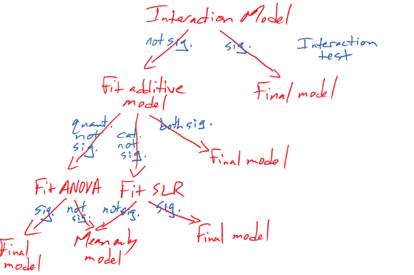

---
output:
  pdf_document: 
    keep_tex: yes
  html_document: default
header-includes:
- \usepackage{amsmath}
- \usepackage{color}
---

# Multiple linear regression {#chapter8}

```{r echo=F,warning=F,message=F}
set.seed(3234)
library(pander)
library(mosaic)
library(knitr)
library(readr)
library(tibble)
library(car)
knitr::opts_chunk$set(cache = F,fig.height=3.5,fig.width=6,fig.pos='ht',
                      message=F,warning=F)
options(show.signif.stars = FALSE)
```


```{r echo=F}
#Color Format
colFmt = function(x, color){
  outputFormat = opts_knit$get("rmarkdown.pandoc.to")
  if(outputFormat == 'latex')
    paste("\\textcolor{",color,"}{",x,"}",sep="")
  else if(outputFormat == 'html')
    paste("<font color='",color,"'>",x,"</font>",sep="")
  else
    x
}
colFmtBold = function(x, color){
  outputFormat = opts_knit$get("rmarkdown.pandoc.to")
  if(outputFormat == 'latex')
    paste("\\textcolor{",color,"}{\\textbf{",x,"}}",sep="")
  else if(outputFormat == 'html')
    paste("<b><font color='",color,"'>",x,"</font></b>",sep="")
  else
    x
}
blackOut = function(x){
  outputFormat = opts_knit$get("rmarkdown.pandoc.to")
  if(outputFormat == 'latex')
    paste("$\\colorbox{black}{",x,"}$",sep="")
  else if(outputFormat == 'html')
    paste("$\\require{color}\\colorbox{black}{",x,"}$",sep="")
}
textItalicBold = function(x){
  outputFormat = opts_knit$get("rmarkdown.pandoc.to")
  if(outputFormat == 'latex')
    paste("\\emph{\\textbf{",x,"}}",sep="")
  else if(outputFormat == 'html')
    paste("<strong><em>",x,"</em></strong>",sep="")
  else
    x
}
```

## Going from SLR to MLR {#section8-1}

In many situations, especially in observational studies, it is unlikely that
the system is simple enough to be characterized
by a single predictor variable. In experiments, if we randomly assign levels of
a predictor variable we can assume that the impacts of other variables cancel
out as a direct result of the random assignment.
\index{random assignment}
But it is possible even in
these experimental situations that we can "improve" our model for the response
variable by adding additional predictor variables that explain additional
variation in the responses, reducing the amount of unexplained variation. This
can allow more precise inferences to be generated from the model. As mentioned
previously, it might be useful to know the sex or weight of the subjects in the
Beers vs BAC study to account for more of the variation in the responses -- this
idea motivates our final topic: ***multiple linear regression*** (**MLR**)
models.
\index{multiple linear regression|see {MLR}}
\index{MLR}
\index{model!MLR}
In observational studies, 
we can think of a suite of characteristics of observations that might be
related to a response variable. For example, consider a study of yearly
salaries and variables that might explain the amount people get paid. We might
be most interested in seeing how incomes change based on age, but it would be
hard to ignore potential differences based on sex and education level. Trying
to explain incomes would likely require more than one predictor variable and we
wouldn't be able to explain all the variability in the responses just based on
gender and education level, but a model using those variables might still
provide some useful information about each component and about age impacts on
income after we adjust (control) for sex and education. The extension to MLR
allows us to incorporate multiple predictors into a regression model.
\index{MLR}
Geometrically, this is a way of relating many different dimensions (number of
$x\text{'s}$) to what happened in a single response variable (one dimension). 

\indent We start with the same model as in SLR except now we allow $K$ different
$x\text{'s}$:
\index{model!MLR!additive}

$$y_i = \beta_0 + \beta_1x_{1i} + \beta_2x_{2i}+ \ldots + \beta_Kx_{Ki}
+ \varepsilon_i$$

Note that if $K=1$, we are back to SLR. In the MLR model, there are $K$
predictors and we still have a
$y$-intercept.
\index{model!MLR}
The MLR model carries the same assumptions as an SLR model with a
couple of slight tweaks specific to MLR (see Section \@ref(section8-2)
for the details on the changes to the validity conditions). 

\indent We are able to use the
least squares criterion for estimating the regression coefficients in MLR, but
the mathematics are beyond the scope of this course.
\index{MLR}
The ``lm`` function takes
care of finding the least squares coefficients using a very sophisticated
algorithm^[If you take advanced applied mathematics courses, you can learn
more about the algorithms being used by ``lm``.
Everyone else only cares 
about the algorithms when they don't work -- which is usually due to the
user's inputs in these models not the algorithm itself.].\index{\texttt{lm()}} The estimated 
regression equation it returns is:

$$\widehat{y}_i = b_0 + b_1x_{1i} +b_2x_{2i}+\ldots+b_Kx_{Ki}$$

where each $b_k$ estimates its corresponding parameter $\beta_k$.

\indent An example of snow depths at some high elevation locations in Montana on a day in 
April provides a nice motivation for these methods. A random sample of 
$n=25$ Montana locations (from the population of $N=85$ at the time) were obtained 
from the Natural Resources Conversation Service's website 
(http://www.wcc.nrcs.usda.gov/snotel/Montana/montana.html) a few years ago.
Information on the snow depth (``Snow.Depth``) in inches, daily Minimum and
Maximum Temperatures (``Min.Temp`` and ``Max.Temp``) in $^\circ F$ and 
elevation of the site (``Elevation``) in feet. A snow science researcher (or
spring back-country skier) might be interested in understanding *Snow depth* 
as a function of *Minimum Temperature*, *Maximum Temperature*, and *Elevation*.
One might assume that colder
and higher places will have more snow, but using just one of the predictor
variables might leave out some important predictive information. The following
code loads the data set and makes the scatterplot matrix 
(Figure \@ref(fig:Figure8-1)) to allow
some preliminary assessment of the pairwise relationships. 

```{r eval=F}
snotel_s <- read_csv("http://www.math.montana.edu/courses/s217/documents/snotel_s.csv")
```

```{r echo=F}
snotel_s <- read_csv("snotel_s.csv")
```

(ref:fig8-1) Scatterplot matrix of data from a sample of SNOTEL sites in April on four variables. \index{R packages!\textbf{psych}}

```{r Figure8-1,fig.cap="(ref:fig8-1)",fig.height=5,fig.width=7}
snotel2 <- snotel_s[,c(1:2,4:6,3)] #Reorders columns for nicer pairs.panel display
library(psych)
pairs.panels(snotel2[,-c(1:2)], ellipse=F,
             main="Scatterplot matrix of SNOTEL Data")
```

It appears that there are many strong linear relationships between the variables,
with *Elevation* and *Snow Depth* having the largest magnitude, ***r*** = 0.80.
Higher temperatures seem to be associated with less snow -- not a big surprise so
far! There might be an outlier at an elevation of 7400 feet and a snow depth
below 10 inches that we should explore further. 

\indent A new issue arises in attempting to build MLR models called  ***multicollinearity***.
\index{multicollinearity}
Again, it is a not surprise that temperature and
elevation are correlated but that creates a
problem if we try to put them both into a model to explain snow depth. Is it
the elevation, temperature, or the combination of both that matters for getting
and retaining more snow? **Correlation between predictor variables** is called
multicollinearity and **makes estimation and interpretation of MLR models more
complicated than in SLR**. Section \@ref(section8-5) deals with this issue
directly and discusses methods
for detecting its presence. For now, remember that in MLR this issue sometimes
makes it difficult to disentangle the impacts of different predictor variables
on the response when the predictors share information -- when they are
correlated. 

\indent To get familiar with this example, we can start with fitting some 
potential SLR
models and plotting the estimated models. Figure \@ref(fig:Figure8-2) contains
the result for the SLR using *Elevation* and results for two temperature based
models are in Figures \@ref(fig:Figure8-3) and \@ref(fig:Figure8-4).
*Snow Depth* is selected as the
obvious response variable both due to skier interest and potential scientific
causation (snow can't change elevation but elevation could be the driver of
snow deposition and retention). 

(ref:fig8-2) Plot of the estimated SLR model for Snow Depth with Elevation as the predictor along with observations and smoothing line generated by the ``residuals=T`` option being specified. \index{R packages!\textbf{effects}}

```{r Figure8-2,fig.cap="(ref:fig8-2)",echo=F,fig.height=3,fig.width=5}
library(effects)
m1 <- lm(Snow.Depth~Elevation,data=snotel2)
plot(allEffects(m1,residuals=T),
     main="SLR: Effect of Elevation")
```

Based on the model summaries provided below, the three estimated SLR models 
are:

$$\begin{array}{rl}
\widehat{\text{SnowDepth}}_i &= -72.006 + 0.0163\cdot\text{Elevation}_i, \\
\widehat{\text{SnowDepth}}_i &= 174.096 - 4.884\cdot\text{MinTemp}_i,\text{ and} \\
\widehat{\text{SnowDepth}}_i &= 122.672 - 2.284\cdot\text{MaxTemp}_i.
\end{array}$$

The term-plots of the estimated models reinforce
our expected results, showing a positive change in *Snow Depth* for higher
*Elevations* and negative impacts for increasing temperatures on *Snow Depth*.
These plots are made across the observed range^[Sometimes the ``effects`` plots 
ignores the edge explanatory observations with the
default display. Always check the original variable summaries when considering
the range of observed values. By turning on the the "partial residuals" with SLR models, the plots show the original observations along with the fitted values and 95% confidence interval band. In more complex models, these displays with residuals are more complicated but can be used to assess linearity with each predictor in the model after accounting for other variables.] of the predictor 
variable and help us to get a sense of the total impacts of
predictors. For example, for elevation in Figure \@ref(fig:Figure8-2), the 
smallest observed
value was 4925 feet and the largest was 8300 feet. The regression line goes
from estimating a mean snow depth of 8 inches to 63 inches. That gives you some
practical idea of the size of the estimated *Snow Depth* change for the changes in
*Elevation* observed in the data. Putting this together, we can say that
there was around a
55 inch change in predicted snow depths for a close to 3400 foot increase in
elevation. This helps make the slope coefficient of 0.0163 in the model more 
easily understood.

\indent Remember that in SLR, the range of $x$ matters just as much 
as the units of $x$ in determining the practical importance and size of the slope
coefficient. A value of 0.0163 looks small but is actually at the heart of a
pretty interesting model for predicting snow depth. A one foot change of elevation is
"tiny" here relative to changes in the response so the slope coefficient can be
small and still amount to big changes in the predicted response across the range
of values of $x$. If the *Elevation* had been recorded in thousands of feet,
then the slope would have been estimated to be $0.0163*1000=16.3$ inches change in mean
*Snow Depth* for a 1000 foot increase in elevation. 

\indent The plots of the two estimated temperature models in 
Figures \@ref(fig:Figure8-3) and \@ref(fig:Figure8-4) suggest a similar change
in the responses over
the range of observed temperatures. Those predictors range from 22$^\circ F$
to 34$^\circ F$ (minimum temperature) and from 26$^\circ F$ to 50$^\circ F$
(maximum temperature). This tells us a 1$^\circ F$ increase in either 
temperature is a
greater proportion of the observed range of each predictor than a 1 unit (foot)
increase in elevation, so the two temperature variables will generate larger apparent
magnitudes of slope coefficients. But having large slope coefficients is no
guarantee of a good model -- in fact, the elevation model has the highest 
*R*^2^ value of these three models even though its slope coefficient looks tiny
compared to the other models.

(ref:fig8-3) Plot of the estimated SLR model using Min Temp as predictor. 

```{r Figure8-3,fig.cap="(ref:fig8-3)",echo=F,fig.height=3,fig.width=5}
m2 <- lm(Snow.Depth~Min.Temp, data=snotel2)
plot(allEffects(m2, residuals=T),
     main="SLR: Effect of Min Temp")
```

(ref:fig8-4) Plot of the estimated SLR model using Max Temp as predictor.

```{r Figure8-4,fig.cap="(ref:fig8-4)",echo=F,fig.height=3,fig.width=5}
m3 <- lm(Snow.Depth~Max.Temp, data=snotel2)
plot(allEffects(m3, residuals=T), 
     main="SLR: Effect of Max Temp")
```

```{r eval=F}
m1 <- lm(Snow.Depth~Elevation, data=snotel2)
m2 <- lm(Snow.Depth~Min.Temp, data=snotel2)
m3 <- lm(Snow.Depth~Max.Temp, data=snotel2)
library(effects)
plot(allEffects(m1, residuals=T), main="SLR: Effect of Elevation")
plot(allEffects(m2, residuals=T), main="SLR: Effect of Min Temp")
plot(allEffects(m3, residuals=T), main="SLR: Effect of Max Temp")
```

\newpage

```{r}
summary(m1)
```

\vspace{22pt}

```{r}
summary(m2)
summary(m3)
```


\indent Since all three variables look like they are potentially useful in predicting
snow depth, we want to consider if an MLR model might explain more of the
variability in *Snow Depth*. To fit an MLR model, we use the same general format
as in previous topics but with adding "``+``" between any additional 
predictors^[We used this same notation in the fitting the additive Two-Way 
ANOVA and this is also additive in terms of these variables. Interaction 
models are discussed later in the chapter.] we want to add to the model, 
``y~x1+x2+...+xk``: \index{model!MLR}

(ref:fig8-5) Term-plots for the MLR for Snow Depth based on Elevation, Min Temp and Max Temp. Compare this plot that comes from one MLR model to Figures \@ref(fig:Figure8-2), \@ref(fig:Figure8-3), and \@ref(fig:Figure8-4) for comparable SLR models. Note the points in these panels are the partial residuals that are generated after controlling for the other two of the three variables as explained below. 

```{r Figure8-5,fig.cap="(ref:fig8-5)",fig.width=10,fig.height=5}
m4 <- lm(Snow.Depth~Elevation+Min.Temp+Max.Temp, data=snotel2)
summary(m4)
plot(allEffects(m4, residuals=T), main="MLR model with Elev, Min & Max Temps")
```

Based on the output, the estimated MLR model is

$$\widehat{\text{SnowDepth}}_i = -10.51 + 0.0123\cdot\text{Elevation}_i
-0.505\cdot\text{MinTemp}_i - 0.562\cdot\text{MaxTemp}_i\ .$$

The direction of the estimated slope coefficients were similar but they 
all changed in magnitude as compared to the respective SLRs, as seen in the
estimated term-plots from the MLR model in Figure \@ref(fig:Figure8-5). 

\indent There are two ways to think about the changes from individual SLR slope
coefficients to the similar MLR results here. 

1. Each term in the MLR is the result for estimating each
slope after controlling for the other two variables (and we will always
use this interpretation any time we interpret MLR effects). For the *Elevation* slope, 
we would say that the slope coefficient is "corrected for" or "adjusted for" the variability that is explained by the
temperature variables in the model. 

2. Because of multicollinearity in the predictors, the
variables might share information that is useful for explaining the
variability in the response variable, so the slope coefficients of each
predictor get perturbed because the model cannot separate their effects on
the response. This issue disappears when the predictors are uncorrelated
or even just minimally correlated. 

There are some ramifications of multicollinearity in MLR:
\index{multicollinearity}

1. Adding variables to a model might lead to almost no improvement in the
overall variability explained by the model. 

2. Adding variables to a model can cause slope coefficients to change signs
as well as magnitudes. 

3. Adding variables to a model can lead to inflated standard errors for some
or all of the coefficients (this is less obvious
but is related to the shared information in predictors making it less
clear what slope coefficient to use for each variable, so more uncertainty in their estimation). 

4. In extreme cases of multicollinearity, it may even be impossible to obtain
some or any coefficient estimates. 

These seem like pretty serious issues and they are but there are many, many
situations where we proceed with MLR even
in the presence of potentially correlated predictors.
\index{MLR}
It is likely that you
have heard or read about inferences from models that are dealing with this
issue -- for example, medical studies often report the increased risk of death
from some behavior or trait after controlling for gender, age, health status, etc. In many
research articles, it is becoming common practice to report the slope for a
variable that is of most interest with it in the model alone (SLR) and in models 
after adjusting for the other variables that are expected to matter. The "adjusted for other variables" results are built with MLR or related multiple-predictor models like MLR. 
\index{MLR}

## Validity conditions in MLR	{#section8-2}

But before we get too excited about any results, we should always assess our
validity conditions. For MLR, they are similar to those for SLR:
\index{validity conditions!MLR}

* **Quantitative variables condition:**

    * The response and all predictors need to be quantitative variables. 
    This condition is relaxed to allow a categorical predictor in two ways 
    in Sections \@ref(section8-9) and \@ref(section8-11). 

* **Independence of observations:**

    * This assumption is about the responses -- we must assume that they were
    collected in a fashion so that they can be assumed to be independent. This
    implies that we also have independent random errors.
    \index{independence assumption!MLR}
    
    * This is not an assumption about the predictor variables!

* **Linearity of relationship (**`r colFmtBold("NEW VERSION FOR MLR!","red")`**):**

    * Linearity is assumed between the response variable and **each**
    explanatory variable ($y$ and each $x$).
    
    * We can check this three ways:
    
        1. Make plots of the response versus each explanatory variable:
        
            * Only visual evidence of a curving relationship is a problem here.
            Transformations of individual explanatory variables or the
            response are possible. It is possible to not find a problem in this plot that becomes more obvious when we account for variability that is explained by other variables in the partial residuals. \index{transformation}
            
        2. Examine the Residuals vs Fitted plot:
        
            * When using MLR, curves in the residuals vs. fitted values
            suggest a missed curving relationship with at least one predictor
            variable, but it will not be specific as to which one is non-linear.
            Revisit the scatterplots to identify the source of the issue.
            \index{Residuals vs Fitted plot}
            
        3. Examine partial residuals and smoothing line in term-plots.
        
            * Turning on the ``residuals=T`` option in the effects plot allows direct assessment of residuals vs each predictor after accounting for others. Look for clear patterns in the partial residuals^[I have not given you a formula for calculating partial residuals. We will leave that for more advanced material.] that the smoothing line is also following for potential issues with the linearity assumption.
            
* **Multicollinearity effects checked for:**

    * Issues here do not mean we cannot proceed with a given model, but it can
    impact our ability to trust and interpret the estimated terms. Extreme issues might require removing some highly correlated variables prior to really focusing on a model.
    
    * Check a scatterplot or correlation matrix \index{correlation matrix} to assess the potential for 
    shared information in different predictor variables.
    
    * Use the diagnostic measure called a ***variance inflation factor***
    (***VIF***) discussed in Section \@ref(section8-5) (we need to develop
    some ideas first to understand this measure). \index{VIF}
    
* **Equal (constant) variance:**

    * Same as before since it pertains to the residuals.
    
* **Normality of residuals:**

    * Same as before since it pertains to the residuals.
    
* **No influential points:**

    * Leverage is now determined by how unusual a point is for multiple
    explanatory variables.
    
    * The ***leverage*** values in the Residuals vs Leverage plot are
    scaled to add up to the *degrees of freedom (df) used for the model*
    which is the number of explanatory variables ($K$) plus 1, so $K+1$. \index{Residuals vs Leverage plot}
    
    * The scale of leverages depends on the complexity of the model through
    the *df* and the sample size.
    
    * The interpretation is still that the larger the leverage value, the 
    more leverage the point has.
    
    * The mean leverage is always *(model used df)/n = (K+1)/n* -- so focus
    on the values with above average leverage.
    
        * For example, with $K=3$ and $n=20$, the average leverage is
        $4/20=1/5$.
    
    * High leverage points whose response does not follow the pattern defined
    by the other observations (now based on patterns for multiple $x\text{'s}$
    with the response) will be influential.
    
    * Use the Residual's vs Leverage plot to identify problematic points.
    Explore further with Cook's D continuing to provide a measure of the 
    influence of each observation.
    
        * The rules and interpretations for Cook's D are the same as in SLR
        (over 0.5 is possibly influential and over 1 is definitely influential).

\indent While not a condition for use of the methods, a note about random assignment and random sampling is useful
here in considering the scope of inference of any results.
\index{scope of inference}
To make inferences
about a population, we need to have a representative sample. If we have 
randomly assigned levels of treatment variables(s), then we can make causal
inferences to subjects like those that we could have observed. And if we both
have a representative sample and randomization, we can make causal inferences
for the population. It is possible to randomly assign levels of variable(s) to
subjects and still collect additional information from other explanatory
(sometimes called ***control***) variables. The causal interpretations would
only be associated with the explanatory variables that were randomly assigned
even though the model might
contain other variables. Their interpretation still involves noting all the
variables included in the model, as demonstrated below. It is even possible to
include interactions between randomly assigned variables and other variables --
like drug dosage and sex of the subjects. In these cases, causal inference
could apply to the treatment levels but noting that the impacts differ based on
the non-randomly assigned variable. 

For the *Snow Depth* data, the conditions can be assessed as:

* **Quantitative variables condition:**

    * These are all clearly quantitative variables.

* **Independence of observations:**

    * The observations are based on a random sample of sites from the 
    population and the sites are spread around the mountains in Montana. Many
    people would find it to be reasonable to assume that the sites are 
    independent of one another but others would be worried that sites closer
    together in space might be more similar than they are to far-away 
    observations (this is called ***spatial correlation***). \index{spatial correlation} I have
    been in a heated discussion with statistics colleagues about whether
    spatial dependency should be considered or if it is valid to ignore it in
    this sort of situation. It is certainly possible to be concerned about
    independence of observations here but it takes more advanced statistical
    methods to actually assess whether there is spatial dependency in these data. Even if you were going to pursue models that incorporate spatial correlations, the first task would be to fit this sort of model
    and then explore the results. When data are collected across space, you should note that there might be some sort of spatial dependency that *could* violate the independence assumption.
    
To assess the remaining assumptions, we can use our diagnostic plots.
\index{assumptions}
The same code
as before will provide diagnostic plots. There is some extra code 
(``par(...)``) added to allow us to add labels to the plots (``sub.caption="..."``) to know which model
is being displayed since we have so many to discuss here. We can also employ a new approach, which is to simulate new observations from the model and make plots to compare simulated data sets to what was observed. The ``simulate`` function from Chapter \@ref(chapter2) \index{\texttt{simulate()}} can be used to generate new observations from the model based on the estimated coefficients and where we know that the assumptions are true. If the simulated data and the observed data are very different, then the model is likely dangerous to use for inferences because of this mis-match. This method can be used to assess the linearity, constant variance, normality of residuals, and influential points aspects of the model. It is not something used in every situation, but is especially helpful if you are struggling to decide if what you are seeing in the diagnostics is just random variability or is really a clear issue. The regular steps in assessing each assumption are discussed first.

(ref:fig8-6) Diagnostic plots for model m4: $\text{Snow.Depth}\sim \text{Elevation} + \text{Min.Temp} + \text{Max.Temp}$.

```{r Figure8-6,fig.cap="(ref:fig8-6)",fig.height=5,fig.width=10}
par(mfrow=c(2,2), oma=c(0,0,2,0))
plot(m4, sub.caption="Diagnostics for m4", pch=16)
```


* **Linearity of relationship (**`r colFmtBold("NEW VERSION FOR MLR!","red")`**):**

    * Make plots of the response versus each explanatory variable:
    
        * In Figure \@ref(fig:Figure8-1), the plots of each variable versus 
        snow depth do not clearly show any nonlinearity except for a little 
        dip around 7000 feet in the plot vs *Elevation*. 
    
    * Examine the Residuals vs Fitted plot in Figure \@ref(fig:Figure8-6):
        
        * Generally, there is no clear curvature in the Residuals vs Fitted
        panel and that would be an acceptable answer. However, there is some
        pattern in the smoothing line that could suggest a more complicated
        relationship between at least one predictor and the response. This also
        resembles the pattern in the *Elevation* vs. *Snow depth* panel in 
        Figure \@ref(fig:Figure8-1) so that might be the source of this 
        "problem". This suggests that there is the potential to do a little 
        bit better but that it is not unreasonable to proceed on with the MLR,
        ignoring this little wiggle in the diagnostic plot.
        
    * Examine partial residuals as seen in Figure \@ref(fig:Figure8-5):
    
        * In the term-plot for elevation from this model, there is a slight pattern in the partial residuals between 6,500 and 7,500 feet. This was also apparent in the original plot and suggests a slight nonlinearity in the pattern of responses versus this explanatory variable.
        
    
* **Multicollinearity effects checked for:**

    * The predictors certainly share information in this application 
    (correlations between -0.67 and -0.91) and multicollinearity looks to be 
    a major concern in being able to understand/separate the impacts of
    temperatures and elevations on snow depths.
    
    * See Section \@ref(section8-5) for more on this issue in these data. 
    
<!-- \newpage -->

* **Equal (constant) variance:**

    * While there is a little bit more variability in the middle of the fitted
    values, this is more an artifact of having a smaller data set with a couple
    of moderate outliers that fell in the same range of fitted values and maybe
    a little bit of missed curvature. So there is not too much of an issue with
    this condition.
    
* **Normality of residuals:**

    * The residuals match the normal distribution fairly closely the QQ-plot, showing only a little 
    deviation for observation 9 from a normal distribution and that deviation 
    is extremely minor. There is certainly no indication of a violation of the normality
    assumption here. \index{QQ-plot}
    
* **No influential points:**

    * With $K=3$ predictors and $n=25$ observations, the average
    leverage is $4/25=0.16$. This gives us a scale to interpret the leverage
    values on the $x$-axis of the lower right panel of our diagnostic plots.
    
    * There are three higher leverage points (leverages over 0.3) with only
    one being influential (point 9) with Cook's D close to 1.
    
        * Note that point 10 had the same leverage but was not influential with
        Cook's D less than 0.5.
        
    * We can explore both of these points to see how two observations can have
    the same leverage and different amounts of influence. 

The two flagged points, observations 9 and 10 in the data set, are for the
sites "Northeast Entrance" (to Yellowstone) and "Combination". We can use the 
MLR equation to do some prediction for each observation and calculate residuals
to see how far the model's predictions are from the actual observed values for
these sites. For the Northeast Entrance, the *Max.Temp* was 45, the *Min.Temp*
was 28, and the *Elevation* was 7350 as you can see in
this printout of just the two rows of the data set available by referencing
rows 9 and 10 in the bracket from ``snotel2``:

```{r}
snotel2[c(9,10),]
```

The estimated *Snow Depth* for the *Northeast Entrance* site (observation 9)
is found using the estimated model with

$$\begin{array}{rl}
\widehat{\text{SnowDepth}}_9 &= -10.51 + 0.0123\cdot\text{Elevation}_9 -
0.505\cdot\text{MinTemp}_9 - 0.562\cdot\text{MaxTemp}_9 \\
& = -10.51 + 0.0123*\boldsymbol{7350} -0.505*\boldsymbol{28} - 
0.562*\boldsymbol{45} \\
& = 40.465 \text{ inches,}
\end{array}$$

but the observed snow depth was actually $y_9=11.2$ inches. The observed  ***residual*** is then

$$e_9=y_9-\widehat{y}_9 = 11.2-40.465 = -29.265 \text{ inches.}$$

So the model "misses" the snow depth by over 29 inches with the model suggesting
over 40 inches of snow but only 11 inches actually being present^[Imagine
showing up to a ski area expecting a 40 inch base and there only being
11 inches. I'm sure ski areas are always more accurate than this model in their
reporting of amounts of snow on the ground...]. 

```{r}
-10.51 + 0.0123*7350 - 0.505*28 - 0.562*45
```


```{r}
11.2 - 40.465
```

\indent This point is being rated as influential (Cook's D $\approx$ 1) with a
leverage of nearly 0.35 and a standardized residual ($y$-axis of Residuals vs. 
Leverage plot) of nearly -3. This suggests that even
with this observation impacting/distorting the slope coefficients (that is what
***influence*** means), the model is still doing really poorly at fitting this
observation. We'll drop it and re-fit the model in a second to see how the slopes
change. First, let's compare that result to what happened for data point 10
("Combination") which was just as high leverage but not identified as
influential. 

\indent The estimated snow depth for the *Combination* site is </span>

$$\begin{array}{rl}
\widehat{\text{SnowDepth}}_{10} &= -10.51 + 0.0123\cdot\text{Elevation}_{10} -
0.505\cdot\text{MinTemp}_{10} - 0.562\cdot\text{MaxTemp}_{10} \\
& = -10.51 + 0.0123*\boldsymbol{5600} -0.505*\boldsymbol{28} - 
0.562*\boldsymbol{36} \\
& = 23.998 \text{ inches.}
\end{array}$$

The observed snow depth here was $y_{10} = 14.0$ inches so the observed
residual is then

$$e_{10}=y_{10}-\widehat{y}_{10} = 14.0-23.998 = -9.998 \text{ inches.}$$

This results in a standardized residual of around -1. This is still a "miss"
but not as glaring as the previous result and also is not having a major impact
on the model's estimated slope coefficients based on the small Cook's D value.

```{r}
-10.51 + 0.0123*5600 - 0.505*28 - 0.562*36
14 - 23.998
```

\indent Note that any predictions using this model presume that it is 
trustworthy, but
the large Cook's D on one observation suggests we should consider the model
after removing that observation. We can re-run the model without the 
9^th^ observation using the data set ``snotel2[-9,]``. 

```{r}
m5 <- lm(Snow.Depth~Elevation+Min.Temp+Max.Temp, data=snotel2[-9,])
summary(m5)
```


(ref:fig8-7) Term-plots for the MLR for Snow Depth based on Elevation, Min Temp, and Max Temp with Northeast entrance observation removed from data set (n=24).

```{r Figure8-7,fig.cap="(ref:fig8-7)",fig.height=5, fig.width=10}
plot(allEffects(m5, residuals=T), main="MLR model with NE Ent. Removed")
```

\indent The estimated MLR model with $n=24$ after removing the influential 
"NE Entrance" observation is

$$\widehat{\text{SnowDepth}}_i = -142.4 + 0.0214\cdot\text{Elevation}_i
+0.672\cdot\text{MinTemp}_i +0.508\cdot\text{MaxTemp}_i\ .$$

Something unusual has happened here: there is a positive slope for both
temperature terms in Figure \@ref(fig:Figure8-7) that both
contradicts reasonable expectations (warmer temperatures are related to higher
snow levels?) and our original SLR results. So what happened? First, removing
the influential point has drastically changed the slope coefficients (remember
that was the definition of an influential point). Second, when there are
predictors that share information, the results can be somewhat unexpected for
some or all the predictors when they are all in the model together. Note that
the *Elevation* term looks like what we might expect and seems to have a big
impact on the predicted *Snow Depths*. So when the temperature variables
are included in the model they might be functioning to explain some differences
in sites that the *Elevation* term could not explain. This is where our
"adjusting for" terminology comes into play. The unusual-looking slopes for
the temperature effects can be explained
by interpreting them as the estimated change in the response for changes in
temperature **after we control for the impacts of elevation**. Suppose that
*Elevation* explains most of the variation in *Snow Depth* except for a few
sites where the elevation cannot explain all the variability and the site
characteristics happen to show higher temperatures and more snow (or lower
temperatures and less snow). This could be because warmer areas might have been
hit by a recent snow storm while colder areas might have been missed (this is
just one day and subject to spatial and temporal fluctuations in precipitation
patterns). Or maybe there is another factor related to having marginally warmer
temperatures that are accompanied by more snow (maybe the lower snow sites for
each elevation were so steep that they couldn't hold much snow but were also
relatively colder?). Thinking about it this way, the temperature model
components could provide useful corrections to what *Elevation* is providing in
an overall model and explain more variability than any of the variables could
alone. It is also possible that the
temperature variables are not needed in a model with *Elevation* in it, are just
"explaining noise", and should be removed from the model. Each of the next
sections take on various aspects of these
issues and eventually lead to a general set of modeling and model selection
recommendations to help you work in situations as complicated as this. 
Exploring the results for this model assumes we trust it and, once again, we
need to check diagnostics before getting too focused on any particular results
from it. 

\indent The Residuals vs. Leverage diagnostic plot in Figure \@ref(fig:Figure8-8) 
for the model fit to the data set without NE Entrance (now $n=24$) reveals a new 
point that is somewhat influential (point 22 in the data set has Cook's D 
$\approx$ 0.5). It is for a location called "Bloody
`r blackOut("Redact.")`^[The site name is redacted to protect
the innocence of the reader. More information on this site, located in
Beaverhead County, is available at
http://www.wcc.nrcs.usda.gov/nwcc/site?sitenum=355&amp;state=mt.] which has a
leverage of nearly 0.2 and a standardized residual of nearly -3. 
This point did not show up as influential in the original version of the data
set with the same model but it is now. It also shows up as a potential outlier. 
As we did before, we can explore it a bit by comparing the model predicted snow
depth to the observed snow depth. The predicted snow depth for this site (see output below for variable values) is

$$\widehat{\text{SnowDepth}}_{22} = -142.4 + 0.0214*\boldsymbol{7550}
+0.672*\boldsymbol{26} +0.508*\boldsymbol{39} = 56.45 \text{ inches.}$$

The observed snow depth was 27.2 inches, so the estimated residual is -39.25
inches. Again, this point is potentially influential and an outlier.
Additionally, our model contains results that are not what we would have
expected *a priori*, so it is not unreasonable to consider removing this
observation to be able to work towards a model that is fully trustworthy. 

```{r echo=F}
snotel2$Station <- as.character(snotel2$Station)
snotel2$Station[snotel2$Station=="Bloody Dick"] <- "Bloody [Redact.]"
snotel2$Station <- factor(snotel2$Station)
```

(ref:fig8-8) Diagnostic plots for MLR for Snow Depth based on Elevation, Min Temp and Max Temp with Northeast entrance observation removed from data set.

```{r Figure8-8,fig.cap="(ref:fig8-8)",fig.height=5,fig.width=10}
par(mfrow=c(2,2), oma=c(0,0,2,0))
plot(m5, sub.caption="Diagnostics for m5", pch=16)
```

(ref:fig8-9) Diagnostic plots for MLR for Snow Depth based on Elevation, Min Temp and Max Temp with two observations removed ($n=23$). 

```{r Figure8-9,fig.cap="(ref:fig8-9)",fig.height=5,fig.width=10,echo=F}
m6 <- lm(Snow.Depth~Elevation+Min.Temp+Max.Temp, data=snotel2[-c(9,22),])
summary(m6)
par(mfrow=c(2,2), oma=c(0,0,2,0))
plot(m6, sub.caption="Diagnostics for m6", pch=16)
```

\newpage

This worry-some observation is located in the 22^nd^ row of the
original data set:

```{r}
snotel2[22,]
```

With the removal of both the "Northeast Entrance" and "Bloody
`r blackOut("Redact.")`" sites, there are $n=23$ observations
remaining. This model (``m6``) seems to contain residual diagnostics (Figure
\@ref(fig:Figure8-9)) that are finally generally reasonable. 

```{r eval=F}
m6 <- lm(Snow.Depth~Elevation+Min.Temp+Max.Temp, data=snotel2[-c(9,22),])
summary(m6)
par(mfrow=c(2,2), oma=c(0,0,2,0))
plot(m6, sub.caption="Diagnostics for m6", pch=16)
```

It is hard to suggest that there any curvature issues and the slight variation
in the Scale-Location plot is mostly
due to few observations with fitted values around 30 happening to be well
approximated by the model. The normality assumption is generally reasonable and
no points seem to be overly influential on this model (finally!). 

\indent The term-plots (Figure \@ref(fig:Figure8-10)) show that the temperature slopes
are both positive although in this model *Max.Temp* seems to be more
"important" than *Min.Temp*. We have ruled out individual
influential points as the source of un-expected directions in slope coefficients
and the more likely issue is multicollinearity -- in a model that
includes *Elevation*, the temperature
effects may be positive, again acting with the *Elevation* term to generate
the best possible predictions of the
observed responses. Throughout this discussion, we have mainly focused on the
slope coefficients and diagnostics. We have other tools in MLR to more
quantitatively assess and compare different regression models that are considered
in the next sections. 
\index{MLR}

(ref:fig8-10) Term-plots for the MLR for Snow Depth based on Elevation, Min Temp and Max Temp with two observations removed.

```{r Figure8-10,fig.cap="(ref:fig8-10)",fig.height=4.5,fig.width=8}
plot(allEffects(m6, residuals=T), main="MLR model with n=23")
```

\indent As a final assessment of this model, we can consider simulating a set of $n=23$ responses from this model and then comparing that data set to the one we just analyzed. This does not change the predictor variables, but creates a new response that is called ``SimulatedSnow`` in the following codechunk. Figure \@ref(fig:Figure8-11) uses the ``plot`` function to just focus on the relationship of the original (``Snow.Depth``) and new (fake) responses (``SimulatedSnow``) versus each of the predictors. In exploring two realizations of simulated responses from the model, the results look fairly similar to the original data set. This model appeared to have reasonable assumptions and the match between simulated responses and the original ones reinforces those previous assessments. When the match is not so close, it can reinforce or create concern about the way that the assumptions have been assessed using other tools.

(ref:fig8-11) Plot of the original responses versus the three predictors ($n$=23 data set) in the top row and two sets of simulated responses versus the predictors in the bottom two rows.

```{r Figure8-11,fig.cap="(ref:fig8-11)",fig.height=10,fig.width=10}
set.seed(307)
snotel_final <- snotel2[-c(9,22),]
snotel_final$SimulatedSnow <- simulate(m6)[[1]] #Creates first set of simulated responses

par(mfrow=c(3,3))
plot(Snow.Depth~Elevation + Max.Temp + Min.Temp, data=snotel_final, 
     pch=16, main="Real Responses")
plot(SimulatedSnow~Elevation + Max.Temp + Min.Temp, data=snotel_final, 
     pch=17, main="First Simulated Responses", col="darkgreen")
# Creates a second set of simulared responses in the same variable name
snotel_final$SimulatedSnow <- simulate(m6)[[1]] 
plot(SimulatedSnow~Elevation + Max.Temp + Min.Temp, data=snotel_final, 
     pch=16, main="Second Simulated Responses", col="skyblue")
```


## Interpretation of MLR terms	{#section8-3}

Since these results (finally) do not contain any highly influential points,
we can formally discuss
interpretations of the slope coefficients and how the term-plots 
(Figure \@ref(fig:Figure8-10)) aid
our interpretations. Term-plots in MLR are constructed by holding all the other
quantitative variables^[Term-plots with additive factor variables use the weighted (based on percentage of the responses in each category) average of their predicted mean responses across their levels but we don't have any factor variables in the MLR models, yet.] at their mean and generating predictions and 95% CIs for the mean
response across the levels of observed values for each predictor variable. This
idea also helps us to work towards interpretations of each term in an MLR
model. For example, for *Elevation*, 
the term-plot starts at an elevation around 5000 feet and ends at an elevation
around 8000 feet. To generate that line and CIs for the mean snow depth at
different elevations, the MLR model of

$$\widehat{\text{SnowDepth}}_i = -213.3 + 0.0269\cdot\text{Elevation}_i
+0.984\cdot\text{MinTemp}_i +1.243\cdot\text{MaxTemp}_i$$

is used, but we need to have "something" to put in for the two temperature
variables to predict *Snow Depth* for different *Elevations*. The typical
convention is to hold the "other" variables at their means to
generate these plots. This tactic also provides a way of interpreting each
slope coefficient. Specifically, we can interpret the *Elevation* slope as:
For a 1 foot increase in *Elevation*, we estimate the mean *Snow Depth* to
increase by 0.0269 inches, holding the minimum and maximum temperatures
constant. More generally, the ***slope interpretation in an MLR*** is:
\index{slope interpretation!MLR}

> For a 1 **[*units of $\boldsymbol{x_k}$*]** increase in 
$\boldsymbol{x_k}$, we estimate the mean of $\boldsymbol{y}$ to change by
$\boldsymbol{b_k}$ **[*units of y*]**, after controlling for
**[list of other explanatory variables in model]**. 
> 

\indent To make this more concrete, we can recreate some points in the Elevation
term-plot. To do this, we first need the mean of the "other" predictors, 
*Min.Temp* and *Max.Temp*. 

```{r}
mean(snotel2[-c(9,22),]$Min.Temp)
mean(snotel2[-c(9,22),]$Max.Temp)
```

We can put these values into the MLR equation and simplify it by combining like terms, to
an equation that is in terms of
just *Elevation* given that we are holding *Min.Temp* and *Max.Temp* at their
means:

$$\begin{array}{rl}
\widehat{\text{SnowDepth}}_i &= -213.3 + 0.0269\cdot\text{Elevation}_i
+0.984*\boldsymbol{27.826} +1.243*\boldsymbol{36.391} \\
&= -213.3 + 0.0269\cdot\text{Elevation}_i + 27.38 + 45.23 \\
&= \boldsymbol{-140.69 + 0.0269\cdot\textbf{Elevation}_i}.
\end{array}$$

So at the means on the two temperature variables, 
the model looks like an SLR with an estimated $y$-intercept of -140.69 (mean 
*Snow Depth* for *Elevation* of 0 if temperatures are at their means) 
and an estimated
slope of 0.0269. Then we can plot the predicted changes in $y$ across all the
values of the predictor variable (*Elevation*) while holding the other
variables constant. To generate the needed values to define a line, we can plug
various *Elevation* values into the simplified equation:

* For an elevation of 5000 at the average temperatures, we predict a mean snow
depth of $-140.69 + 0.0269*5000 = -6.19$ inches.

* For an elevation of 6000 at the average temperatures, we predict a mean snow
depth of $-140.69 + 0.0269*6000 = 20.71$ inches.

* For an elevation of 8000 at the average temperatures, we predict a mean snow
depth of $-140.69 + 0.0269*8000 = 74.51$ inches.

We can plot this information (Figure \@ref(fig:Figure8-12)) using the ``plot``
function to show the points we calculated and the ``lines`` function to add 
a line that connects the dots. In the ``plot`` function, we used the
``ylim=...`` option to make the scaling on the $y$-axis match the previous
term-plot's scaling.

(ref:fig8-12) Term-plot for Elevation "by-hand", holding temperature variables constant at their means. 

```{r Figure8-12,fig.cap="(ref:fig8-12)",echo=F}
par(mfrow=c(1,1))
#Making own effect plot:
elevs <- c(5000,6000,8000)
snowdepths <- c(-6.19,20.71,74.51)
plot(snowdepths~elevs, ylim=c(-20,90), cex=2, col="blue", pch=16,
     main="Effect plot of elevation by hand")
lines(snowdepths~elevs, col="red", lwd=2)
```

```{r eval=F}
#Making own effect plot:
elevs <- c(5000,6000,8000)
snowdepths <- c(-6.19,20.71,74.51)
plot(snowdepths~elevs, ylim=c(-20,90), cex=2, col="blue", pch=16,
     main="Effect plot of elevation by hand")
lines(snowdepths~elevs, col="red", lwd=2)
```

Note that we only needed 2 points to
define the line but need a denser grid of elevations if we want to add the 95%
CIs for the true mean snow depth across the different elevations since they
vary as a function of the distance from the mean of the explanatory variables. 


\indent The partial residuals in MLR models^[This also applies to the additive two-way ANOVA model.] highlight the relationship between each predictor and the response after the impacts of the other variables are incorporated. To do this, we start with the raw residuals, $e_i = y_i - \hat{y}_i$ which is the left-over part of the responses after accounting for all the predictors. If we add the component of interest to explore (say $b_kx_{kj}$) to the residuals, $e_i$, we get $e_i + b_kx_{kj} = y_i - \hat{y}_i + b_kx_{kj} = y_i - (b_0 + b_1x_{1i} +b_2x_{2i}+\ldots + b_kx_{ki} + \ldots + b_Kx_{Ki}) + b_kx_{kj}$ $= y_i - (b_0 + b_1x_{1i} +b_2x_{2i}+\ldots + b_{k-1}x_{k-1,i} + b_{k+1}x_{k+1,i} + \ldots + b_Kx_{Ki})$. This new residual is a partial residual (also known as "component-plus-residuals" to indicate that we put the residuals together with the component of interest to create them). \index{partial residual} It contains all of the regular residual as well as what would be explained by $b_kx_{kj}$ given the other variables in the model. Some choose to plot these partial residuals or to center them at 0 and, either way, plot them versus the component, here $x_{kj}$. In effects plots, partial residuals are vertically scaled to match the height that the term-plot has created by holding the other predictors at their means so they can match the y-axis of the lines of the estimated terms based on the model. However they are vertically located, partial residuals help to highlight missed patterns left in the residuals that might be related to a particular predictor.   

\indent To get the associated 95% CIs for an individual term, we could return to using the ``predict``
function for the MLR, again holding the temperatures at their
mean values. The ``predict`` function is sensitive and needs the same variable
names as used in the original model fitting to work. First we create a "new"
data set using the ``seq`` function to generate the desired grid of
elevations and the ``rep`` function^[The ``seq`` function has syntax of
``seq(from=startingpoint, to=endingpoint,
length.out=#ofvalues_between_start_and_end)`` and the ``rep`` function has
syntax of ``rep(numbertorepeat, #oftimes).``] to repeat the means of the
temperatures for each of elevation values we need to make the plot. The code
creates a specific version of the predictor variables to force the ``predict``
function to provide fitted values and CIs across different elevations with
temperatures held constant that is stored in ``newdata1``. \index{\texttt{seq()}} \index{\texttt{rep()}}

```{r}
elevs <- seq(from=5000, to=8000, length.out=30)
newdata1 <- tibble(Elevation=elevs, Min.Temp=rep(27.826,30),
                       Max.Temp=rep(36.3913,30))
newdata1
```

The predicted snow depths along with 95% confidence intervals for the mean,
holding temperatures at their means, are:

\small

```{r}
predict(m6, newdata=newdata1, interval="confidence")
```

\normalsize

So we could do this with any model **for each predictor** variable to create
term-plots, or we can just use the ``allEffects`` function to do this for us.
This exercise is useful to complete once to understand what is being displayed
in term-plots but using the ``allEffects`` function makes getting these plots
much easier. 
\index{\texttt{allEffects()}}

\indent There are two other model components of possible interest in this model. The 
slope of 0.984 for *Min.Temp* suggests that for a 1$^\circ F$ increase in 
*Minimum Temperature*, we estimate a 0.984 inch change in the mean *Snow Depth*,
after controlling for *Elevation* and *Max.Temp* at the sites. Similarly, the
slope of 1.243 for the *Max.Temp* suggests that for a 1$^\circ F$ increase in
*Maximum Temperature*, we estimate a 1.243 inch change in the mean *Snow Depth*,
holding *Elevation* and *Min.Temp* constant. Note that there are a variety of ways
to note that each term in an
MLR is only a particular value given the other variables in the model. We can
use words such as "holding the other variables constant" or "after adjusting
for the other variables" or "in a model with..." or "for observations with similar values of the other variables but a difference of 1 unit in the predictor..". The main
point is to find words that reflect that this single slope coefficient might be
different if we had a different overall model and the only way to interpret it
is conditional on the other model components. 

\indent Term-plots have a few general uses to enhance our regular slope
interpretations. They can help us assess how much change in the mean of $y$ the model predicts over the range of each 
observed $x$. This can
help you to get a sense of the "practical" importance of each term. 
Additionally, the term-plots show 95% confidence intervals for the mean response
across the range of each variable, 
holding the other variables at their means. These intervals can be useful for
assessing the precision in the estimated mean at different values of each
predictor. However, note that you should not use these plots for deciding
whether the term should be retained in the model -- we have other tools for
making that assessment. And one last note about term-plots -- they do not mean
that the relationships are really linear between the predictor and response
variable being displayed. The model **forces** the relationship to be linear
even if that is not the real functional form. **Term-plots are not diagnostics
for the model unless you add the partial residuals, the lines are just summaries of the model you assumed was correct!**
Any time we do linear regression, the inferences are contingent upon the
model we chose. We know our model is not
perfect, but we hope that it helps us learn something about our research
question(s) and, to trust its results, we hope it matches the data fairly well. 

\indent To both illustrate the calculation of partial residuals and demonstrate their potential utility, a small simulated example is considered. These are simulated data to help to highlight these patterns but are not too different than results that can be seen in some real applications. This situation has a response of simulated cholesterol levels with (also simulated) predictors of age, exercise level, and healthiness level with a sample size of $n=100$. First, consider the plot of the response versus each of the predictors in Figure \@ref(fig:Figure8-13). It appears that age might be positively related to the response, but exercise and healthiness levels do not appear to be related to the response. But it is important to remember that the response is made up of potential contributions that can be explained by each predictor and unexplained variation, and so plotting the response versus each predictor may not allow us to see the real relationship with each predictor.

```{r echo=F}

n<-100; set.seed(9754)
x1<-runif(n=100,0,100); x2<-runif(n=100,0,100); x3 <- (runif(n=100,0,100) + x1); x3 <- 100*(x3-min(x3))/(max(x3) - min(x3))

y1<-3+0.5*x1+0.005*(x2-50)^2-.4*x3+rnorm(n=100,0,2)

Age <- 20+(x1/100)*40

ExAmount <- x2
  
HealthLevel <- x3

CholLevel <- 100+150*(y1-min(y1))/(max(y1)-min(y1))

d1 <- tibble(CholLevel, Age, ExAmount, HealthLevel)
```


(ref:fig8-13) Scatterplot of Cholesterol level versus three predictors (simulated data).

```{r Figure8-13,fig.cap="(ref:fig8-13)",echo=T,fig.width=5,fig.height=3}
par(mfrow=c(1,3))
plot(CholLevel~Age+ExAmount+HealthLevel, data=d1); 
sim1<-lm(CholLevel~Age+ExAmount+HealthLevel, data=d1)
summary(sim1)$coefficients
```

In the summary it appears that each predictor might be related to the response given the other predictors in the model with p-values of <0.0001, 0.068, and <0.0001 for Age, Exercise, and Healthiness, respectively.

In Figure \@ref(fig:Figure8-14), we can see more of the story here by exploring the partial residuals versus each of the predictors. There are actually quite clear relationships for each partial residual versus its predictor. For *Age* and *HealthLevel*, the relationship after adjusting for other predictors is clearly positive and linear. For *ExAmount* there is a clear relationship but it is actually curving, so would violate the linearity assumption. It is interesting that none of these were easy to see or even at all present in plots of the response versus individual predictors. This demonstrates the power of MLR methods to adjust/control for other variables to help us potentially more clearly see relationships between individual predictors and the response, or at least their part of the response.

(ref:fig8-14) Term-plots with partial residuals for Cholesterol level versus three predictors (simulated data).

```{r Figure8-14,fig.cap="(ref:fig8-14)",echo=T,fig.width=10,fig.height=4.5}
plot(allEffects(sim1, residuals=T))
```


\indent For those that are interested in these partial residuals, we can re-construct some of the work that the ``effects`` package does to provide them. As noted above, we need to take our regular residuals and add back in the impacts of a predictor of interest to calculate the partial residuals. The regular residuals can be extracted using the ``residuals`` function on the estimated model and the contribution of, say, the *ExAmount* predictor is found by taking the values in that variable times its estimated slope coefficient, $b_2=0.07447965$. Plotting these partial residuals versus *ExAmount* as in Figure \@ref(fig:Figure8-15) provides a plot that is similar to the second term-plot except for differences in the y-axis. The y-axis in term-plots contains an additional adjustment but the two plots provide the same utility in diagnosing a clear missed curve in the partial residuals that is related to the *ExAmount*. Methods to incorporate polynomial functions of the predictor are simple extensions of the `lm` work we have been doing but are beyond the scope of this material -- but you should always be checking the partial residuals to assess the linearity assumption with each predictor and if you see a pattern like this, consult further statistical resources or a statistician for help.

(ref:fig8-15) Plot of partial residual for ExAmount.

```{r Figure8-15,fig.cap="(ref:fig8-15)",echo=T,fig.width=5,fig.height=3}
partres<- residuals(sim1) + d1$ExAmount*0.07447965
scatterplot(partres~d1$ExAmount, xlab="ExAmount", ylab="Partial Residual",
            smooth=list(spread=F))
```

## Comparing multiple regression models	{#section8-4}

With more than one variable, we now have many potential models that we could
consider.
\index{model!MLR!comparison of}
We could include only one of the predictors, all of them, or
combinations of sets of the
variables. For example, maybe the model that includes *Elevation* does not "need"
both *Min.Temp* and *Max.Temp*? Or maybe the model isn't improved over an SLR
with just *Elevation* as a predictor. Or maybe none of the predictors are
"useful"? In this section, 
we discuss some general model comparison issues and a metric that can be used
to pick among a suite of different models (often called a set of ***candidate
models*** to reflect that they are all potentially interesting and we need to
compare them and possibly pick one). \index{candidate models}

\indent It is certainly possible the researchers may have an *a priori*
reason to only consider a single model. For example, in a designed experiment
where combinations of, say, three different predictors are randomly assigned, 
the initial model with all three predictors may be sufficient to address all the
research questions of interest. One advantage in these situations is that the
variable combinations can be created to prevent multicollinearity among the
predictors and avoid that complication in interpretations. However, this is
more the exception than the rule. Usually, there are competing predictors or
questions about whether some predictors matter more than others. This type of
research always introduces the potential for multicollinearity to complicate the
interpretation of each predictor in the presence of others. Because of this, 
multiple models are often considered, where "unimportant" variables are dropped
from the model. The assessment of "importance" using p-values will be discussed
in Section \@ref(section8-6), but for now we will consider other reasons to pick
one model over another. \index{model!MLR!comparison of}

\indent There are some general reasons to choose a particular model:

1. Diagnostics are better with one model compared to others.

2. One model predicts/explains the responses better than the others 
(***R***^2^).

3. *a priori* reasons to "use" a particular model, for example in a designed
experiment or it includes variable(s) whose estimated slopes directly address the research question(s), even if the variables are not "important" in the model.

4. Model selection "criteria" suggest one model is better than the others^[Also
see Section \@ref(section8-13) for another method of picking among different
models.]. 

It is OK to consider multiple reasons to select a model but it is dangerous to
"shop" for a model across many possible models -- a practice which is sometimes
called ***data-dredging*** and leads to a high chance of spurious results from a
single model that is usually reported based on this type of exploration. Just
like in other discussions of
multiple testing issues previously, if you explore many versions of a model, 
maybe only keeping the best ones, this is very different from picking one model
(and tests) *a priori* and just exploring that result.

\indent As in SLR, we can use the ***R***^2^ (the ***coefficient of
determination***) \index{R-squared} to measure the percentage of the variation in the
response variable that the model explains. In MLR, it is important to remember
that ***R***^2^ is now an overall
measure for the model and not specific to a single variable. It is comparable to
other models including those fit with only a single predictor (SLR). So to
meet criterion (2), we could simply find the model with the largest
***R***^2^ value, finding the model that explains the most variation in
the responses. 
Unfortunately for this idea, when you add more "stuff" to a regression model
(even "unimportant" predictors), the ***R***^2^ will always go up. This
can be seen by considering 

$$R^2 = \frac{\text{SS}_{\text{regression}}}{\text{SS}_{\text{total}}}\ 
\text{ where }\  \text{SS}_{\text{regression}} = \text{SS}_{\text{total}}
- \text{SS}_{\text{error}}\ 
\text{ and }\  \text{SS}_{\text{error}} = \Sigma(y-\widehat{y})^2\ .$$

Because adding extra variables to a linear model will only make the fitted
values better, not worse, the $\text{SS}_{\text{error}}$ will always go down
if more predictors are added to the model. If $\text{SS}_{\text{error}}$
goes down and $\text{SS}_{\text{total}}$ is fixed, then adding extra variables
will always increase $\text{SS}_{\text{regression}}$ and, thus, increase 
***R***^2^. This means that ***R***^2^ is only useful for
selecting models when you are picking between two models of the same size
(same number of predictors). So we mainly use it as a summary of model quality
once we pick a model, not a method of picking among a set of candidate models.
Remember that ***R***^2^ continues to have the property of being between
0 and 1 (or 0% and 100%) and that value refers to the **proportion (percentage)
of variation in the response explained by the model**, whether we are using it
for SLR or MLR. 

\indent However, there is an adjustment to the ***R***^2^ measure that makes it
useful for selecting among models. The measure is called the ***adjusted***
***R***^2^. \index{R-squared!adjusted} The $\boldsymbol{R}^2_{\text{adjusted}}$ measure adds a
penalty for adding more variables to the model, providing the potential for this
measure to decrease if the extra variables do not really benefit the model. The
measure is calculated as

$$R^2_{\text{adjusted}} = 1 - 
\frac{\text{SS}_{\text{error}}/df_{\text{error}}}{\text{SS}_{\text{total}}/(N-1)}
= 1 - \frac{\text{MS}_{\text{error}}}{\text{MS}_{\text{total}}},$$

which incorporates the *degrees of freedom* for the model via the error 
*degrees of freedom* which go
down as the model complexity increases. This adjustment means that just
adding extra useless variables (variables that do not explain very much extra
variation) do not increase this measure. That makes this measure useful for
model selection since it can help us to stop adding unimportant variables and
find a "good" model among a set of candidates. Like the regular
***R***^2^, larger values are better. The downside to
$\boldsymbol{R}^2_{\text{adjusted}}$ is that it **is no longer a percentage
of variation in the response that is explained by the model**; it can be less
than 0 and so has no interpretable scale. It is just "larger is better". It
provides
one method for building a model (different from using p-values to drop
unimportant variables as discussed below), by fitting a set of candidate models
containing different variables and then **picking the model with the largest**
$\boldsymbol{R}^2_{\text{adjusted}}$.
\index{candidate models}
You will want to interpret this new
measure on a percentage scale, but do not do that. It is a just a measure to
help you pick a model and that is all it is! 

\indent One other caveat in
model comparison is worth mentioning: make sure you are comparing models for
the same responses. That may sound trivial and usually it is. But when there
are missing values in the data set, especially on some explanatory variables
and not others, it is important to be careful that the $y\text{'s}$ do not
change between models you are comparing. This relates to our *Snow Depth*
modeling because responses were being removed due to their influential nature.
We can't compare ***R***^2^ or $\boldsymbol{R}^2_{\text{adjusted}}$
for $n=25$ to a model when $n=23$ -- it isn't a fair comparison on
either measure since they based on the total variability which is changing as
the responses used change. 

\indent In the MLR (or SLR) model summaries, both the ***R***^2^ and
$\boldsymbol{R}^2_{\text{adjusted}}$
are available. Make sure you are able to pick out the correct one. For the
reduced data set ($n=23$) *Snow Depth* models, the pertinent part of the model
summary for the model with all three predictors is in the last three lines:

```{r}
m6 <- lm(Snow.Depth~Elevation+Min.Temp+Max.Temp, data=snotel2[-c(9,22),])
summary(m6)
```

There is a value for $\large{\textbf{Multiple R-Squared}} \text{ of } 0.8535$,
this is the ***R***^2^ value and suggests that the model with
*Elevation*, *Min* and *Max* temperatures explains 85.4% of the variation in 
*Snow Depth*. The $\boldsymbol{R}^2_{\text{adjusted}}$ is 0.8304 and is
available further to the right labeled as 
$\color{red}{{\textbf{Adjusted R-Squared}}}$. We repeated this for a 
suite of different models for this same $n=23$ data set and found the following
results in Table \@ref(tab:Table8-1). The top $\boldsymbol{R}^2_{\text{adjusted}}$
model is the model with *Elevation* and *Max.Temp*, which beats out the model with
all three variables on $\boldsymbol{R}^2_{\text{adjusted}}$. Note that the top
*R*^2^ model is the model with three predictors, but the most complicated model
will always have that characteristic. 

(ref:tab8-1) Model comparisons for Snow Depth data, sorted by model complexity.

```{r Table8-1,echo=F,results="asis"}
columnHeaders <- c("**Model**&nbsp;&nbsp;&nbsp;&nbsp;&nbsp;&nbsp;&nbsp;&nbsp;",
                   "$\\boldsymbol{K}$","$\\boldsymbol{R^2}$",
                   "$\\boldsymbol{R^2_{\\text{adjusted}}}$",
                   "$\\boldsymbol{R^2_{\\text{adjusted}}}$ **Rank**")
row1 <- c("SD $\\sim$ Elevation",1,0.8087,0.7996,3)
row2 <- c("SD $\\sim$ Min.Temp",1,0.6283,0.6106,5)
row3 <- c("SD $\\sim$ Max.Temp",1,0.4131,0.3852,7)
row4 <- c("SD $\\sim$ Elevation + Min.Temp",2,0.8134,0.7948,4)
row5 <- c("SD $\\sim$ Elevation + Max.Temp",2,0.8495,0.8344,1)
row6 <- c("SD $\\sim$ Min.Temp + Max.Temp",2,0.6308,0.5939,6)
row7 <- c("SD $\\sim$ Elevation + Min.Temp + Max.Temp",3,0.8535,0.8304,2)
x <- matrix(c(row1,row2,row3,row4,row5,row6,row7),ncol=5,byrow=T)
m <- as.data.frame(x)
colnames(m) <- columnHeaders
pandoc.table(m, keep.line.breaks = TRUE,caption="(\\#tab:Table8-1) (ref:tab8-1)",
             split.table = 300,
             justify=c("left","center","right","right","center"))
```

\indent The top adjusted ***R***^2^ model contained *Elevation* and *Max.Temp* and has an ***R***^2^ of
0.8495, so we can say that the model with
*Elevation* and *Maximum Temperature* explains 84.95% percent of the variation
in *Snow Depth* and also that this model was selected based on the
$\boldsymbol{R}^2_{\text{adjusted}}$. One of the important features of 
$\boldsymbol{R}^2_{\text{adjusted}}$ is available in this example -- adding
variables often does not always increase its value even though 
***R***^2^ does increase with **any** addition. In 
Section \@ref(section8-13) we consider a competitor for this model selection
criterion that may "work" a bit better and be extendable into more complicated
modeling situations; that measure is called the ***AIC***. 

## General recommendations for MLR interpretations and VIFs	{#section8-5}

There are some important issues to remember^[This section was inspired by a
similar section from @DeVeaux2011.] when interpreting
regression models that can result in common mistakes. 

* **Don't claim to "hold everything constant" for a single individual**:

    Mathematically this is a correct interpretation of the MLR model but it is 
    rarely the case that we could have this occur in real applications. Is it
    possible to increase the *Elevation* while holding the *Max.Temp* constant?
    We discussed making term-plots doing exactly this -- holding the other
    variables constant at their means. If we
    interpret each slope coefficient in an MLR conditionally then we can craft
    interpretations such as: For locations that have a *Max.Temp* of, say,
    $45^\circ F$ and *Min.Temp* of, say, $30^\circ F$, a 1 foot increase in 
    *Elevation* tends to be associated with a 0.0268 inch increase in *Snow Depth*
    on average. This does not try to imply that we can actually make that sort
    of change but that given those other variables, the change for that variable
    is a certain magnitude. 

* **Don't interpret the regression results causally (or casually?)...**

    Unless you are analyzing the results of a designed experiment (where the
    levels
    of the explanatory variable(s) were randomly assigned) you cannot state that a
    change in that $x$ **causes** a change in $y$, especially for a given
    individual. The multicollinearity in predictors makes it especially difficult
    to
    put too much emphasis on a single slope coefficient because it may
    be corrupted/modified by the other variables being in the model. In
    observational studies, there are also all the potential lurking variables that
    we did not measure or even confounding variables that we did measure but can't
    disentangle from the variable used in a particular model.
    \index{confounding}
    While we do have a
    complicated mathematical model relating various $x\text{'s}$ to the response,
    do not lose that fundamental focus on causal vs non-causal inferences based on
    the design of the study. 

* **Be cautious about doing prediction in MLR -- you might be doing extrapolation!**

    It is harder to know if you are doing extrapolation in MLR since you could be
    in a region of the $x\text{'s}$ that no observations were obtained. Suppose we
    want to predict the *Snow Depth* for an *Elevation* of 6000 and *Max.Temp* 
    of 30. Is this extrapolation based on Figure \@ref(fig:Figure8-16)? In other
    words, can you find any observations "nearby" in the plot of the two 
    variables together? What about an *Elevation* of 6000 and a *Max.Temp* of 
    40? The first prediction is in a different proximity to observations than 
    the second one... In situations with more than two explanatory variables it
    becomes even more challenging to know whether you are doing extrapolation 
    and the problem grows as the number of dimensions to search increases... In
    fact, in complicated MLR models we typically do not know whether there are
    observations "nearby" if we are doing predictions for unobserved
    combinations of our predictors. Note that Figure
    \@ref(fig:Figure8-16) also reinforces our potential collinearity problem
    between *Elevation* and *Max.Temp* with higher elevations being strongly
    associated with lower temperatures. 

    ```{r Figure8-16,fig.cap="Scatterplot of observed Elevations and Maximum Temperatures for SNOTEL data.",echo=F,fig.width=5,fig.height=3}
    plot(Max.Temp~Elevation,data=snotel2[-c(9,22),],pch=16,
         main="Plot of Max Temp and Elevation")
    ```

* **Don't think that the sign of a coefficient is special...**

    Adding other variables into the MLR models can cause a switch in the 
    coefficients or change their magnitude or make them go from "important" to
    "unimportant" without changing the slope too much. This is related to the
    conditionality of the relationships being estimated in MLR and the potential
    for sharing of information in the predictors when it is present. 

* **Multicollinearity in MLR models:**

    When explanatory variables are not independent (related) to one another, then
    including/excluding one variable will have an impact on the other variable. Consider the
    correlations among the predictors in the SNOTEL data set or visually displayed
    in Figure \@ref(fig:Figure8-17):
    \index{R packages!\textbf{corrplot}}
    \index{correlation plot}

    ```{r eval=F}
    library(corrplot)
    par(mfrow=c(1,1), oma=c(0,0,1,0))
    corrplot.mixed(cor(snotel2[-c(9,22),3:6]), upper.col=c(1, "orange"),
                   lower.col=c(1, "orange"))
    round(cor(snotel2[-c(9,22),3:6]),2)
    ```
    
    ```{r Figure8-17,fig.cap="Plot of correlation matrix in the snow depth data set with influential points removed",fig.width=6.5,echo=F}
    library(corrplot)
    par(mfrow=c(1,1), oma=c(0,0,1,0))
    corrplot.mixed(cor(snotel2[-c(9,22),3:6]), upper.col=c(1, "orange"),lower.col=c(1, "orange"), tl.cex=0.75)
    round(cor(snotel2[-c(9,22),3:6]),2)
    ```
    
    The predictors all share at least moderately strong linear relationships. For
    example, the $\boldsymbol{r}=-0.91$ between *Min.Temp* and *Elevation*
    suggests \index{correlation matrix} 
    that they contain very similar information and that extends to other pairs of
    variables as well. When variables share information, their addition to models
    may not improve the performance of the model and actually can make the
    estimated
    coefficients ***unstable***, creating uncertainty in the correct coefficients
    because of the shared information. It seems that *Elevation* is related to
    *Snow Depth* but maybe it is because it has lower *Minimum Temperatures*? So
    you might wonder how we can find the "correct" slopes when they are sharing
    information in the response variable. The short answer is that we can't. But
    we
    do use ***Least Squares*** to find coefficient estimates as we did before -- 
    except that we have to remember that these **estimates are conditional on
    other
    variables in the model** for our interpretation since they impact one another
    within the model. It ends up that the uncertainty
    of pinning those variables down in the presence of shared information leads to
    larger SEs for all the slopes. And that we can actually measure **how much
    each of the SEs are inflated** because of multicollinearity with other
    variables
    in the model using what are called ***Variance Inflation Factors*** (or 
    ***VIFs***). 

\indent  `r textItalicBold("VIFs")` provide a way to assess the multicollinearity in the MLR model that
is caused by including specific variables. \index{VIF} The amount of information that is
shared between a single explanatory variable and the others can be found by
regressing that variable on the others and calculating ***R***^2^
for that model. The code for this regression is something like:
``lm(X1~X2+X3+...+XK)``, which regresses *X1*on *X2* through *XK*.
\index{\texttt{lm()}}
The 
$1-\boldsymbol{R}^2$ from this regression is the amount of independent 
information in *X1* that is not explained by (or related to) the other variables in the model. \index{R-squared} 
The VIF for each variable is defined using this quantity as
$\textbf{VIF}_{\boldsymbol{k}}\boldsymbol{=1/(1-R^2_k)}$ for variable $k$.
If there is no shared information $(\boldsymbol{R}^2=0)$, then the VIF will be
1. But if the information is completely shared with other variables
$(\boldsymbol{R}^2=1)$, then the VIF goes to infinity (1/0). Basically, large
VIFs are bad, with the rule of thumb that values over 5 or 10 are considered
"large" values indicating high or extreme multicollinearity in the model for that particular
variable. We use this scale to determine if multicollinearity is a definite problem for a
variable of interest. But any value of the VIF over 1 indicates some amount of multicollinearity is present. Additionally, the $\boldsymbol{\sqrt{\textbf{VIF}_k}}$ is
also very interesting as it is the number of times larger than the SE for the
slope for variable $k$ is due to collinearity with other variables in the model.
This is the most useful scale to understand VIFs and allows you to make your own assessment of whether you think the multicollinearity is "important" based on how inflated the SEs are in a particular situation. An example will show how to easily get these results
and where the results come from. 

\indent In general, the easy way to obtain VIFs is using the ``vif`` function from the
``car`` package (@R-carData, @Fox2003).
\index{R packages!\textbf{car}} \index{\texttt{vif()}} 
It has the advantage of also providing a reasonable
result when we include categorical variables in models 
(Sections \@ref(section8-9) and \@ref(section8-11)) over some other sources of this information in R. We apply the ``vif``
function directly to a model of interest and it generates values for each explanatory variable. 

```{r message=F,warning=F}
library(car)
vif(m6)
```

Not surprisingly, there is an indication of extreme problems with multicollinearity in
two of the three variables in the model with the largest issues identified for
*Elevation* and *Min.Temp*. Both of their VIFs exceed 5 indicating large
multicollinearity problems. On the square-root scale, the VIFs show more
interpretation utility. 

```{r}
sqrt(vif(m6))
```

The result for *Elevation* of 2.86 suggests that the SE for *Elevation* is 2.86
times larger than it should be because of multicollinearity with other variables
in the model. Similarly, the *Min.Temp* SE is 2.45 times larger and the
*Max.Temp* SE is 1.83 times larger. Even the result for *Max.Temp* suggests an issue with multicollinearity even though it is below the cut-off for noting extreme issues with shared information. All of this generally suggests issues with
multicollinearity in the model and that we need to be cautious in interpreting
any slope coefficients from this model because they are all being impacted by shared information in the predictor variables. 

\indent In order to see how the VIF is calculated for *Elevation*, we need to 
regress *Elevation* on *Min.Temp* and *Max.Temp*. Note that this model is only 
fit to find the percentage of variation in elevation explained by the temperature
variables. It ends up being 0.8775 -- so a high percentage of *Elevation* can be
explained by the linear model using min and max temperatures. 


```{r}
# VIF calc:
elev1 <- lm(Elevation~Min.Temp+Max.Temp, data=snotel2[-c(9,22),])
summary(elev1)
```


Using this result, we can calculate

$$\text{VIF}_{\text{elevation}} = \dfrac{1}{1-R^2_{\text{elevation}}} = \dfrac{1}{1-0.8775} = \dfrac{1}{0.1225} = 8.16$$

```{r}
1 - 0.8775
```


```{r}
1/0.1225
```

Note that when we observe small VIFs (close to 1), that provides us with confidence that
multicollinearity is not causing problems under the surface of
a particular MLR model. Also note that we can't use the VIFs to do anything about
multicollinearity in the models -- it is just a diagnostic to understand the
magnitude of the problem. 

## MLR inference: Parameter inferences using the t-distribution	{#section8-6}

I have been deliberately vague about what an important variable is up to this
point, and chose to focus on some bigger modeling issues. Now we turn our
attention to one
of the most common tasks in any basic statistical model -- assessing whether a
particular observed result is more unusual than we would expect by chance if it really wasn't related to the response. The
previous discussions of estimation in MLR models informs our interpretations of
of the tests.
\index{model!MLR}
The $t$-tests for slope coefficients are based on our standard
recipe -- take the estimate, divide it by its standard error and then, assuming
the statistic follows a $t$-distribution under the null hypothesis, find a
p-value.
\index{@$t$-distribution}
This tests whether each true slope coefficient, $\beta_k$, is 0 or not,
in a model that contains the other variables. Again, sometimes we say
"after adjusting for" the other $x\text{'s}$ or
"conditional on" the other $x\text{'s}$ in the model or "after allowing for"...
as in the slope coefficient interpretations above. The main point is that 
**you should not interpret anything related to slope coefficients in MLR without
referencing the other variables that are in the model!** The tests for the
slope coefficients assess $\boldsymbol{H_0:\beta_k=0}$, which in words is
a test that there is no linear relationship between explanatory variable $k$
and the response variable, $y$, in the population, given the other variables in
model. The typical alternative hypothesis is $\boldsymbol{H_0:\beta_k\ne 0}$.
In words, the alternative hypothesis is that there is some linear relationship
between explanatory variable $k$ and the response variable, $y$, in the population,
given the other variables in the model. It is also possible to test for positive
or negative slopes in the alternative, but this is rarely the first concern,
especially when MLR slopes can occasionally come out in unexpected directions. 

\indent The test statistic for these hypotheses is 
$\boldsymbol{t=\dfrac{b_k}{\textbf{SE}_k}}$ and, if our assumptions hold,
follows a $t$-distribution with $n-K-1$ *df* where $K$ is the number of
predictor variables in the model.
\index{@$t$-distribution}
We perform the test for each slope
coefficient, but the test is conditional on the other variables in the model -- the order the variables are fit in does
**not** change $t$-test results. For the *Snow Depth* example with **Elevation**
and *Maximum Temperature* as predictors, the pertinent output is in the four
columns of the ***Coefficient table*** that is the first part of the model
summary we've been working with. You can find the estimated slope 
(``Estimate`` column), the SE of the slopes (``Std. Error`` column), the
$t$-statistics (``t value`` column), and the p-values (``Pr(>|t|)`` column).
The degrees of freedom for the $t$-distributions show up below the coefficients
and the $df=20$ here. This is because $n=23$ and $K=2$, so $df=23-2-1=20$. 

\vspace{11pt}

```{r}
m5 <- lm(Snow.Depth~Elevation+Max.Temp, data=snotel2[-c(9,22),])
summary(m5)
```

The hypotheses for the *Maximum Temperature* term (*Max.Temp*) are:

* $\boldsymbol{H_0: \beta_{\textbf{Max.Temp}}=0}$ **given that** ***Elevation***
**is in the model vs**

* $\boldsymbol{H_A: \beta_{\textbf{Max.Temp}}\ne 0}$ **given that**
***Elevation*** **is in the model.**

The test statistic is $t=2.327$ with $df = 20$ (so under the null hypothesis
the test statistic follows a $t_{20}$-distribution). 

The output provides a p-value of $0.0306$ for this test. We can also find this
using ``pt``:
\index{p-value!calculation of}
\index{\texttt{pt()}}

\vspace{11pt}

```{r}
2*pt(2.327, df=20, lower.tail=F)
```

The chance of observing a
slope for *Max.Temp* as extreme or more extreme than assuming there really is no
linear relationship between *Max.Temp* and *Snow Depth* (in a model with
*Elevation*), is about 3% so this presents moderate evidence against the null hypothesis, in favor of retaining this term in the model. 

Conclusion: There is moderate evidence against the null hypothesis of no linear
relationship between *Max.Temp* and *Snow Depth* ($t_{20}=2.33$, p-value=0.03), once we account for
*Elevation*, so we can conclude that there likely is a linear relationship between them given *Elevation* in the population of SNOTEL sites in Montana on this day and we should retain this term in the model. Because
we cannot randomly assign the temperatures to sites, we cannot conclude that
temperature causes changes in the snow depth -- in fact it might even be
possible for a location to have different temperatures because of different
snow depths. The inferences do pertain to the population of SNOTEL sites on this day because of the random sample from the population of sites. \index{Scope of inference}

\indent Similarly, we can test for *Elevation* after controlling for the *Maximum Temperature*:

$$\boldsymbol{H_0: \beta_{\textbf{Elevation}}=0 \textbf{ vs } H_A: \beta_{\textbf{Elevation}}\ne 0},$$

given that *Max.Temp* is in the model:

$t=7.613$ ($df=20$) with a p-value of $0.00000025$ or just $<0.00001$.

So there is strong evidence against the null hypothesis of no linear relationship between *Elevation* and *Snow Depth*, once we adjust for *Max.Temp* in the population of SNOTEL
sites in Montana on this day, so we would conclude that they are linearly related and that we should retain the *Elevation* predictor in the model with *Max.Temp*. 

\indent There is one last test that is of dubious interest in almost every 
situation -- to test that the $y$-intercept $(\boldsymbol{\beta_0})$ in an MLR 
is 0. This tests if the
true mean response is 0 when all the predictor variables are set to 0. I see
researchers reporting this p-value frequently and it is possibly the most
useless piece of information in the regression model summary.
\index{p-value!interpretation of}
Sometimes less
educated statistics users even think this result is proof of something interesting
or are disappointed when the p-value is not small. Unless you want to do some
prediction and are interested in whether the mean response when all the
predictors are set to 0 is different from 0, this test should not be reported
or, if reported, is certainly not very interesting^[There are some social
science models where the model is fit with the mean subtracted from each 
predictor so all have mean 0 and the precision of the $y$-intercept is 
interesting. In some cases both the response and predictor variables are "standardized" to have means of 0 and standard deviations of 1. The interpretations of coefficients then relates to changes in standard deviations around the means. These coefficients are called "standardized betas". \index{standardized betas} But even in these models where the $x$-values of 0 are of interest, the test for the $y$-intercept being 0 is 
rarely of interest.]. 
\index{@$y$-intercept interpretation!MLR}
But we should at least go through the motions on this 
test once so you don't make the same mistakes: 

$\boldsymbol{H_0: \beta_0=0 \textbf{ vs } H_A: \beta_0\ne 0}$ in a model with
*Elevation* and *Maximum Temperature*.

$t=-4.269$, with an assumption that the test statistic follows a 
$t_{20}$-distribution under the null hypothesis, and the p-value $= 0.000375$. 

There is strong evidence against the null hypothesis that the true mean 
*Snow Depth* is 0 when the *Maximum Temperature* is 0 and the
*Elevation* is 0 in the population of SNOTEL sites, so we could conclude that the true mean Snow Depth is different from 0 at these values of the predictors. To reinforce the general
uselessness of this test, think about the combination of $x\text{'s}$ -- is that
even physically possible in Montana (or the continental US) in April? 

\indent Remember when testing slope coefficients in MLR, that if we find weak evidence against the null hypothesis, it does not mean that there is no relationship or
even no linear
relationship between the variables, but that there is insufficient evidence against the null hypothesis of no linear
relationship **once we account for the other variables in the model**. If you do
not find a small p-value for a variable, you should
either be cautious when interpreting the coefficient, or not interpret it. Some
model building strategies would lead to dropping the term from the model but
sometimes we will have models to interpret that contain terms with larger
p-values. Sometimes they are still of interest but the weight on the
interpretation isn't as heavy as if the term had a small p-value -- you should
remember that you can't prove that coefficient is different from 0 in that
model. It also may mean that you don't know too much about its specific value. 
Confidence intervals will help us pin down where we think the true slope
coefficient might be located, given the other variables in the model, and so are usually pretty interesting to report, regardless of how you approached model building and possible refinement. 

\indent Confidence intervals provide the dual uses of inferences for the 
location of the true slope and whether the true slope seems to be different 
from 0. The confidence intervals here have our regular format of estimate 
$\mp$ margin of error. Like the previous tests, 
we work with $t$-distributions with $n-K-1$ degrees of freedom.
\index{degrees of freedom!MLR}
\index{@$t$-distribution}
Specifically
the 95% confidence interval for slope coefficient $k$ is

$$\boldsymbol{b_k \mp t^*_{n-K-1}\textbf{SE}_{b_k}}\ .$$

The interpretation is the same as in SLR with the additional tag of "after
controlling for the other variables in the model" for the reasons
discussed before. The general slope CI interpretation for predictor 
$\boldsymbol{x_k}$ in an MLR is:
\index{slope CI interpretation!MLR}

> For a 1 **[*unit of $\boldsymbol{x_k}$*]** increase in $\boldsymbol{x_k}$, we
are 95% confident that the true mean of $\boldsymbol{y}$ changes by between
**LL** and **UL** **[*units of $\boldsymbol{Y}$*]** in the population, after
adjusting for the other $x\text{'s}$ **[list them!]**.
> 

We can either calculate these intervals as we have many times before or
rely on the ``confint`` function to do this:

```{r}
confint(m5)
```

So for a $1^\circ F$ increase in *Maximum Temperature*, we are 95% confident
that the true mean *Snow Depth* will change by between 0.13 and 2.38 inches
in the population, after adjusting for the *Elevation* of the sites. Similarly,
for a 1 foot increase in *Elevation*, we are 95% confident that the true mean
*Snow Depth* will change by between 0.0175 and 0.0307 inches in the population,
after adjusting for the *Maximum Temperature* of the sites. 

## Overall F-test in multiple linear regression	{#section8-7}

In the MLR summary, there is an $F$-test and p-value reported at the bottom 
of the output. For the model with *Elevation* and *Maximum Temperature*, the 
last row of the model summary is:

```
## F-statistic: 56.43 on 2 and 20 DF,  p-value: 5.979e-09
```
This test is called the ***overall F-test*** in MLR and is very similar to
the $F$-test in a reference-coded One-Way ANOVA model. 
\index{@$F$-test!overall}
It tests the null
hypothesis that involves setting every coefficient except the $y$-intercept to
0 (so all the slope coefficients equal 0). We saw this reduced model in the
One-Way material when we considered setting all the deviations from the
baseline group to 0 under the null hypothesis. We can frame this as a
comparison between a full and reduced model as follows:

* ***Full Model:*** &nbsp; $y_i = \beta_0 + \beta_1x_{1i} + \beta_2x_{2i}+\cdots + \beta_Kx_{Ki}+\varepsilon_i$

* ***Reduced Model:*** &nbsp; $y_i = \beta_0 + 0x_{1i} + 0x_{2i}+\cdots + 0x_{Ki}+\varepsilon_i$

The reduced model estimates the same values for all $y\text{'s}$, 
$\widehat{y}_i=\bar{y}=b_0$ and corresponds to the null hypothesis of: 

$\boldsymbol{H_0:}$ **No explanatory variables should be included in the model:** $\beta_1=\beta_2=\cdots=\beta_K=0$. 

The full model corresponds to the alternative:

$\boldsymbol{H_A:}$ **At least one explanatory variable should be included in the model: Not all** $\beta_k\text{'s}=0$ for $(k=1,\ldots,K)$.

Note that $\beta_0$ is not set to 0 in the reduced model (under the null
hypothesis) -- it becomes the true mean of $y$ for all values of the 
$x\text{'s}$ since all the predictors are multiplied by coefficients of 0. 

\indent The test statistic to assess these hypotheses is 
$F = \text{MS}_{\text{model}}/\text{MS}_E$, which is assumed to follow an
$F$-distribution with $K$ numerator *df* and $n-K-1$ denominator *df* under the
null hypothesis.
\index{@$F$-distribution}
The output provides us with $F(2, 20)=56.43$ and a p-value 
of $5.979*10^{-9}$ (p-value $<0.00001$)
and strong evidence against the null hypothesis. Thus, there is strong evidence against the null hypothesis that the true slopes for the two predictors are 0 and so we would conclude that
at least one of the two slope coefficients (*Max.Temp*'s or *Elevation*'s) is
different from 0 in the population of SNOTEL sites in Montana on this date.
While this test is a little bit interesting and a good indicator of something
interesting existing in the model, the moment you see this result, you want to know more
about each predictor variable. If neither predictor variable is important, we
will discover that in the $t$-tests for each coefficient and so our general recommendation is to start there. 

\indent The overall F-test, then, is really about testing whether there is something
good in the model somewhere.
\index{overall @$F$-test}
And that certainly is important but it is also not
too informative.  There is one situation where this test is really interesting,
when there is only one predictor variable in the model (SLR). In that situation,
this test provides exactly the same p-value as the $t$-test. $F$-tests will be
important when we are mixing categorical and quantitative predictor variables
in our MLR models (Section \@ref(section8-12)), but the overall $F$-test is of
**very** limited utility. 

## Case study: First year college GPA and SATs	{#section8-8}

Many universities require students to have certain test scores in order to be
admitted into their institutions. They
obviously must think that those scores are useful predictors of student success
to use them in this way. Quality assessments of recruiting classes are also
based on their test scores. The Educational Testing Service (the company behind
such fun exams as the SAT and GRE) collected a data set to validate their SAT
on $n=1000$ students from an unnamed Midwestern university; the data set is
available in the ``openintro`` package [@R-openintro]
in the ``satgpa`` data set. 
\index{R packages!\textbf{openintro}}
It is unclear from the documentation whether a
random sample was collected, in fact it looks like it certainly wasn't a random
sample of all incoming students at a large university (more later). What
potential issues would arise if a company was providing a data set to show the
performance of their test and it was not based on a random sample? 

\indent We will proceed assuming they used good methods in developing their test 
(there are sophisticated
statistical models underlying the development of the SAT and GRE) and also in
obtaining a data set for testing out the performance of their tests that is at
least representative of the students (or some types of students) at this
university. They provided information on the *SAT Verbal* (``sat_v``)
and *Math* (``sat_m``) percentiles (these are not the scores but the ranking
percentile that each score translated to in a particular year),
*High School GPA* (``HSGPA``), *First Year* of college *GPA* (``fy_gpa``), *Gender* (``Sex`` of the students coded 1 and 2 with possibly 1 for males and 2 for females -- the documentation was also unclear this). Should ``Sex`` even be displayed in a plot with correlations since it is a categorical variable? Our interests here are in whether the two SAT percentiles are (together?)
related to the first year college GPA, describing the size of their impacts
and assessing the predictive potential of SAT-based measures for first year in
college GPA. There are certainly other possible research questions that can be
addressed with these data but this will keep us focused. 
\index{R packages!\textbf{psych}}

(ref:fig8-18) Scatterplot matrix of SAT and GPA data set.

```{r Figure8-18,fig.cap="(ref:fig8-18)",fig.height=5.5,fig.width=10}
library(openintro)
data(satgpa)
satGPA <- as_tibble(satgpa)
pairs.panels(satGPA[,-4], ellipse=F, col="red", lwd=2)
```

There are positive relationships in Figure \@ref(fig:Figure8-18) among all the
pre-college measures and the *college GPA* but none are above the moderate
strength level. The *HSGPA* has a highest correlation with
first year of college results but its correlation is not that strong. Maybe
together in a model the SAT percentiles can also be useful... 

\newpage 

\indent Also note this plot shows an odd *HSGPA* of 4.5 that probably should be removed^[Either
someone had a weighted GPA with bonus points, or more likely here, there
was a coding error in the data set since only one observation was over 4.0 in
the GPA data. Either way, we could remove it and note that our inferences for
HSGPA do not extend above 4.0.] if that variable is going to be used (*HSGPA*
was not used in the following models so the observation remains in the data). 

\indent In MLR, the modeling process is a bit more complex and often involves 
more than one model, so we will often avoid the 6+ steps in testing initially 
and try to generate a model we can use in that more specific process. In this 
case, the first model of interest using the two SAT percentiles,

$$\text{fy_gpa}_i = \beta_0 + \beta_{\text{sat_v}}\text{sat_v}_i 
+ \beta_{\text{sat_m}}\text{sat_m}_i +\varepsilon_i,$$

looks like it might be worth interrogating further so we can jump straight
into considering the 6+ steps involved in hypothesis testing for the two slope
coefficients to address our RQ about assessing the predictive ability and relationship of the SAT scores on first year college GPA. 
\index{hypothesis testing}
We will use $t$-based
inferences, assuming that we can trust the assumptions and the initial plots get us some idea of the potential relationship. 

\indent Note that this is not a randomized experiment but we can assume that 
it is representative of the students at that
single university. We would not want to extend these inferences to other
universities (who might be more or less selective) or to students who did not
get into this university and, especially, not to students that failed to complete
the first year. The second and third constraints point to a severe limitation
in this research -- only students who were accepted, went to, and finished one
year at this university could be studied. Lower SAT percentile students might
not have been allowed in or may not have finished the first year and higher SAT
students might have been attracted to other more prestigious institutions. So
the scope of inference is just limited to students that were invited and chose
to attend this institution and successfully completed one year of courses. It
is hard to know if the SAT "works" when the inferences are so restricted in who
they might apply to... But you could see why the company that administers the SAT might want to analyze these data. Admissions people also often focus on predicting first year retention rates, but that is a categorical response variable (retained/not) and so not compatible with the linear models considered here.

\indent The following code fits the model of interest, provides a model summary, 
and the diagnostic plots, allowing us to consider the tests of interest:

(ref:fig8-19) Diagnostic plots for the $\text{fy_gpa}\sim\text{ sat_v }+\text{ sat_m}$ model.

```{r Figure8-19,fig.cap="(ref:fig8-19)",fig.height=5,fig.width=10}
gpa1 <- lm(fy_gpa~sat_v+sat_m, data=satGPA)
summary(gpa1)
par(mfrow=c(2,2), oma=c(0,0,2,0))
plot(gpa1, sub.caption="Diagnostics for GPA model with sat_v and sat_m")
```

1. Hypotheses of interest:

    * $H_0: \beta_\text{sat_v}=0$ given *sat_m* in the model vs 
    $H_A: \beta_\text{sat_v}\ne 0$ given *sat_m* in the model.
    
    * $H_0: \beta_\text{sat_m}=0$ given *sat_v* in the model vs 
    $H_A: \beta_\text{sat_m}\ne 0$ given *sat_v* in the model.

2. Plot the data and assess validity conditions:

    * **Quantitative variables condition:**
    
        * The variables used here in this model are quantitative. Note that *Gender* was
        plotted in the previous scatterplot matrix and is not quantitative --
        we will explore its use later.
        
    <!-- \newpage -->
    
    * **Independence of observations:**
    
        * With a sample from a single university from (we are assuming) a 
        single year of students, there is no particular reason to assume a
        violation of the independence assumption. If there was information about students from different years being included or maybe even from different colleges in the university in a single year, we might worry about systematic differences in the GPAs and violations of the independence assumption. We can't account for either and there is possibly not a big difference in the GPAs across colleges to be concerned about, especially with a sample of students from a large university. 
        
    * **Linearity of relationships:**
    
        * The initial scatterplots (Figure \@ref(fig:Figure8-18)) do not show 
        any clear nonlinearities with each predictor used in this model.
        
        * The Residuals vs Fitted and Scale-Location plots (Figure 
        \@ref(fig:Figure8-19)) do not show much more than a football shape,
        which is our desired result.
        
        * The partial residuals are displayed in Figure \@ref(fig:Figure8-20) and do not suggest any clear missed curvature.
        
            * Together, there is no suggestion of a violation of the linearity
            assumption.
            
    * **Multicollinearity checked for:**
    
        * The original scatterplots suggest that there is some collinearity
        between the two SAT percentiles with a correlation of 0.47. That is
        actually a bit lower than one might expect and suggests that each
        score must be measuring some independent information about different
        characteristics of the students.
        
        * VIFs also do not suggest a major issue with multicollinearity in the
        model with the VIFs for both variables the same at 1.278^[When there
        are just two predictors, the VIFs have to be the same since the
        proportion of information shared is the same in both directions. With 
        more than two predictors, each variable can have a different VIF
        value.]. This suggests that both SEs are about 13% larger than they
        otherwise would have been due to shared information between the two
        predictor variables. \index{VIF}
        
        ```{r}
        vif(gpa1)
        sqrt(vif(gpa1))
        ```
    * **Equal (constant) variance:**
    
        * There is no clear change in variability as a function of fitted 
        values so no indication of a violation of the constant variance of residuals assumption.
        
    * **Normality of residuals:**
    
        * There is a minor deviation in the upper tail of the residual
        distribution from normality. It is not pushing towards having larger
        values than a normal distribution would generate so should not cause us
        any real problems with inferences from this model. Note that this upper limit is likely due to using 
        GPA as a response variable and it has an upper limit. This is an
        example of a potentially ***censored*** variable. \index{censoring} For a continuous
        variable it is possible that the range of a measurement scale doesn't
        distinguish among subjects who differ once they pass a certain point.
        For example, a 4.0 high school student is likely going to have a high first 
        year college GPA, on average, but there is no room for variability in
        college GPA up, just down once you are at the top of the GPA scale. For students more in the middle of the range,
        they can vary up or down. So in some places you can get symmetric
        distributions around the mean and in others you cannot. There are 
        specific statistical models for these types of responses that are 
        beyond our scope. In this situation, failing to account for the 
        censoring may push some slopes toward 0 a little because we can't have
        responses over 4.0 in college GPA to work with. 
        
    * **No influential points:**
    
        * There are no influential points. In large data sets, the influence
        of any point is decreased and even high leverage and outlying points
        can struggle to have any impacts at all on the results. 

So we are fairly comfortable with all the assumptions being at least not clearly
violated and so the inferences from our model should be relatively trustworthy. 

3. Calculate the test statistics and p-values:

    * For *sat_v*: $t=\dfrac{0.02539}{0.002859}=8.88$ with the $t$ having $df=997$ and p-value $<0.0001$.
    
    * For *sat_m*: $t=\dfrac{0.02240}{0.002786}=8.04$ with the $t$ having $df=997$ and p-value $<0.0001$.
    
4. Conclusions:

   * For *sat_v*: There is strong evidence against the null hypothesis of 
    no linear relationship between *sat_v* and *fy_gpa* ($t_{997}=8.88$,
    p-value < 0.0001) and conclude that, in 
    fact, there is a linear relationship between *sat_v* percentile and the 
    first year of college *GPA*, after controlling for the *sat_m* percentile, 
    in the population of students that completed their first year at this
    university.
    
    * For *sat_m*: There is strong evidence against the null hypothesis of
    no linear relationship between *sat_m* and *fy_gpa* ($t_{997}=8.04$,
    p-value < 0.0001)and conclude that, in
    fact, there is a linear relationship between *sat_m* percentile and the
    first year of college *GPA*, after controlling for the *sat_v* percentile,
    in the population of students that completed their first year at this
    university.

5. Size:

    * The model seems to be valid and have predictors with small p-values, but note how much of the variation is not explained by the model. It only explains 21.22% \index{R-squared} of the variation in the responses. So we found evidence that these variables are useful in predicting the responses, but are they useful enough to use for decisions on admitting students? By quantifying
the size of the estimated slope coefficients, we can add to the information about how potentially useful this model might be. The estimated MLR model is

    $$\widehat{\text{fy_gpa}}_i=0.00737+0.0254\cdot\text{sat_v}_i+0.0224\cdot\text{sat_m}_i\ .$$

    * So for a 1 percent increase in the *sat_v* percentile, we estimate, on average, a 0.0254 point change in *GPA*, after controlling for *sat_m* percentile. Similarly, for a 1 percent increase in the *sat_m* percentile, we estimate, on average, a 0.0224 point change in *GPA*, after controlling for *sat_v* percentile. While this is a correct interpretation of the slope coefficients,
it is often easier to assess "practical" importance of the results by considering
how much change this implies over the range of observed predictor values. 

    * The term-plots (Figure \@ref(fig:Figure8-20)) provide a visualization of the "size" of the differences in the response variable explained by each predictor. \index{effects plot} The *sat_v* term-plot shows that for the range of percentiles from around the
30^th^ percentile to the 70^th^ percentile, the mean first 
year *GPA* is predicted to go from approximately 1.9 to 3.0. That is a pretty
wide range of differences in GPAs across the range of observed percentiles.
This looks like a pretty interesting and important change in the mean first
year GPA across that range of different SAT percentiles. Similarly, the *sat_m*
term-plot shows that the *sat_m* percentiles were observed to range between
around the 30^th^ percentile and 70^th^ percentile and
predict mean GPAs between 1.95 and 2.8. It seems that the SAT Verbal 
percentiles produce slightly more impacts
in the model, holding the other variable constant, but that both are important
variables. The 95% confidence intervals for the means in both plots suggest
that the results are fairly precisely estimated -- there is little variability
around the predicted means in each plot. This is mostly a function of the
sample size as opposed to the model itself explaining most of the variation in the
responses. \index{R packages!\textbf{effects}}

```{r eval=F}
plot(allEffects(gpa1, residuals=T))
```


(ref:fig8-20) Term-plots for the $\text{fy_gpa}\sim\text{sat_v} + \text{sat_m}$ model with partial residuals.

```{r Figure8-20,fig.cap="(ref:fig8-20)",warning=F,message=F,echo=F}
plot(allEffects(gpa1, residuals=T))
```


* The confidence intervals also help us pin down the uncertainty in each
estimated slope coefficient. As always, the "easy" way to get 95% confidence
intervals is using the ``confint`` function:

```{r}
confint(gpa1)
```

* So, for a 1 percent increase in the *sat_v* percentile, we are 95% confident
that the true mean *fy_gpa* changes between 0.0198 and 0.031 points, in the
population of students who completed this year at this institution, after
controlling for *sat_m*. The *sat_m* result is similar with an interval from 
0.0169 and 0.0279. Both of these intervals might benefit from re-scaling
the interpretation to, say, a 10 percentile increase in the predictor variable, with
the change in the *fy_gpa* for that level of increase of *sat_v* providing an
interval from 0.198 to 0.31 points and for *sat_m* providing an interval from 
0.169 to 0.279. So a boost of 10% in either exam percentile likely results in a
noticeable but not huge average *fy_gpa* increase. 

6. Scope of Inference:

    * The term-plots also inform the types of students attending this university and successfully completing the first year of school. This seems like a good, but
maybe not great, institution with few students scoring over the 75^th^
percentile on either SAT Verbal or Math (at least that ended up in this data
set). This result makes questions about their sampling mechanism re-occur as
to who this data set might actually be representative of...

    * Note that neither inference is causal because there was no random
    assignment of SAT percentiles to the subjects. The inferences
    are also limited to students who stayed in school long enough to get a 
    *GPA* from their first year of college at this university. 

\indent One final use of these methods is to do prediction and generate prediction
intervals, which could be quite informative for a student considering going to
this university who has a particular set of SAT scores. For example, suppose
that the student is interested in the average *fy_gpa* to expect with *sat_v*
at the 30^th^ percentile and *sat_m* at the 60^th^ percentile.
The predicted mean value is

$$\begin{array}{rl}
\widehat{\mu}_{\text{GPA}_i} &= 0.00737 + 0.0254\cdot\text{sat_v}_i 
+ 0.0224\cdot\text{sat_m}_i \\
&= 0.00737 + 0.0254*30 + 0.0224*60 = 2.113.
\end{array}$$

This result and the 95% confidence interval for the mean student *GPA* at these
scores can be found using the ``predict`` function as: \index{\texttt{predict()}}

```{r}
predict(gpa1, newdata=tibble(sat_v=30,sat_m=60))
predict(gpa1, newdata=tibble(sat_v=30,sat_m=60), interval="confidence")
```

For students at the 30^th^ percentile of *sat_v* and 60^th^
percentile of *sat_m*, we are 95% confident that the true mean first year GPA
is between 1.98 and 2.24 points. For an individual student, we would want the 
95% prediction interval:

```{r}
predict(gpa1,newdata=tibble(sat_v=30,sat_m=60),interval="prediction")
```

For a student with *sat_v*=30 and *sat_m*=60, we are 95% sure that their first
year GPA will be between 0.81 and 3.4 points. You can see that while we are
very certain about the mean in this situation, there is a lot of uncertainty
in the predictions for individual students. The PI is so wide as to almost 
not be useful. 

\indent To support this difficulty in getting a precise prediction for a new student,
review the original scatterplots and partial residuals: there is quite a bit of vertical variability
in first year *GPA*s for each level of any of the predictors. The residual
SE, $\widehat{\sigma}$, is also informative in this regard -- 
remember that it is the standard deviation of the residuals around the
regression line. It is 0.6582, so the SD of new observations around the line is
0.66 GPA points and that is pretty large on a GPA scale. Remember that if the residuals meet our assumptions and follow a normal distribution around the line, observations within 2 or 3 SDs of the mean would be expected which is a large range of GPA values. 
Figure \@ref(fig:Figure8-21) remakes
both term-plots, holding the other predictor at its mean, and adds the 95%
prediction intervals to show the difference in variability between estimating
the mean and pinning down the value of a new observation. The R code is very messy
and rarely needed, but hopefully this helps reinforce the differences in these
two types of intervals -- to make them in MLR, you have to fix all but one of
the predictor variables and we usually do that by fixing the other variables at
their means. \index{effects plot} \index{prediction interval}

(ref:fig8-21) Term-plots for the $\text{fy_gpa}\sim\text{sat_v} + \text{sat_m}$ model with 95% confidence intervals (red, dashed lines) and 95% PIs (light grey, dotted lines). 

```{r Figure8-21,fig.cap="(ref:fig8-21)",fig.height=5,fig.width=10}
#Remake effects plots with 95% PIs
dv1 <- tibble(sat_v=seq(from=24,to=76,length.out=50), sat_m=rep(54.4,50))
dm1 <- tibble(sat_v=rep(48.93,50), sat_m=seq(from=29,to=77,length.out=50))

mv1 <- as_tibble(predict(gpa1, newdata=dv1, interval="confidence"))
pv1 <- as_tibble(predict(gpa1, newdata=dv1, interval="prediction"))

mm1 <- as_tibble(predict(gpa1, newdata=dm1, interval="confidence"))
pm1 <- as_tibble(predict(gpa1, newdata=dm1, interval="prediction"))

par(mfrow=c(1,2))

plot(dv1$sat_v, mv1$fit, lwd=2, ylim=c(pv1$lwr[1],pv1$upr[50]), type="l",
     xlab="sat_v Percentile", ylab="GPA", main="sat_v Effect, CI and PI")
lines(dv1$sat_v, mv1$lwr, col="red", lty=2, lwd=2)
lines(dv1$sat_v, mv1$upr, col="red", lty=2, lwd=2)
lines(dv1$sat_v, pv1$lwr, col="grey", lty=3, lwd=3)
lines(dv1$sat_v, pv1$upr, col="grey", lty=3, lwd=3)
legend("topleft", c("Estimate", "CI","PI"), lwd=3, lty=c(1,2,3),
       col = c("black", "red","grey"))

plot(dm1$sat_m, mm1$fit, lwd=2, ylim=c(pm1$lwr[1],pm1$upr[50]), type="l",
     xlab="sat_m Percentile", ylab="GPA", main="sat_m Effect, CI and PI")
lines(dm1$sat_m, mm1$lwr, col="red", lty=2, lwd=2)
lines(dm1$sat_m, mm1$upr, col="red", lty=2, lwd=2)
lines(dm1$sat_m, pm1$lwr, col="grey", lty=3, lwd=3)
lines(dm1$sat_m, pm1$upr, col="grey", lty=3, lwd=3)
```

\sectionmark{Different intercepts for different groups}

## Different intercepts for different groups: MLR with indicator variables	{#section8-9}

\sectionmark{Different intercepts for different groups}

One of the implicit assumptions up to this point was that the models were being
applied to a single homogeneous population.
\index{assumptions} \index{indicator}
In many cases, we take a sample
from a population but that overall group is likely a combination of individuals from
different sub-populations. For example, the SAT study was interested in all
students at the university but that contains the obvious sub-populations based
on the gender of the students. It is dangerous to fit MLR models across
subpopulations but we can also use MLR models to address more sophisticated
research questions by comparing groups. We will be able to compare the
intercepts (mean levels) and the slopes to see if they differ between the
groups. For example, does the relationship between the *sat_v* and *fy_gpa*
differ for male and female students? We can add the grouping information to
the scatterplot of *fy_gpa* vs *sat_v* (Figure \@ref(fig:Figure8-22)) and
consider whether there is visual evidence of a difference in the slope and/or
intercept between the two groups, with men coded^[We 
are actually making an educated guess about what these codes mean. Other
similar data sets used 1 for males but the documentation on these data is a bit
sparse. We proceed with a small potential that the conclusions regarding
differences in gender are in the wrong direction.] as 1 and women coded as 2. Code below changes this variable to ``GENDER`` with more explicit labels, even though they might not be correct and the students were likely forced to choose one or the other.
\index{model!MLR!additive}

\indent It appears that the slope for females might be larger (steeper) in this
relationship than it is for
males. So increases in SAT Verbal percentiles for females might have more of an
impact on the average first year GPA. We'll handle this sort of situation in
Section \@ref(section8-11), where we will formally consider how to change the
slopes for different groups. In this section, we develop new methods needed to
begin to handle these situations and explore creating models that assume the same
slope coefficient for all groups but allow for different $y$-intercepts. This material
ends up resembling what we did for the Two-Way ANOVA additive model. 

\indent The results for *sat_v* contrast with Figure \@ref(fig:Figure8-23) for the relationship
between first year college *GPA* and *sat_m*
percentile by gender of the students. The lines for the two groups appear to be
mostly parallel and just seem to have different $y$-intercepts. In this section, we will learn how we can use our
MLR techniques to fit a model to the entire data set that allows for different
$y$-intercepts. The real power of this idea is that we can then also test whether
the different groups have different $y$-intercepts -- whether the shift between
the groups is "real". In this example, it appears to suggest that females
generally have slightly higher GPAs than males, on average, but that an
increase in sat_m has about the same impact on GPA for both groups. If this difference in
$y$-intercepts is not "real", then there appears to be no difference between the
sexes in their relationship between sat_m and GPA and we can safely continue
using a model that does not differentiate the two groups. We could also just
subset the data set and do two analyses, but that approach will not allow us 
to assess whether things are "really" different between the two groups. 

```{r eval=F}
satGPA$GENDER <- factor(satGPA$sex) #Make 1,2 coded sex into factor GENDER
# Make category names clear but names might be wrong
levels(satGPA$GENDER) <- c("MALE", "FEMALE") 
scatterplot(fy_gpa~sat_v|GENDER, lwd=3, data=satGPA, smooth=F,
            main="Scatterplot of GPA vs sat_v by Sex")
scatterplot(fy_gpa~sat_m|GENDER, lwd=3, data=satGPA, smooth=F,
            main="Scatterplot of GPA vs sat_m by Sex")
```

\indent To fit one model to a data set that contains multiple groups, we need a way of
entering categorical variable information in an MLR model. Regression models
require quantitative predictor variables for the $x\text{'s}$ so we can't 
directly enter the text coded information on the gender of the students into the regression model since it 
contains "words" and how can multiply a word times a slope coefficient. To be able to
put in "numbers" as predictors, we create what are called
***indicator variables***^[Some people also call them ***dummy variables*** to reflect that they are stand-ins for dealing with the categorical information. But it seems like a harsh anthropomorphism so I prefer "indicators".]
that are made up of 0s and 1s, with the 0 reflecting one category and 1 the
other, changing depending on the category of the individual in that row of the data set. The
``lm`` function does this whenever a
factor variable is used as an explanatory variable. \index{indicator} \index{factor}
\index{\texttt{lm()}}
It sets up the indicator
variables using a baseline category (which gets coded as a 0) and the deviation
category for the other level of the variable (which gets coded as a 1). We can see how this works by
exploring what happens when we put ``GENDER`` into our ``lm`` with ``sat_m``, after first making sure it is categorical using
the ``factor`` function and making the factor ``levels`` explicit instead of 1s
and 2s. 
\index{\texttt{factor()}}
\index{\texttt{levels()}}

```{r}
satGPA$GENDER <- factor(satGPA$sex) #Make 1,2 coded sex into factor GENDER
# Make category names clear but names might be wrong
levels(satGPA$GENDER) <- c("MALE", "FEMALE") 
SATGENDER1 <- lm(fy_gpa~sat_m+GENDER, data=satGPA) #Fit lm with sat_m and SEX
summary(SATGENDER1)
```

(ref:fig8-22) Plot of fy_gpa vs sat_v by Sex of students.

```{r Figure8-22,fig.cap="(ref:fig8-22)",echo=F,fig.height=5,fig.width=10}
library(viridis)
scatterplot(fy_gpa~sat_v|GENDER, lwd=3, data=satGPA, smooth=F,
            main="Scatterplot of GPA vs sat_v by Sex", cex.main=1, col=viridis(8)[c(7,1)])
```

(ref:fig8-23) Plot of fy_gpa vs sat_m by Sex of students.

```{r Figure8-23,fig.cap="(ref:fig8-23)",echo=F,fig.height=5,fig.width=10}
scatterplot(fy_gpa~sat_m|GENDER, lwd=3, data=satGPA, smooth=F,
            main="Scatterplot of GPA vs sat_m by Sex", cex.main=1, col=viridis(8)[c(7,1)])
```

The ``GENDER `` row contains information that the linear model chose *MALE* as
the baseline category and *FEMALE* as the deviation category since *MALE* does
not show up in the output. To see what ``lm`` is doing for us when we give it a
two-level categorical variable, we can create our own "numerical" predictor that
is 0 for *males* and 1 for *females* that we called ``GENDERINDICATOR``, displayed
for the first 10 observations:

```{r}
# Convert logical to 0 for male, 1 for female
satGPA$GENDERINDICATOR <- as.numeric(satGPA$GENDER=="FEMALE") 
# Explore first few observations
head(tibble(GENDER=satGPA$GENDER, GENDERINDICATOR=satGPA$GENDERINDICATOR), 10) 
```

We can define the indicator variable more generally by calling it
$I_{\text{Female},i}$ to denote that it is an indicator 
$(I)$ that takes on a value of 1 for
observations in the category *Female* and 0 otherwise (*Male*) -- changing based
on the observation ($i$). Indicator variables, once created, 
are quantitative variables that take on values of 0 or 1 and we can put them
directly
into linear models with other $x\text{'s}$ (quantitative or categorical). If we
replace the categorical ``GENDER`` variable with our quantitative ``GENDERINDICATOR``
and re-fit the model, we get:

```{r}
SATGENDER2 <- lm(fy_gpa~sat_m+GENDERINDICATOR, data=satGPA)
summary(SATGENDER2)
```

This matches all the previous ``lm`` output except that we didn't get any
information on the categories used since ``lm`` didn't know that GENDERINDICATOR
was anything different from other quantitative predictors. 

\indent Now we want to think about what this model means. We can write the estimated 
model as

$$\widehat{\text{fy_gpa}}_i = 0.216 + 0.0386\cdot\text{sat_m}_i +
0.313I_{\text{Female},i}\ .$$

When we have a *male* observation, the indicator takes on a value of 0 so the 
0.313 drops out of the model, leaving an SLR just in terms of *sat_m*. For a
*female* student, the indicator is 1 and we add 0.313 to the previous 
$y$-intercept. The following
works this out step-by-step, simplifying the MLR into two SLRs:


* Simplified model for *Males* (plug in a 0 for $I_{\text{Female},i}$):

    * $\widehat{\text{fy_gpa}}_i = 0.216 + 0.0386\cdot\text{sat_m}_i +
    0.313*0 = 0.216 + 0.0386\cdot\text{sat_m}_i$

* Simplified model for *Females* (plug in a 1 for $I_{\text{Female},i}$):
    
    * $\widehat{\text{fy_gpa}}_i = 0.216 + 0.0386\cdot\text{sat_m}_i + 0.313*1$
    
    * $= 0.216 + 0.0386\cdot\text{sat_m}_i + 0.313$ (combine "like" terms to
    simplify the equation)
    
    * $= 0.529 + 0.0386\cdot\text{sat_m}_i$ \index{indicator}
    
In this situation, we then end up with two SLR models that relate *sat_m* to 
*GPA*, one model for *males* 
$(\widehat{\text{fy_gpa}}_i= 0.216 + 0.0386\cdot\text{sat_m}_i)$ and one for *females*
$(\widehat{\text{fy_gpa}}_i= 0.529 + 0.0386\cdot\text{sat_m}_i)$. The only difference
between these two models is in the $y$-intercept, with the *female* model's
$y$-intercept shifted up from the *male* $y$-intercept by 0.313. And that is what
adding indicator variables into models does in general^[This is true for 
additive uses of indicator variables. In Section \@ref(section8-11), we
consider interactions between quantitative and categorical variables which has
the effect of changing slopes and intercepts. The simplification ideas to
produce estimated equations for each group are used there but we have to account
for changing slopes by group too.] -- it shifts the intercept up or down from 
the baseline group (here selected as *males*) to get a new intercept for the
deviation group (here *females*).

\indent To make this visually clearer, Figure \@ref(fig:Figure8-24) contains the
regression lines that were estimated for each
group. For any *sat_m*, the difference in the groups is the 0.313 coefficient from
the ``GENDERFEMALE`` or ``GENDERINDICATOR`` row of the model summaries. For example,
at *sat_m*=50, the difference in terms of predicted average first year GPAs
between males and females is displayed as a difference between 2.15 and 2.46.
This model assumes that the slope on *sat_m* is the same for both groups except
that they are allowed to have different $y$-intercepts, which is reasonable here
because we saw approximately parallel relationships for the two groups in
Figure \@ref(fig:Figure8-23). 

(ref:fig8-24) Plot of estimated model for *fy_gpa* vs *sat_m* by *GENDER* of students (female line is thicker dark line). Dashed lines aid in seeing the consistent vertical difference of 0.313 in the two estimated lines based on the model containing a different intercept for each group.

```{r Figure8-24,fig.cap="(ref:fig8-24)",echo=F,warning=F,message=F}
fitmales <- 0.216+0.0386*dm1$sat_m
fitfemales <- 0.529+0.0386*dm1$sat_m

par(mfrow=c(1,1))
plot(dm1$sat_m,fitmales,ylim=c(min(fitmales),max(fitfemales)),
     main="Plot of estimated regression lines by gender",
     type="l",lwd=2,xlab="sat_m",ylab="fy_gpa", col=viridis(8)[7])
lines(dm1$sat_m,fitfemales,lwd=3,col=viridis(8)[1])
abline(v=50,lty=2,col="grey")
abline(h=0.216+0.0386*50,lty=2,col=viridis(8)[7])
abline(h=0.529+0.0386*50,lty=2,col=viridis(8)[1])
legend("topleft", c("Male", "Female"),lwd=c(2,3),lty=1,col=viridis(8)[c(7,1)])
```

\indent Remember that ``lm`` selects baseline categories typically based on the
alphabetical order of the levels of the categorical variable when it is created unless the ``reorder`` function is used to change the order. Here, the ``GENDER``
variable started with a coding of 1 and 2 and retained that
order even with the recoding of levels that we created to give it more explicit
names. Because we allow ``lm`` to create indicator variables for us, the main
thing you need to do is explore the model summary and look for the hint at the
baseline level that is not displayed after the name of the categorical variable. \index{indicator}

\indent We can also work out the impacts of adding an indicator variable to the model
in general in the theoretical model with a single quantitative predictor $x_i$
and indicator $I_i$. The model starts as

$$y_i=\beta_0+\beta_1x_i + \beta_2I_i + \varepsilon_i\ .$$

Again, there are two versions:

* For any observation $i$ in the **baseline** category, $I_i=0$ and the model
is $y_i=\beta_0+\beta_1x_i + \varepsilon_i$.

* For any observation $i$ in the **non-baseline (deviation)** category, $I_i=1$
and the model simplifies to $y_i=(\beta_0+\beta_2)+\beta_1x_i + \varepsilon_i$.

    * This model has a $y$-intercept of $\beta_0+\beta_2$.

The interpretation and inferences for $\beta_1$ resemble the work with any 
MLR model, noting that these results are "controlled for", "adjusted for", or
"allowing for differences based on" the categorical variable in the model. The
interpretation of $\beta_2$ is as a shift up or down in the $y$-intercept for
the model that includes $x_i$. When we make term-plots in a model with
a quantitative and additive categorical variable, the two reported model
components match with the previous discussion -- the same estimated term from
the quantitative variable for all observations and a shift to reflect the
different $y$-intercepts in the two groups. In Figure \@ref(fig:Figure8-25), the
females are estimated to be that same 0.313 points higher on first year GPA.
The males have a mean GPA slightly above 2.3 which is the predicted GPA for the
average sat_m percentile for a male (remember that we have to hold the other variable at 
its mean to make each term-plot). When making the sat_m term-plot, the intercept is generated based on a weighted average of the intercept for the baseline category (`male`) of $b_0= 0.216$ and the intercept for the deviation category (`female`) of $b_0 + b_2 = 0.529$ with weights of $516/1000=0.516$ for the estimated male intercept and $484/1000=0.484$ for estimated female intercept, $0.516 \cdot 0.216 + 0.484 \cdot 0.529 = 0.368$.

(ref:fig8-25) Term-plots for the estimated model for $\text{fy_gpa}\sim\text{sat_m} + \text{GENDER}$.

```{r Figure8-25,fig.cap="(ref:fig8-25)",warning=F,message=F}
tally(GENDER~1, data=satGPA)
plot(allEffects(SATGENDER1))
```

\indent The model summary and confidence intervals provide some potential interesting
inferences in these models. Again, these are just applications of MLR methods
we have already seen except that the definition of one of the variables is
"different" using the indicator coding idea. \index{indicator} For the same model, the ``GENDER``
coefficient can be used to generate inferences for differences in the mean the
groups, controlling for their *sat_m* scores. 

```
##                Estimate Std. Error t value Pr(>|t|)
## GENDERFEMALE    0.31322    0.04360   7.184 1.32e-12
```

Testing the null hypothesis that $H_0: \beta_2=0$ vs $H_A: \beta_2\ne 0$ using
our regular $t$-test provides the opportunity to test for a difference in
intercepts between the groups. In this situation, the test
statistic is $t=7.184$ and, based on a $t_{997}$-distribution
if the null is true, the p-value is $<0.0001$. We have very strong evidence against the null hypothesis that there is no difference in the true
$y$-intercept in a *sat_m* model for first year college GPA between *males* and *females*, so we would conclude that there is a difference in their true mean GPA levels controlled for *sat_m*. The confidence
interval is also informative:

<!-- \newpage -->

```{r}
confint(SATGENDER1)
```

We are 95% confident that the true mean GPA for females is between 0.228 and
0.399 points higher than for males, after adjusting for the *sat_m* in the
population of students. If we had subset the data set by gender and fit two SLRs, we
could have obtained the same simplified regression models for each group but we never could
have performed inferences for the differences between the two groups without
putting all the observations together in one model and then assessing those
differences with targeted coefficients. We also would not be able to get an
estimate of their common slope for *sat_m*, after adjusting for differences
in the intercept for each group.

## Additive MLR with more than two groups: Headache example	{#section8-10}

The same techniques can be extended to more than two groups. A study was
conducted to explore sound tolerances using $n=98$ subjects with the data
available in the ``Headache`` data set from the ``heplots`` package 
[@R-heplots].
\index{R packages!\textbf{heplots}}
Each
subject was initially exposed to a tone, stopping when the tone became definitely
intolerable (*DU*) and that decibel level was recorded (variable called ``du1``).
Then the subjects were randomly assigned to one of four treatments: *T1* 
(Listened again to the tone at their initial *DU* level, for the same amount of
time they were able to tolerate it before); *T2* (Same as *T1*, with one
additional minute of exposure); *T3* (Same as *T2*, but the subjects were
explicitly instructed to use the relaxation techniques); and *Control* (these
subjects experienced no further exposure to the noise tone until the final
sensitivity measures were taken). Then the *DU* was measured again (variable
called ``du2``). One would expect that there would be a relationship between the
upper tolerance levels of the subjects before and after treatment. But
maybe the treatments impact that relationship? We can use our indicator \index{indicator}
approach to see if the treatments provide a shift to higher tolerances after
accounting for the relationship between the two measurements^[Models like this with a categorical variable and quantitative variable are often called *ANCOVA* or *analysis of covariance* models but really are just versions of our linear models we've been using throughout this material.]. The scatterplot^[Note that we employed some specific options in the ``legend`` option to get the legend to fit on this scatterplot better. Usually you can avoid this but the ``coords`` option defined a location and the ``columns`` option made it a two column legend. The ``viridis(4)`` code makes the plot in a suite of four colors from the ``viridis`` package [@R-viridis].] \index{R packages!\textbf{viridis}}
of the results in Figure \@ref(fig:Figure8-26) shows some variation in the
slopes and the intercepts for the groups although the variation in intercepts
seems more prominent than differences in slopes. Note that the ``relevel`` function was applied to the ``treatment`` variable with an option of ``"Control"`` to make the *Control* category the baseline category as the person who created the data set had set ``T1`` as the baseline in the ``treatment`` variable.  

(ref:fig8-26) Scatterplot of post-treatment decibel tolerance (du2) vs pre-treatment tolerance (du1) by treatment level (4 groups).  

```{r Figure8-26,fig.cap="(ref:fig8-26)",fig.height=5,fig.width=10}
library(heplots)
library(viridis)
data(Headache)
Headache <- as_tibble(Headache)
Headache
Headache$treatment <- factor(Headache$treatment)
# Make Control the baseline category
Headache$treatment <- relevel(Headache$treatment, "Control") 
scatterplot(du2~du1|treatment, data=Headache, smooth=F, lwd=2,
            main="Plot of Maximum DB tolerances before & after treatment (by treatment)",
            legend=list(coords="topleft",columns=2), col=viridis(4))
```


\indent This data set contains a categorical variable with 4 levels. To go beyond two
groups, we have to add more than one indicator variable, \index{indicator} defining three
indicators to turn on (1) or off (0) for three of the levels of the variable
with the same reference level used for all the indicators. For this example, 
the *Control* group is chosen as the baseline group so it hides in
the background while we define indicators for the other three levels. The
indicators for *T1*, *T2*, and *T3* treatment levels are:

* Indicator for *T1*: $I_{T1,i}=\left\{\begin{array}{rl} 1 & \text{if Treatment}=T1 \\ 0 & \text{else} \end{array}\right.$

* Indicator for *T2*: $I_{T2,i}=\left\{\begin{array}{rl} 1 & \text{if Treatment}=T2 \\ 0 & \text{else} \end{array}\right.$

* Indicator for *T3*: $I_{T3,i}=\left\{\begin{array}{rl} 1 & \text{if Treatment}=T3 \\ 0 & \text{else} \end{array}\right.$

We can see the values of these indicators for a few observations and their
original variable (``treatment``) in the following output.  For *Control* all the
indicators stay at 0. 

<!-- \newpage -->


```{r echo=F}
head1 <- lm(du2~du1+treatment,data=Headache)
dummies <- model.matrix(head1)[,c(3:5)]
colnames(dummies) <- c("I_T1", "I_T2","I_T3")
res1 <- data.frame(Treatment=Headache$treatment,dummies)[1:17,]
# res1
emphasize.strong.rows(c(1,2,7,16))
options(knitr.kable.NA = '')
knitr::kable(res1,booktabs=TRUE)
```


\indent When we fit the additive model of the form ``y~x+group``, the ``lm``
function takes the $\boldsymbol{J}$ categories and creates $\boldsymbol{J-1}$
indicator variables.
\index{additive model} \index{indicator}
The baseline level is always handled in the intercept.
The true model will be of the form

$$y_i=\beta_0 + \beta_1x_i +\beta_2I_{\text{Level}2,i}+\beta_3I_{\text{Level}3,i}
+\cdots+\beta_{J}I_{\text{Level}J,i}+\varepsilon_i$$

where the $I_{\text{CatName}j,i}\text{'s}$ are the different indicator variables. 
Note that each indicator variable gets a coefficient associated with it and is
"turned on" whenever the $i^{th}$ observation is in that category. At most only one of
the $I_{\text{CatName}j,i}\text{'s}$ is a 1 for any observation, so the
$y$-intercept will either be $\beta_0$ for the baseline group or $\beta_0+\beta_j$
for $j=2,\ldots,J$. It is important to remember that this
is an "additive" model since the effects just add and there is no interaction
between the grouping variable and the quantitative predictor. To be able to
trust this model, we need to check that we do not need different slope
coefficients for the groups as discussed in the next section. 

\indent For these types of models, it is always good to start with a plot of the data
set with regression lines for each group -- assessing whether the lines look
relatively parallel or not.
\index{non-parallel lines}
In Figure \@ref(fig:Figure8-26), there are some
differences in slopes -- we investigate that further in the next section. For
now, we can proceed with fitting the additive model with different intercepts
for the four levels of ``treatment`` and the quantitative explanatory variable, ``du1``. 

\vspace{11pt}

```{r}
head1 <- lm(du2~du1+treatment, data=Headache)
summary(head1)
```


The complete estimated regression model is

$$\widehat{\text{du2}}_i=0.252+0.837\cdot\text{du1}_i +0.558I_{\text{T1},i}+0.634I_{\text{T2},i}+1.367I_{\text{T3},i}\ .$$

For each group, the model simplifies to an SLR as follows:

* For *Control* (baseline):

$$\begin{array}{rl}
\widehat{\text{du2}}_i &=0.252+0.837\cdot\text{du1}_i +0.558I_{\text{T1},i}+0.634I_{\text{T2},i}+1.367I_{\text{T3},i} \\
&= 0.252+0.837\cdot\text{du1}_i+0.558*0+0.634*0+1.367*0 \\
&= 0.252+0.837\cdot\text{du1}_i.
\end{array}$$
    
* For *T1*:

$$\begin{array}{rl}
\widehat{\text{du2}}_i &=0.252+0.837\cdot\text{du1}_i +0.558I_{\text{T1},i}+0.634I_{\text{T2},i}+1.367I_{\text{T3},i} \\
&= 0.252+0.837\cdot\text{du1}_i+0.558*1+0.634*0+1.367*0 \\
&= 0.252+0.837\cdot\text{du1}_i + 0.558 \\
&= 0.81+0.837\cdot\text{du1}_i.
\end{array}$$

<!-- \newpage -->

* Similarly for *T2*:

$$\widehat{\text{du2}}_i = 0.886 + 0.837\cdot\text{du1}_i\ .$$

* Finally for *T3*:

$$\widehat{\text{du2}}_i = 1.62 + 0.837\cdot\text{du1}_i\ .$$

To reinforce what this additive model is doing, Figure \@ref(fig:Figure8-27)
displays the estimated regression lines for all four
groups, showing the shifts in the *y*-intercepts among the groups.
\index{additive model}

(ref:fig8-27) Plot of estimated noise tolerance additive model.

```{r Figure8-27,fig.cap="(ref:fig8-27)",echo=F, fig.height=4,fig.width=7}
du1s <- seq(from=0.37,to=15.1,length.out=50)
hdT1 <- tibble(du1=du1s,treatment=rep("T1",50))
hdT2 <- tibble(du1=du1s,treatment=rep("T2",50))
hdT3 <- tibble(du1=du1s,treatment=rep("T3",50))
hdcontrol <- tibble(du1=du1s,treatment=rep("Control",50))
plot(du1s,predict(head1,newdata=hdcontrol),lwd=2,lty=2,ylim=c(0,16),
     type="l",xlab="DU1",ylab="DU2",
     main="Plot of additive estimated regression model", col=viridis(4)[1])
lines(du1s,predict(head1,newdata=hdT1),lwd=2,col=viridis(4)[2])
lines(du1s,predict(head1,newdata=hdT2),lwd=2,col=viridis(4)[3],lty=2)
lines(du1s,predict(head1,newdata=hdT3),lwd=3,col=viridis(4)[4],lty=3)
legend("topleft",lwd=c(2,2,2,3),title="Groups",legend=c("Control","T1","T2","T3"),lty=c(2,1,2,3),col=viridis(4))
```

\indent The right panel of the term-plot (Figure \@ref(fig:Figure8-28)) shows how the *T3* group
seems to have shifted up the most relative to
the others and the *Control* group seems to have a mean that is a bit lower than the others,
in the model that otherwise assumes that the same linear relationship holds between
``du1`` and ``du2`` for all the groups. After controlling for the *Treatment*
group, for a 1 decibel increase in initial tolerances, we estimate, on average,
to obtain a 0.84 decibel change in the second tolerance measurement. The
***R***^2^ shows that this is a decent model for the responses, with
this model explaining 75.1% percent of the
variation in the second decibel tolerance measure. We should check the
diagnostic plots and VIFs to check for any issues -- all the diagnostics and
assumptions are as before except that there is no assumption of linearity
between the grouping variable and the responses.
\index{assumptions}
Additionally, sometimes we
need to add group information to diagnostics to see if any patterns in residuals look
different in different groups, like linearity or non-constant variance, when we are fitting models that might contain multiple groups. 
 
(ref:fig8-28) Term-plots of the additive decibel tolerance model with partial residuals. 

```{r Figure8-28,fig.cap="(ref:fig8-28)",warning=F,message=F}
plot(allEffects(head1, residuals=T))
```

\indent The diagnostic plots in Figure \@ref(fig:Figure8-29) provides some 
indications of a few observations in the tails that deviate from a normal
distribution to having slightly heavier tails but
only one outlier is of real concern and causes some concern about the normality assumption. There is a small indication of increasing
variability as a function of the fitted values as both the Residuals vs. Fitted
and Scale-Location plots show some fanning out for higher values but this is a
minor issue. There are no influential points here since all the Cook's D values are less than 0.5. \index{influential}

(ref:fig8-29) Diagnostic plots for the additive decibel tolerance model. 

```{r Figure8-29,fig.cap="(ref:fig8-29)",fig.width=10,fig.height=5}
par(mfrow=c(2,2), oma=c(0,0,2,0))
plot(head1,pch=16,
     sub.caption="Plot of diagnostics for additive model with du1 and treatment for du2")
```


\indent Additionally, sometimes we
need to add group information to diagnostics to see if any patterns in residuals look
different in different groups, like linearity or non-constant variance, when we are fitting models that might contain multiple groups. We can use the ``scatterplot`` function to plot the residuals (extracted using the ``residuals`` function) versus the fitted values (extracted using the ``fitted`` function) by groups as in Figure \@ref(fig:Figure8-30). In this example, there are no additional patterns extracted by making this plot, but it is a good additional check in these multi-group situations.


(ref:fig8-30) Plot of residuals versus fitted values by treatment group from the additive decibel tolerance model.


```{r Figure8-30,fig.cap="(ref:fig8-30)",warning=F,message=F,fig.width=8,fig.height=4}
scatterplot(residuals(head1)~fitted(head1)|treatment,
            data=Headache, smooth=F, col=viridis(4))
```


\indent The VIFs are different for categorical variables than for quantitative
predictors in MLR. The 4 levels
are combined in a measure called the ***generalized VIF (GVIF)***. For GVIFs,
we only focus on the inflation of the SE scale (square root for 1 df effects
and raised to the power $1/(2*J)$ for a $J$-level predictor). On this scale,
the interpretation is as **the multiplicative increase in the SEs for the coefficients on all the indicator variables due to
multicollinearity with other predictors**. In this model, the SE for ``du1`` is
1.009 times larger due to multicollinearity with other predictors
and the SEs for the indicator variables for ``treatment`` are 1.003 times larger due to multicollinearity than they otherwise
would have been. Neither are large so multicollinearity is not a problem in
this model. 

```{r}
vif(head1)
```

\indent While there are inferences available in the model output, the tests for the
indicator variables are not too informative since they only compare each group
to the baseline. In Section \@ref(section8-12), we see how to use ANOVA 
*F*-tests to help us ask general questions about including a categorical predictor in the
model. But we can compare adjusted ***R***^2^ values with and without
*Treatment* to see if including the categorical variable was "worth
it":

```{r}
head1R <- lm(du2~du1, data=Headache)
```

<!-- \newpage -->

```{r}
summary(head1R)
```

The adjusted ***R***^2^ in the model with both *Treatment* and *du1* is
0.7404 and the adjusted *R*^2^ for this reduced model with just *du1* is 0.7344,
suggesting the *Treatment* is useful. The next section
provides a technique to be able to work with different slopes on the
quantitative predictor for each group. Comparing those results to the results
for the additive model allows assessment of the assumption in this section that
all the groups had the same slope coefficient for the quantitative variable. 

## Different slopes and different intercepts	{#section8-11}

Sometimes researchers are specifically interested in whether the slopes vary
across groups or the regression lines in the scatterplot for the different
groups may not look parallel or it may just be hard to tell visually if there
really is a difference in the slopes.
\index{non-parallel lines}
Unless you are **very sure** that there
is not an interaction between the grouping variable and the quantitative
predictor, you should^[The strength of this recommendation drops when you have many predictors as you can't do this for every variable, but the concern remains about an assumption of no interaction whenever you fit models without them. In more complex situations, think about variables that are most likely to interact in their impacts on the response based on the situation being studied and try to explore those.] start by fitting a model containing an
interaction and then see if you can drop it.
\index{interaction!MLR}
\index{model!MLR!interaction}
It may be the case that you end up
with the simpler additive model from the previous sections, but you don't want
to assume the same slope across groups unless you are absolutely sure that is
the case.
\index{additive model}
This should remind you a bit of the discussions of the additive and
interaction models in the Two-way ANOVA material. The models, concerns, and
techniques are very similar, but with the quantitative variable replacing one
of the two categorical variables. As always, the scatterplot is a good first
step to understanding whether we need the extra complexity that these models 
require. 

\indent A new example provides motivation for the consideration of different 
slopes and
intercepts. A study was performed to address whether the relationship between
nonverbal IQs and
reading accuracy differs between dyslexic and non-dyslexic students. Two groups
of students were identified, one group of *dyslexic* students was identified
first (19 students) and then a group of gender and age similar student matches
were identified (25 students) for a total sample size of $n=44$, provided in the
``dyslexic3`` data set from the ``smdata`` package [@R-smdata].
\index{R packages!\textbf{smdata}}
This type of study design is an attempt to "balance" the data from the two
groups on some important characteristics to make the comparisons of the groups
as fair as possible.
\index{case-control}
The researchers attempted to balance the characteristics
of the subjects in the two groups so that if they found different results for
the two groups, they could attribute it to the main difference they used to
create the groups -- dyslexia or not. This design, ***case-control*** or
**case-comparison** where each subject with a trait is matched to one or more
subjects in the "control" group would hopefully reduce confounding from other
factors and then allow stronger conclusions in situations where it is
impossible to randomly
assign treatments to subjects.
\index{confounding}
We still would avoid using "causal" language but
this design is about as good as you can get when you are unable to randomly
assign levels to subjects. 

\indent Using these data, we can explore the relationship between nonverbal 
IQ scores and reading accuracy, with reading accuracy measured as a proportion
correct. The fact that there is an
upper limit to the response variable attained by many students will cause
complications below, but we can still learn something from our attempts to
analyze these data using an MLR model. The scatterplot in
Figure \@ref(fig:Figure8-31) seems to indicate some clear differences in the
*IQ* vs *reading score* relationship between the *dys*=0 (non-dyslexic) and 
*dys*=1 (dyslexic) students (code below makes these levels more explicit in the data set). Note that the IQ is standardized to have mean 0 
and standard deviation of 1 which means that
a 1 unit change in IQ score is a 1 SD change and that the *y*-intercept (for
$x=0$) is right in the center of the plot and actually interesting^[Standardizing quantitative predictor variables is popular in social sciences, often where the response variable is also standardized. In those situations, they generate what are called "standardized betas" (https://en.wikipedia.org/wiki/Standardized_coefficient) that estimate the change in SDs in the response for a 1 SD increase in the explanatory variable.]. 

(ref:fig8-31) Scatterplot for reading score versus nonverbal IQ by dyslexia group. 

```{r Figure8-31,fig.cap="(ref:fig8-31)",echo=F,fig.width=8,fig.height=4.5}
library(smdata)
data("dyslexic3")
dyslexic3$dys <- factor(dyslexic3$dys)
levels(dyslexic3$dys) <- c("no", "yes")
scatterplot(score~ziq|dys, xlab="Standardized nonverbal IQ scores",
            ylab="Reading score", data=dyslexic3, smooth=F,
            main="Plot of IQ vs Reading by dyslexia status",
            cex.main=0.75, col=viridis(7)[c(1,6)])
```

```{r eval=F}
library(smdata)
data("dyslexic3")
dyslexic3 <- as_tibble(dyslexic3)
dyslexic3$dys <- factor(dyslexic3$dys)
levels(dyslexic3$dys) <- c("no", "yes")
scatterplot(score~ziq|dys, xlab="Standardized nonverbal IQ scores",
            ylab="Reading score", data=dyslexic3, smooth=F,
            main="Plot of IQ vs Reading by dyslexia status", col=viridis(7)[c(1,6)])
```

\indent To allow for both different $y$-intercepts and slope coefficients on the
quantitative predictor, we need to include a "modification" of the slope
coefficient. This is performed using an ***interaction*** between the two
predictor variables where we allow the impacts of one variable
(slopes) to change based on the levels of another variable (grouping variable). 
\index{interaction!MLR}
The formula notation is ``y~x*group``, remembering that this also includes the
***main effects*** (the additive variable components) as well as the
interaction coefficients; this is similar to what we discussed in the Two-Way ANOVA interaction model.
\index{main effects}
We can start with the general model for a two-level categorical variable with an
interaction, which is

$$y_i=\beta_0 + \beta_1x_i +\beta_2I_{\text{CatName},i} +
{\color{red}{\boldsymbol{\beta_3I_{\text{CatName},i}x_i}}}+\varepsilon_i,$$

where the new component involves the product of both the indicator and the quantitative
predictor variable. The $\color{red}{\boldsymbol{\beta_3}}$ coefficient will be
found in a row of output with **both** variable names in it (with the indicator
level name) with a colon between them (something like ``x:grouplevel``). As
always, the best way to understand any
model involving indicators is to plug in 0s or 1s for the indicator variable(s)
and simplify the equations. \index{indicator}

* For any observation in the baseline group $I_{\text{CatName},i}=0$, so

    $$y_i=\beta_0+\beta_1x_i+\beta_2I_{\text{CatName},i}+
    {\color{red}{\boldsymbol{\beta_3I_{\text{CatName},i}x_i}}}+\varepsilon_i$$

    simplifies quickly to:

    $$y_i=\beta_0+\beta_1x_i+\varepsilon_i\ .$$
    
    * So the baseline group's model involves the initial intercept and
    quantitative slope coefficient.
        
        
* For any observation in the second category $I_{\text{CatName},i}=1$, so

    $$y_i=\beta_0+\beta_1x_i+\beta_2I_{\text{CatName},i}+
    {\color{red}{\boldsymbol{\beta_3I_{\text{CatName},i}x_i}}}+\varepsilon_i$$
    
    is
    
    $$y_i=\beta_0+\beta_1x_i+\beta_2*1+
    {\color{red}{\boldsymbol{\beta_3*1*x_i}}}+\varepsilon_i$$
    
    which "simplifies" to
    
    $$y_i = (\beta_0+\beta_2) + (\beta_1+{\color{red}{\boldsymbol{\beta_3}}})x_i
    +\varepsilon_i,$$

    by combining like terms.
    
    * For the second category, the model contains a modified $y$-intercept,
    now $\beta_0+\beta_2$, **and** a modified slope coefficient, now
    $\beta_1+\color{red}{\boldsymbol{\beta_3}}$.
    
We can make this more concrete by applying this to the dyslexia data with 
``dys`` as a categorical variable for dyslexia status of subjects (levels of *no* and *yes*) and ``ziq`` the standardized IQ. The model is estimated as:

```{r}
dys_model <- lm(score~ziq*dys, data=dyslexic3)
summary(dys_model)
```

The estimated model can be written as  

$$\widehat{\text{Score}}_i=0.876+0.058\cdot\text{ZIQ}_i - 0.280I_{\text{yes},i}
-{\color{red}{\boldsymbol{0.073}}}I_{\text{yes},i}\cdot\text{ZIQ}_i$$

and simplified for the two groups as:

* For the baseline (non-dyslexic, $I_{\text{yes},i}=0$) students:

    $$\widehat{\text{Score}}_i=0.876+0.058\cdot\text{ZIQ}_i\ .$$
    
* For the deviation (dyslexic, $I_{\text{yes},i}=1$) students:

    $$\begin{array}{rl}
    \widehat{\text{Score}}_i&=0.876+0.058\cdot\text{ZIQ}_i - 0.280*1-
    0.073*1\cdot\text{ZIQ}_i \\
    &=(0.876- 0.280) + (0.058-0.073)\cdot\text{ZIQ}_i, \\
    \end{array}$$

    which simplifies finally to:
    
    $$\widehat{\text{Score}}_i=0.596-0.015\cdot\text{ZIQ}_i.$$

* So the slope switched from 0.058 in the non-dyslexic students to -0.015 in
the dyslexic students. The interpretations of these coefficients are outlined
below:

    * For the non-dyslexic students: For a 1 SD increase in verbal IQ score,
    we estimate, on average, the reading score to go up by 0.058 
    "points".
    
    * For the dyslexic students: For a 1 SD increase in verbal IQ score, we
    estimate, on average, the reading score to change by -0.015 
    "points". 

So, an expected pattern of results emerges for the non-dyslexic students. 
Those with higher IQs tend to have
higher reading accuracy; this does not mean higher IQ's cause more accurate
reading because random assignment of IQ is not possible. However, for the
dyslexic students, the relationship is not what one would might expect. It is
slightly negative, showing that higher verbal IQ's are related to lower reading
accuracy. What we conclude from this is that we should not expect higher IQ's
to show higher performance on a test like this. 

\indent Checking the assumptions is always recommended before getting focused 
on the inferences in the model. When interactions are present, you should not use VIFs as they are naturally inflated because the same variable is re-used in multiple parts of the model to create the interaction components. Checking the multicollinearity in the related additive model can be performed to understand shared information in the variables used in interactions. When fitting models with multiple groups, it is possible to see "groups" in the
fitted values ($x$-axis in Residuals vs Fitted and Scale-Location plots) and that is not a problem -- it is a feature of these models.
\index{Residuals vs Fitted plot}
\index{Scale-Location plot}
\index{assumptions}
You
should look for issues in the residuals for each group but the residuals should
overall still be normally distributed and have the same variability everywhere. 
It is a bit hard to see issues in Figure \@ref(fig:Figure8-32) because of the
group differences, 
but note the line of residuals for the higher fitted values. This is an
artifact of the upper threshold in the reading accuracy test used. As in the
first year of college GPA, these observations were ***censored*** -- their
true score was outside the range of values we could observe -- and so we did not
really get a measure of how good these students were since a lot of their
abilities were higher than the test could detect and they all binned up at the
same value of getting all the questions correct. The relationship in this group might be even stronger if we could
really observe differences in the highest level readers. We should treat the
results for the non-dyslexic group with caution even though they are clearly
scoring on average higher and have a different slope than the results for the
dyslexic students. The QQ-plot suggests a slightly long left tail but this deviation is not too far from what might happen if we simulated from a normal distribution, so is not clear evidence of a violation of the normality assumption. The influence diagnostics do not suggest any
influential points because no points have Cook's D over 0.5. \index{censored}

(ref:fig8-32) Diagnostic plots for interaction model for reading scores. 

```{r Figure8-32,fig.cap="(ref:fig8-32)",fig.width=10,fig.height=5}
par(mfrow=c(2,2), oma=c(0,0,2,0))
plot(dys_model,
     sub.caption="Plot of diagnostics for Dyslexia Interaction model", pch=16)
```

\indent For these models, we have relaxed an earlier assumption that data were collected
from only one group. In
fact, we are doing specific research that is focused on questions about the
differences between groups. However, these models still make assumptions that, 
within a specific group, the relationships are linear between the predictor and response variables. They also assume that
the variability in the residuals is the same for all observations. Sometimes it
can be difficult to check the assumptions by looking at the overall diagnostic
plots and it may be easier to go back to the original scatterplot or plot the
residuals vs fitted values by group to fully assess the results.
\index{Residuals vs Fitted plot!by group}
Figure \@ref(fig:Figure8-33)
shows a scatterplot of the residuals vs the quantitative explanatory variable
by the groups. The variability in the residuals is a bit larger in the
non-dyslexic group, possibly suggesting that variability in the reading test is
higher for higher scoring individuals even though we couldn't observe all of
that variability because there were so many perfect scores in this group. 

(ref:fig8-33) Plot of Residuals vs Fitted from interaction dyslexia data model with groups indicated.

```{r Figure8-33,fig.cap="(ref:fig8-33)",warning=F,message=F}
scatterplot(residuals(dys_model)~fitted(dys_model)|dys,
            data=dyslexic3, smooth=F, col=viridis(7)[c(1,6)])
```

\indent If we feel comfortable enough with the assumptions to trust the inferences here
(this might be dangerous), then we can consider what some of the model inferences
provide us in this situation. For example, the test for 
$H_0: {\color{red}{\boldsymbol{\beta_3}}}=0$ vs 
$H_A: {\color{red}{\boldsymbol{\beta_3}}}\ne 0$ provides an interesting comparison.
Under the null hypothesis, the two groups would have the same slope so it
provides an
opportunity to directly consider whether the relationship (via the slope) is
different between the groups in their respective populations. We find 
$t=-1.907$ which, if the assumptions are true, follows a $t(40)$-distribution
under the null hypothesis. This test
statistic has a corresponding p-value of 0.0638. So it provides some evidence against the null hypothesis of no difference in the slopes between the two groups but it isn't strong evidence against it. There are serious issues (like getting
the wrong idea about directions of relationships) if we ignore a potentially
important
interaction and some statisticians would recommend retaining interactions even
if the evidence is only moderate for its inclusion in the model.
\index{interaction!MLR}
For the
original research question of whether the relationships differ for the two
groups, we only have marginal evidence to support that result. Possibly with a
larger sample size or a reading test that only a few students could get 100%
on, the researchers might have detected a more pronounced difference in the
slopes for the two groups. 


\indent In the presence of a categorical by quantitative interaction, term-plots can
be generated that plot the results for each group on the same display or on separate facets for each level of the categorical variable. The first version is useful for comparing the different lines and the second version is useful to add the partial residuals and get a final exploration of model assumptions and ranges of values where predictor variables were observed in each group.
\index{interaction!MLR!term-plot}
The term-plots basically provide a plot of the "simplified" SLR models for each group. In 
Figure \@ref(fig:Figure8-34) we can see noticeable differences in the slopes 
and intercepts. Note that
testing for differences in intercepts between groups is not very interesting
when there are different slopes because if you change the slope, you have to
change the intercept. The plot shows that there are clear differences in the
means even though we don't have a test to directly assess that in this
complicated of a model^[There is a way to test for a difference in the two lines at a particular $x$ value but it is beyond the scope of this material.]. Figure Figure \@ref(fig:Figure8-35) splits the plots up and adds partial residuals to the plots. The impact on the estimated model for the perfect scores in the non-dyslexic subjects is very prominent as well as the difference in the relationships between the two variables in the two groups.

(ref:fig8-34) Term-plots for interaction model for reading scores using the ``multiline=T`` option to overlay the results for the two groups on one plot. 

```{r Figure8-34,fig.cap="(ref:fig8-34)",warning=F,message=F}
plot(allEffects(dys_model), ci.style="bands", multiline=T, lty=c(1,2), grid=T)
```


(ref:fig8-35) Term-plots for interaction model for reading scores with partial residuals and the results for the two groups in different panels of the plot. 

```{r Figure8-35,fig.cap="(ref:fig8-35)",warning=F,message=F}
plot(allEffects(dys_model, residuals=T), lty=c(1,2), grid=T)
```

\indent It certainly appears in the plots that IQ has a different impact on the mean
score in the two groups (even though the p-value only provided marginal
evidence in support of the interaction). To
reinforce the potential dangers of forcing the same slope for both groups, 
consider the additive model for these data. Again, this just shifts one group
off the other one, but both have the same slope. The following model summary
and term-plots (Figure \@ref(fig:Figure8-36)) suggest the potentially
dangerous conclusion that
can come from assuming a common slope when that might not be the case. 

\vspace{33pt}

(ref:fig8-36) Term-plots for additive model for reading scores.

```{r Figure8-36,fig.cap="(ref:fig8-36)",warning=F,message=F}
dys_modelR <- lm(score~ziq+dys, data=dyslexic3)
summary(dys_modelR)
plot(allEffects(dys_modelR, residuals=T))
```

This model provides little evidence against the null hypothesis that IQ is not linearly related to reading score for all
students ($t_{41}=1.34$, p-value=0.188), adjusted for dyslexia status, but strong evidence against the null hypothesis of no difference in the true
$y$-intercepts ($t_{41}=-6.88$, p-value $<0.00001$) after adjusting for the verbal IQ score. 

\indent Since the IQ term has a large p-value, we could drop it from the 
model -- leaving a model that only includes the grouping variable:


```{r}
dys_modelR2 <- lm(score~dys, data=dyslexic3)
summary(dys_modelR2)
```

\vspace{11pt}

(ref:fig8-37) Term-plot for dyslexia status only model for reading scores.

```{r Figure8-37,fig.cap="(ref:fig8-37)",warning=F,message=F}
plot(allEffects(dys_modelR2, residuals=T))
```

These results, including the term-plot in Figure \@ref(fig:Figure8-37), suggest a difference in the mean reading scores
between the two groups and maybe that is all these data really say... This is the
logical outcome if we decide that the interaction is not important *in this data set*. In general, if the interaction is dropped, the interaction model can be
reduced to considering an additive model with the categorical and quantitative
predictor variables.
\index{interaction model}
\index{additive model}
Either or both of those variables could also be considered
for removal, usually starting with the variable with the larger p-value, 
leaving a string of ever-simpler models possible if large p-values are continually
encountered^[This is an example of what is called "step down" testing for model
refinement which is a commonly used technique for arriving at a final model to
describe response variables. Note that each step in the process should be 
reported, not just the final model that only has variables with small p-values
remaining in it.]. 

\indent It is useful to note that the last model has returned us to the first 
model we encountered in Chapter \@ref(chapter2) where we were just comparing 
the means for two groups. 
However, the researchers probably were not seeking to make the discovery that
dyslexic students have a tougher time than non-dyslexic students on a reading
test but sometimes that is all that the data support. The key part of this
sequence of decisions was how much evidence you think a p-value of 0.06
contains...

\indent For more than two categories in a categorical variable, the model 
contains more
indicators to keep track of but uses the same ideas. We have to deal with
modifying the intercept and slope coefficients for **every** deviation group so the task is onerous but relatively repetitive. \index{indicator}
The general model is:

$$\begin{array}{rl}
y_i=\beta_0 &+ \beta_1x_i +\beta_2I_{\text{Level }2,i}+\beta_3I_{\text{Level }3,i}
+\cdots+\beta_JI_{\text{Level }J,i} \\
&+\beta_{J+1}I_{\text{Level }2,i}\:x_i+\beta_{J+2}I_{\text{Level }3,i}\:x_i
+\cdots+\beta_{2J-1}I_{\text{Level }J,i}\:x_i +\varepsilon_i.\ 
\end{array}$$

Specific to the audible tolerance/headache data that had four groups. The model
with an interaction present is

$$\begin{array}{rl}
\text{du2}_i = \beta_0 & + \beta_1\cdot\text{du1}_i + \beta_2I_{T1,i} +
\beta_3I_{T2,i} + \beta_4I_{\text{T3},i} \\
&+ \beta_5I_{T1,i}\cdot\text{du1}_i + \beta_6I_{T2,i}\cdot\text{du1}_i
+ \beta_7I_{\text{T3},i}\cdot\text{du1}_i+\varepsilon_i.\ 
\end{array}$$

Based on the following output, the estimated general regression model is

$$\begin{array}{rl}
\widehat{\text{du2}}_i = 0.241 &+ 0.839\cdot\text{du1}_i + 1.091I_{T1,i} + 0.855I_{T2,i} +0.775I_{T3,i} \\
& - 0.106I_{T1,i}\cdot\text{du1}_i - 0.040I_{T2,i}\cdot\text{du1}_i
+ 0.093I_{T3,i}\cdot\text{du1}_i.\ 
\end{array}$$

Then we could work out the specific equation for **each group** with
replacing their indicator variable in two places with 1s and the rest of
the indicators with 0. For example, for the *T1* group:

$$\begin{array}{rll}
\widehat{\text{du2}}_i &= 0.241 &+ 0.839\cdot\text{du1}_i + 1.091\cdot1 + 0.855\cdot0 +0.775\cdot0 \\
&&- 0.106\cdot1\cdot\text{du1}_i - 0.040\cdot0\cdot\text{du1}_i
+ 0.093\cdot0\cdot\text{du1}_i \\
\widehat{\text{du2}}_i&=0.241&+0.839\cdot\text{du1}_i + 1.091 - 0.106\cdot\text{du1}_i \\
\widehat{\text{du2}}_i&=1.332 &+ 0.733\cdot\text{du1}_i.\ 
\end{array}$$

(ref:fig8-38) Term-plot for decibel tolerance interaction model with partial residuals (version 1). 

```{r Figure8-38,fig.cap="(ref:fig8-38)",fig.height=4,fig.width=7,echo=F}
head2 <- lm(du2~du1*treatment,data=Headache)
plot(allEffects(head2, residuals=T), grid=T)
```

\vspace{22pt}

```{r}
head2 <- lm(du2~du1*treatment, data=Headache)
summary(head2)
```


Or we can let the term-plots (Figures \@ref(fig:Figure8-38) and 
\@ref(fig:Figure8-39)) show us all four different simplified models. Here we
can see that all the slopes "look" to be pretty similar. When the interaction
model is fit and the results "look" like the additive model, there is a good
chance that we will be able to avoid all this complication and just use the
additive model without missing anything interesting.
\index{additive model}
There are two different
options for displaying interaction models. Version 1 (Figure
\@ref(fig:Figure8-38)) has a
different panel for each level of the categorical variable and Version 2
(Figure \@ref(fig:Figure8-39)) puts all the lines on the same plot. In this
case, neither
version shows much of a difference and Version 2 overlaps so much that you
can't see all the groups. In these situations, it can be useful to make the term-plots with ``multiline=T`` and ``multiline=F`` and select the version that captures the results best.

(ref:fig8-39) Term-plot for decibel tolerance interaction model (version 2). This plot is not printed in color because it is impossible to distinguish the four groups whether in color or black and white.

```{r Figure8-39,fig.cap="(ref:fig8-39)",echo=F}
plot(allEffects(head2), multiline=T, ci.style="bands")
```

```{r eval=F}
plot(allEffects(head2, residuals=T))
plot(allEffects(head2), multiline=T, ci.style="bands")
```

\indent In situations with more than 2 levels, the $t$-tests for the interaction or
changing $y$-intercepts are not informative for deciding if you really need
different slopes or intercepts for all the groups.
\index{interaction!MLR}
They only tell
you if a specific group is potentially different from the baseline group and
the choice of the baseline is arbitrary. To assess whether we really need to
have varying slopes or intercepts with more than two groups we need to develop
$F$-tests for the interaction part of the model. 

<!-- \newpage -->

\phantom{Make the sectionmark actually work!}

\sectionmark{F-tests for MLR models with Q and C variables and interactions}

## F-tests for MLR models with quantitative and categorical variables and interactions	{#section8-12}

\sectionmark{F-tests for MLR models with Q and C variables and interactions}

For models with multi-category $(J>2)$ categorical variables we need a method
for deciding if all the extra
complexity present in the additive or interaction models is necessary. We can
appeal to model selection methods such as the adjusted ***R***^2^ that
focus on balancing model fit and complexity but interests often move to trying to
decide if the differences are more extreme
than we would expect by chance if there were no group differences in intercepts
or slopes. Because of the multi-degree of freedom aspects of the use of indicator
variables ($J-1$ variables for a $J$ level categorical variable), we have to
develop tests that combine and assess information across multiple
"variables" -- even though these indicators all pertain to a single original
categorical variable. \index{indicator} ANOVA $F$-tests did exactly
this sort of thing in the One and Two-Way ANOVA models and can do that for us
here. There are two models that we perform tests in -- the additive and the
interaction models.
\index{interaction model}
\index{additive model}
We start with a discussion of the tests in an interaction
setting since that provides us the **first test to consider** in most situations
to assess evidence of whether the extra complexity of varying slopes is really
needed. If we don't "need" the varying
slopes or if the plot really does have lines for the groups that look
relatively parallel, we can fit the additive model and either assess evidence of
the need for different intercepts or for the quantitative predictor -- either is
a reasonable next step.
\index{non-parallel lines}
Basically this establishes a set of ***nested models***
(each model is a reduced version of another more complicated
model higher in the tree of models and we can move down the tree by setting a set of slope coefficients to 0) displayed in Figure \@ref(fig:Figure8-40).
This is based on
the assumption that we would proceed through the model, dropping terms if the
p-values are large ("not significant" in the diagram) to arrive at a final
model. \index{model!nested}

(ref:fig8-40) Diagram of models to consider in an interaction model. 

```{r Figure8-40,fig.cap="(ref:fig8-40)",echo=F,warning=F,message=F,out.width="90%",fig.align="center"}

```

\indent If the initial interaction test suggests the interaction is important, then no
further refinement should be considered and that model should be explored (this
was the same protocol suggested in the 2-WAY ANOVA situation, the other place
where we considered interactions).
\index{interaction model}
If the interaction is not deemed important
based on the test, then the model should be re-fit using both variables in an
additive model.
\index{additive model}
In that additive model, both variables can be assessed
conditional on the other one. If both have small p-values, then that is the
final model and should be explored further. If either the categorical or
quantitative variable have large p-values, then they can be dropped from the
model and the model re-fit with only one variable in it, usually starting with
dropping the component with the largest p-value if both are not "small". Note
that if there is only a categorical variable remaining, then we would call that
linear model a One-Way ANOVA (quantitative response and $J$ group categorical
explanatory) and if the only remaining variable is quantitative, then a SLR model
is being fit. If that final variable has a
large p-value in either model, it can be removed and all that is left to
describe the responses is a mean-only model. Otherwise the single variable
model is the final model. Usually we will not have to delve deeply into this
tree of models and might stop earlier in the tree if that fully addresses our research question, but it is good to consider the potential paths that an analysis
could involve before it is started if model refinement is being considered.

\indent To perform the first test (after checking that assumptions are not problematic, of
course),
we can apply the ``Anova`` function from the ``car`` package to an interaction
model^[We could also use the ``anova`` function to do this but using ``Anova``
throughout this material provides the answers we want in the additive model and
it has no impact for the only test of interest in the interaction model since
the interaction is the last component in the model.]. 
\index{\texttt{Anova()}}
It will provide three tests, one for each variable by themselves, which are not
too interesting, and then the interaction test. This will result in an
$F$-statistic that, if the assumptions are true, will follow an 
$F(J-1, n-2J)$-distribution
under the null hypothesis. This tests
the hypotheses:

* $\boldsymbol{H_0:}$ **The slope for $\boldsymbol{x}$ is the same for all 
$\boldsymbol{J}$ groups in the population vs**

* $\boldsymbol{H_A:}$ **The slope for $\boldsymbol{x}$ in at least one group
differs from the others in the population.**

This test is also legitimate in the case of a two-level categorical variable
$(J=2)$ and then follows an $F(1, n-4)$-distribution under the null
hypothesis. With $J=2$, the p-value from this test matches the results for the
$t$-test $(t_{n-4})$ for the single slope-changing coefficient in the model
summary output. The noise tolerance study, introduced in Section
\@ref(section8-10), provides a situation for exploring the results in
detail. 

\indent With the $J=4$ level categorical variable (*Treatment*), the model for the
second noise tolerance measurement (*du2*) as a function of the interaction 
between *Treatment* and initial noise tolerance (*du1*) is

$$\begin{array}{rl}
\text{du2}_i = \beta_0 &+ \beta_1\cdot\text{du1}_i + \beta_2I_{T1,i} +
\beta_3I_{T2,i} + \beta_4I_{T3,i} \\
&+ \beta_5I_{T1,i}\cdot\text{du1}_i + \beta_6I_{T2,i}\cdot\text{du1}_i
+ \beta_7I_{T3,i}\cdot\text{du1}_i+\varepsilon_i.
\end{array}$$

We can re-write the previous hypotheses in one of two more specific ways:

* $H_0:$ The slope for *du1* is the same for all four *Treatment* groups in the
population OR

* $H_0: \beta_5=\beta_6=\beta_7=0$

    * This defines a null hypothesis that all the deviation coefficients for
    getting different slopes for the different treatments are 0 in the
    population.
    
* $H_A:$ The slope for *du1* is NOT the same for all four *Treatment* groups in
the population (at least one group has a different slope) OR

* $H_A:$ At least one of  $\beta_5,\beta_6,\beta_7$ is different from 0 in the
population.

    * The alternative states that at least one of the deviation coefficients
    for getting different slopes for the different *Treatments* is not 0 in the
    population. 

In this situation, the results for the test of these hypotheses is in the row
labeled ``du1:treatment`` in the ``Anova`` output. The ANOVA table below shows
a test statistic of $F=0.768$ with the *numerator df* of 3, coming from $J-1$,
and the *denominator df* of 90, coming from $n-2J=98-2*4=90$ and also provided
in the ``Residuals`` row in the table, leading to an $F(3, 90)$-distribution
for the test statistic under the null hypothesis.
\index{ANOVA table}
The p-value from this
distribution is 0.515, showing little to no evidence against
the null hypothesis, so does not suggest that the slope coefficient for *du1* in explaining *du2* is different for
at least one of the *Treatment* groups in the population. 

```{r}
Anova(head2)
```

\indent Without evidence to support using an interaction, we should consider both the
quantitative and categorical variables in an additive model. The ANOVA table
for the additive model contains two interesting tests.
\index{additive model}
\index{ANOVA table}
One test is for the
quantitative variable discussed previously. The other is for the categorical
variable, assessing whether different $y$-intercepts are needed. The additive
model here is

$$\text{du2}_i = \beta_0 + \beta_1\cdot\text{du1}_i + \beta_2I_{T1,i} +
\beta_3I_{T2,i} + \beta_4I_{T3,i} +\varepsilon_i.\ $$


The hypotheses assessed in the ANOVA test for treatment are:

* $H_0:$ The $y$-intercept for the model with *du1* is the same for all four
*Treatment* groups in the population OR

* $H_0: \beta_2=\beta_3=\beta_4=0$

    * This defines a null hypothesis that all the deviation coefficients for
    getting different $y$-intercepts for the different *Treatments* are 0 in 
    the population. 

* $H_A:$ The $y$-intercepts for the model with *du1* is NOT the same for all four
*Treatment* groups in the population (at least one group has a different
$y$-intercept) OR

* $H_A:$ At least one of  $\beta_2,\beta_3,\beta_4$ is different from 0 in the
population.

    * The alternative states that at least one of the deviation coefficients
    for getting different $y$-intercepts for the different *Treatments* is not 0
    in the population. 

The $F$-test for the categorical variable in an additive model follows 
$F(J-1, n-J-1)$-distribution under the null hypothesis.
\index{additive model}
\index{@$F$-test}
For this example, the
test statistic for *Treatment* follows an $F(3, 93)$-distribution under the null
hypothesis. The observed test statistic has a value of 1.74, generating a p-value
of 0.164. So we would find weak evidence against the null hypothesis and so does not suggest some difference in $y$-intercepts
between the *treatment* groups, in a model with *du1*, in the population. We
could interpret this in the fashion we used initially in MLR by stating this
result as: there is little evidence against the null hypothesis of no difference in the mean *du2* for the
*Treatment* groups after controlling for *du1* so we would conclude that there is possibly no difference between the groups controlled for *du1*.

```{r}
head1 <- lm(du2~du1+treatment, data=Headache)
Anova(head1)
```

\indent In the same ANOVA table, there is a test for the *du1* model component. This tests 
$H_0: \beta_1=0$ vs $H_A: \beta_1\ne 0$ in a model with different $y$-intercepts
for the different treatment groups. If we remove this term from the model, all
we are left with is different
$y$-intercepts for the groups. A model just with different $y$-intercepts is typically
called a One-Way ANOVA model. Here, there it appears that the quantitative
variable is needed in the model after controlling for the different
$y$-intercepts for different treatments since it has a small p-value ($F$(1,93)=261.55 or $t$(93)=16.172, p-value<0.0001). Note that this interpretation retains
the conditional wording regardless of whether the other variable had a small
p-value or it did not. If you want an unconditional interpretation for a variable, then you
will need to refit the model without the other variable(s) after deciding that
they are not important. 

## AICs for model selection	{#section8-13}

There are a variety of techniques for selecting among a set of potential models 
or refining an initially fit MLR
model. Hypothesis testing can be used (in the case where we have nested models either by adding or deleting a single term at a time)
or comparisons of adjusted ***R***^2^
across different potential models (which is valid for nested or non-nested
model comparisons).
\index{hypothesis testing}
Diagnostics should play a role in the models considered and
in selecting among models that might appear to be similar on a model comparison
criterion. 
In this section, a new model selection method is introduced that has stronger
theoretical underpinnings, a slightly more interpretable scale, and, often, 
better performance in picking an optimal^[In most situations, it would be crazy
to assume that the true model for a
process has been obtained so we can never pick the "correct" model. In fact, we
won't even know if we are picking a "good" model, but just the best from a set
of the candidate models on a criterion. But we can study the general performance of methods
using simulations where we know the true model and the AIC has some useful
properties in identifying the correct model when it is in the candidate set of
models. No such similar theory exists for the adjusted ***R***^2^.]
model than the ***adjusted*** ***R***^2^. The measure is called the
***AIC*** (Akaike's An Information Criterion^[Most people now call this 
Akaike's (pronounced **ah-kah-ee-kay**) Information Criterion, but he used the
AIC nomenclature to mean An Information Criterion -- he was not so vain as to
name the method after himself in the original paper that proposed it. But it is now common to use "A" for his last name.], 
[@Akaike1974]). It is extremely popular, but sometimes misused, in some fields
such as Ecology and has been applied in almost every other potential
application area where statistical models can be compared. @Burnham2002
have been responsible for popularizing the use of AIC for model
selection, especially in Ecology. The **AIC is an estimate of the distance
(or discrepancy or divergence) between a candidate model and the true model, 
on a log-scale**, based on a measure called the Kullback-Leibler divergence. The
models that are closer (have a smaller distance) to the truth are better and we
can compare how close two models are to the truth, picking the one that has a
smaller distance (smaller AIC) as better. The AIC includes a component that is
on the log-scale, so negative values are possible and you should not be
disturbed if you are comparing large magnitude negative numbers -- just pick the
model with the smallest AIC score. 

\indent The AIC is optimized (smallest) for a model that contains the optimal 
balance of
simplicity of the
model with quality of fit to the observations. Scientists are driven to
different degrees by what is called the ***principle of parsimony***: that
**simpler explanations (models) are better if everything else is equal or even
close to equal**. In this case, it would
mean that if two models are similarly good on AIC, then select the simpler of
the two models since it is more likely to be correct in general than the more
complicated model. The AIC is calculated as $AIC=-2log(Likelihood)+2m$, where
the ***Likelihood*** provides a measure of fit of the model (we let R
calculate it for us) and gets smaller for better fitting models and 
$m$ = (number of estimated $\beta\text{'s}+1$). The value $m$ is called the 
*model degrees of freedom* for AIC calculations and relates to how
many total parameters are estimated.
\index{degrees of freedom!model}
Note that it is a different measure of
*degrees of freedom* than used in ANOVA $F$-tests. The main things to understand
about the formula for the AIC is that as $m$ increases, the AIC will go up and
that as the fit improves, the *likelihood* will increase (so -2*log-likelihood* will get smaller)^[More details on these components of the methods will be
left for more advanced material - we will focus on an introduction to using the AIC measure here.]. 

\indent There are some facets of this discussion to keep in mind when comparing
models. More complicated models always fit better (we saw this for the 
***R***^2^ measure, as the proportion of variation explained always goes
up if more "stuff" is put into the model even if the "stuff" isn't useful). The
AIC resembles the adjusted ***R***^2^ in that it incorporates the count
of the number of parameters estimated. This allows the AIC to make sure that
enough extra variability is explained in the responses to justify making the
model more complicated (increasing $m$). The optimal model on AIC has to balance
adding complexity and increasing quality of the fit. Since this measure
provides an estimate of the distance or discrepancy to the "true model", the
model with the smallest value "wins" -- it is top-ranked on the AIC. Note that
the **top-ranked AIC model** will often **not be the best fitting** model
since the best fitting model is always the most complicated model considered. 
The top AIC model is the one that is estimated to be closest to the truth, 
where the truth is still unknown...

\indent To help with interpreting the scale of AICs, they are often reported in a table
sorted from smallest to largest values with the AIC and the "delta AIC" or,
simply, $\Delta\text{AIC}$ reported. The 

$$\Delta\text{AIC}=\text{AIC}_{\text{model}} - \text{AIC}_{\text{topModel}}$$

and so provides a value of 0 for the top-ranked AIC model and a measure of how
much worse on the AIC scale the other models are. A rule of thumb is that a 2 
unit difference on AICs $(\Delta\text{AIC}=2)$ is moderate evidence of a
difference in the models and more than 4 units $(\Delta\text{AIC}>4)$ is strong evidence of a difference. This is more based on experience than a distinct reason
or theoretical result but seems to provide reasonable results in most situations.
Often researchers will consider any models within 2 AIC units of the top model
$(\Delta\text{AIC}<2)$ as indistinguishable on
AICs and so either select the simplest model of the choices or report all the
models with similar "support", allowing the reader to explore the suite of
similarly supported potential models. It is important to remember that if you
search across too many models, even with the AIC to support your model
comparisons, you might find a spuriously top model. Individual results that are
found by exploring many tests or models have higher chances to be ***spurious***
and results found in this manner are difficult to ***replicate*** when
someone repeats a similar study. 
For these reasons, there is a set of general recommendations that have been
developed for using AICs:

* Consider a suite of models (often pre-specified and based on prior research in
the area of interest) and find the models with the top (in other words, 
smallest) AIC results. 

    * The suite of candidate models need to contain at least some good models.
    Selecting the best of a set of BAD models only puts you at the top of
    $%#%-mountain, which is not necessarily a good thing.
    
* Report a table with the models considered, sorted from smallest to largest
AICs ($\Delta\text{AICs}$ from smaller to larger) that includes a count of
number of parameters estimated^[Although sometimes excluded, the count of
parameters should include counting the residual variance as a parameter.], the
AICs, and $\Delta\text{AICs}$. 

    * Remember to incorporate the mean-only model in the model selection results. This allows you to compare the top model to one that does not contain any predictors.

* Interpret the top model or top models if a few are close on the AIC-scale to
the top model.

* **DO NOT REPORT P-VALUES OR CALL TERMS "SIGNIFICANT" when models were selected
using AICs.** \index{p-value!caution}

    * Hypothesis testing and AIC model selection are not compatible philosophies
    and testing in models selected by AICs invalidates the tests as they have
    inflated Type I error rates.
    \index{type I error}
    \index{hypothesis testing}
    The AIC results are your "evidence" -- you don't need anything else. If you wanted to report p-values, use them to select your model.
    
* You can describe variables as "important" or "useful" and report confidence
intervals to aid in interpretation of the terms in the selected model(s)
but need to avoid performing hypothesis tests with the confidence intervals.

* Remember that the selected model is not the "true" model -- it is only the
best model *according to AIC* among the set of models *you provided*.

* AICs assume that the model is
specified correctly up to possibly comparing different predictor variables. Perform diagnostic checks on your initial model and the top model and do not trust AICs when assumptions are clearly violated (p-values are similarly not valid in that situation). \index{assumptions}

\indent When working with AICs, there are two options. Fit the models of interest and
then run the ``AIC`` function on each model. This can be tedious, especially
when we have many possible models to consider. We can make
it easy to fit all the potential candidate models that are implied by a
complicated starting model by using the ``dredge`` function from the ``MuMIn``
package [@R-MuMIn].
\index{R packages!\textbf{MuMIn}}
The name (dredge) actually speaks to what ***fitting
all possible models*** really engages -- what is called ***data dredging***.
The term is meant to
refer to considering way too many models for your data set, probably finding
something good from the process, but maybe identifying something spurious since
you looked at so many models. Note that if you take a hypothesis testing
approach where you plan to remove any terms with large p-values in this same
situation, you are really considering all possible models as well because you
could have removed some or all model components.
\index{hypothesis testing}
Methods that consider all
possible models are probably best used in exploratory analyses where you do not
know if any or all terms should be important. If you have more specific
research questions, then you probably should try to focus on comparisons of models
that help you directly answer those questions, either with AIC or p-value methods. 

\indent The ``dredge`` function provides an automated method of assessing all possible
simpler models based on an initial (full) model. It generates a table of AIC
results, $\Delta\text{AICs}$, and also shows when various predictors are in or
out of the model for all reduced models possible from an initial model. For
quantitative predictors, the estimated slope is reported when that predictor is
in the model. For categorical variables and interactions with them, it just
puts a "+" in the table to let you know that the term is in the models. Note
that you must run the ``options(na.action = "na.fail")`` code to get ``dredge``
to work. 

\indent To explore the AICs and compare their results to the adjusted ***R***^2^
that we used before for model selection, we can revisit the *Snow Depth* data set
with related results found in Section \@ref(section8-4) and 
Table \@ref(tab:Table8-1). In that situation we were considering
a "full" model that included *Elevation*, *Min.Temp*, and *Max.Temp* as potential
predictor variables after removing two influential points. \index{influential} \index{Cook's Distance} And we considered all
possible reduced models from that "full"^[We put quotes on "full" or sometimes
call it the "fullish" model because we could always add more to the model, like
interactions or other explanatory variables. So we rarely have a completely full model but
we do have our "most complicated that we are considering" model.] model. Note
that the ``dredge`` output adds one more model that adjusted ***R***^2^
can't consider -- the mean-only model that contains no predictor variables. In
the following output it is the last model in the output (worst ranked on AIC).
Including the mean-only model in these results helps us "prove" that there is
support for having something in the model, but only if there is better support for
other models than this simplest possible model. 

\indent In reading ``dredge`` output^[The options in ``extra=...`` are to get extra information displayed that you do not necessarily need. You can simply run ``dredge(m6,rank="AIC")`` to get just the AIC results.] as it is constructed here, the models are sorted by
top to bottom AIC values (smallest AIC to largest). The column ``delta`` is for
the $\Delta\text{AICs}$ and shows a 0 for the first row, which is the
top-ranked AIC model. Here it is for the model with *Elevation* and *Max.Temp* but
not including *Min.Temp*. This was also the top ranked model from adjusted
***R***^2^, which is reproduced in the ``adjRsq`` column. The ``AIC``
is calculated using the previous formula based on the ``df`` and ``logLik``
columns. The ``df`` is also a useful column for comparing models as it helps
you see how complex each model is. For example, the top model used up 4
*model df* (three $\beta\text{'s}$ and the residual error variance) and the
most complex model that included four predictor variables used up 5 *model df*. 


```{r echo=F}
oldWidth <- options()$width
options(width=80)
```

\small

```{r message=FALSE, warning=FALSE}
library(MuMIn)
options(na.action = "na.fail") #Must run this code once to use dredge
snotel2R <- snotel2[-c(9,22),]
m6 <- lm(Snow.Depth~Elevation+Min.Temp+Max.Temp, data=snotel2R)
dredge(m6, rank="AIC", extra = c("R^2", adjRsq=function(x) summary(x)$adj.r.squared))
```

\normalsize

```{r echo=F}
options(width=oldWidth)
```

\indent You can use the table of results from ``dredge`` to find information to compare the estimated models. There are two models that are clearly favored over the others with 
$\Delta\text{AICs}$ for the model with *Elevation* and *Max.Temp* of 0 and for
the model with all three predictors of 1.37. The $\Delta\text{AIC}$ for the
third ranked model (contains just *Elevation*) is 3.51 suggesting clear support 
for the top model over this because of a difference of 3.51 AIC units to the truth. The
difference between the second and third ranked models also provides relatively
strong support for the more complex model over the model with just *Elevation*.
And the mean-only model had a $\Delta\text{AIC}$ of nearly 40 -- suggesting
extremely strong evidence for the top model versus using no predictors. So we
have pretty clear support for models that include the *Elevation* and *Max.Temp*
variables (in both top models) and some support for also including the
*Min.Temp*, but the top model did not require its inclusion. It is also possible to think about the AICs as a result on a number line from "closest to the truth" to "farthest" for the suite of models considered, as shown in Figure \@ref(fig:Figure8-41).


(ref:fig8-41) Display of AIC results on a number line with models indicated by their number in the ``dredge`` output. Note that the actual truth is unknown but further left in the plot corresponds to the models that are estimated to be closer to the truth and so there is stronger evidence for those models versus the others.

```{r Figure8-41,fig.cap="(ref:fig8-41)",echo=F, fig.height=4, fig.width=8,echo=F,warning=F,message=F}
res1 <- dredge(m6, rank="AIC",
       extra = c("R^2", adjRsq=function(x) summary(x)$adj.r.squared))
plot(x=res1$AIC,y=rep(0,8), pch=4, xlab="AIC", yaxt='n', ylab="", ylim=c(-.5,0.2))
abline(h=0)
abline(v=seq(169.7,to=210,by=1), col="skyblue")
text(x=res1$AIC,y=rep(.1,8), labels=rownames(res1))
text(x=seq(169.7,to=210,by=10),y=rep(-.5,5), labels=c(0,10, 20, 30, 40), col="red")
text(x=c(173),y=-.5, labels="DeltaAIC", col="red")
```

\indent We could add further explorations of the term-plots and confidence 
intervals for
the slopes from the
top or, here, possibly top two models. We would not spend any time with
p-values since we already used the AIC to assess evidence related to the model
components and they are invalid if we model select prior to reporting them. We
can quickly compare the slopes for variables that are shared in the two models
since they are both quantitative variables using the output. It is interesting
that the *Elevation* and *Max.Temp* slopes change little with the inclusion of
*Min.Temp* in moving from the top to second ranked model (0.02408 to 0.0286 and
1.253 to 1.243). 

\indent This was an observational study and so we can't consider causal 
inferences here
as discussed previously. Generally, the use of AICs does not preclude making
causal statements but if you have randomized assignment of levels of an
explanatory variable, it is more philosophically consistent to use hypothesis
testing methods in that setting. If you went to the effort to impose the levels
of a treatment on the subjects, it also makes sense to see if the differences
created are beyond what you might expect by chance if the treatment didn't
matter. 

## Case study: Forced expiratory volume model selection using AICs	{#section8-14}

Researchers were interested in studying the effects of smoking by children on
their lung development by measuring the forced expiratory volume (*FEV*,
measured in Liters) in a representative sample of children ($n=654$) between 
the ages of 3 and 19; this data set is available in the ``FEV`` data set in the
``coneproj`` package (@R-coneproj, @Liao2014).
\index{R packages!\textbf{coneproj}}
Measurements on the *age* (in years)
and *height* (in inches) as well as the *sex* and *smoking status* of the
children were made. We would expect both the *age* and *height* to have positive
relationships with *FEV* (lung capacity) and that smoking might decrease the lung
capacity but also that older children would be more likely to smoke. So the
*height* and *age* might be ***confounded*** with smoking status and smoking
might diminish lung development for older kids -- resulting in a
potential interaction between *age* and *smoking*. The *sex* of the child might
also matter and should be considered or at
least controlled for since the response is a size-based measure. This creates
the potential for including up to four variables (*age*, *height*, *sex*, and
*smoking status*) and possibly the interaction between *age* and *smoking status*.
Initial explorations suggested that modeling the log-FEV would be more successful
than trying to model the responses on the original scale. Figure 
\@ref(fig:Figure8-42) shows the suggestion of different slopes for the
smokers than non-smokers and that there aren't very many smokers under 9 years
old in the data set. 

\indent So we will start with a model that contains an *age* by *smoking* interaction
and include *height* and *sex* as additive terms. We are not sure if any of
these model components will be needed, so the simplest candidate model will be
to remove all the predictors and just have a mean-only model (``FEV~1``). In
between the mean-only and most complicated model are many different options
where we can drop the interaction or drop the additive terms or drop the terms
involved in the interaction if we don't need the interaction. 

(ref:fig8-42) Scatterplot of log(FEV) vs Age by smoking status.

```{r Figure8-42,fig.cap="(ref:fig8-42)",echo=F,fig.height=5,fig.width=10}
library(coneproj)
data(FEV)
FEV <- as_tibble(FEV)
FEV$sex <- factor(FEV$sex) #Make sex a factor
levels(FEV$sex) <- c("Female","Male") #Make sex labels explicit
FEV$smoke <- factor(FEV$smoke) #Make smoking status a factor
levels(FEV$smoke) <- c("Nonsmoker","Smoker") #Make smoking status labels explicit
scatterplot(log(FEV)~age|smoke, data=FEV, smooth=F,
            main="Plot of log(FEV) vs Age of children by smoking  status",
            legend=list(coords="topleft",columns=1,cex.leg=0.75),col=viridis(6)[c(4,1)])
```

```{r eval=F}
library(coneproj)
data(FEV)
FEV <- as_tibble(FEV)
FEV$sex <- factor(FEV$sex) #Make sex a factor
levels(FEV$sex) <- c("Female","Male")  #Make sex labels explicit
FEV$smoke <- factor(FEV$smoke) #Make smoking status a factor
levels(FEV$smoke) <- c("Nonsmoker","Smoker") #Make smoking status labels explicit
scatterplot(log(FEV)~age|smoke, data=FEV, smooth=F,
            main="Plot of log(FEV) vs Age of children by smoking  status",
            legend=list(coords="topleft", columns=1, cex.leg=0.75),col=viridis(6)[c(4,1)])
```

\indent To get the needed results, start with the ***full model*** -- the most
complicated model you want to consider. It is good to check assumptions before
considering reducing the model as they rarely get better in simpler models and
the **AIC is only appropriate to use if the model assumptions are not clearly violated**. As suggested above, our "fullish" model for the *log(FEV)* values is
specified as ``log(FEV)~height+age*smoke+sex``. 

(ref:fig8-43) Diagnostics for the log(FEV) model that includes height, sex, and an interaction between age and smoking status (the full model). 

```{r Figure8-43,fig.cap="(ref:fig8-43)",fig.height=5,fig.width=10}
fm1 <- lm(log(FEV)~height+age*smoke+sex, data=FEV)
summary(fm1)
par(mfrow=c(2,2), oma=c(0,0,2,0))
plot(fm1, sub.caption="Diagnostics for full FEV model", pch=16)
```

The diagnostic plots suggest that there are a few outlying points (Figure \@ref(fig:Figure8-43)) but they
are not influential and there is no indication of violations of the constant
variance assumption. There is a slight left skew with a long left tail to cause a very minor concern with the normality assumption but not enough to be concerned about our inferences from this model. If we select a different
model(s), we would want to check its diagnostics and make sure that the results
do not look noticeably worse than these do. 

\indent The ``AIC`` function can be used to generate the AIC values for a 
single or set \index{\texttt{AIC()}}
of candidate models. It will also provide the model degrees of freedom used for
each model if run the function on multiple models. For example, suppose that the want to compare ``fm1 `` to a model
without the interaction term in the model, called ``fm1R``. You need to fit both
models and then apply the ``AIC`` function to them with commas between the model
names:

```{r}
fm1R <- lm(log(FEV)~height+age+smoke+sex, data=FEV)
AIC(fm1, fm1R)
```

These results tells us that the ``fm1R`` model (the one without the interaction)
is better (more negative) on the AIC by 0.09 AIC units. Note that this model does not "fit" as well
as the full model, it is just the top AIC model -- the AIC results suggest that
it is slightly closer to the truth than the more complicated model but with such a small difference there is similar support and little evidence of a difference between the two models. This
provides only an assessment of the difference between including or excluding
the interaction between *age* and *smoking* in a model with two other predictors.
We are probably also interested in whether the other terms are
needed in the model. The full suite of results from dredge provide model
comparisons that help us to assess the presence/absence of each model component
including the interaction. 

\small


```{r echo=F}
oldWidth <- options()$width
options(width=120)
```

```{r warning=F,message=F}
options(na.action = "na.fail") #Must run this code once to use dredge
dredge(fm1, rank="AIC", 
       extra = c("R^2", adjRsq=function(x) summary(x)$adj.r.squared))
```


```{r echo=F}
options(width=oldWidth)
```

\normalsize

There is a lot of information in the output and some of the needed information
in the second set of rows, so we will try to point out some useful features to
consider. The left columns describe the models being estimated. For example, the
first row of results is for a model with an intercept (``Int``), *age* (``age``)
, *height* (``hgh``), *sex* (``sex``), and *smoking*(``smk``). For *sex* and
*smoking*, there are "``+``"s in the output row when they are included in that
model but no coefficient since they are categorical variables. There is no
interaction between *age* and *smoking* in the top ranked model. The top AIC
model has an $\boldsymbol{R}^2=0.8106$, adjusted ***R***^2^ of 0.8095,
*model df*=6 (from an intercept, four slopes, and the residual variance),
log-likelihood (``logLik``)=335.302, an AIC=-658.6 and $\Delta\text{AIC}$ of 0.00.
The next best model adds the interaction between *age* and *smoking*, resulting
in increases in the ***R***^2^, adjusted ***R***^2^, and
*model df*, but increasing the AIC by 0.09 units $(\Delta\text{AIC}=0.09)$.
This suggests that these two models are essentially equivalent on the AIC because
the difference is so small and this comparison was discussed previously. The simpler model is a little bit better on AIC so
you could focus on it or on the slightly more complicated model -- but you should
probably note that the evidence is equivocal for these two models. 

\indent The comparison to other potential models shows the strength of evidence in
support of all the other model components. The intercept-only model is again the
last in the list with the least support on AICs with a $\Delta\text{AIC}$
of 1080.32, suggesting it is not worth considering in comparison with the top
model. **Comparing the mean-only model to our favorite model on AICs is a bit
like the overall $\boldsymbol{F}$-test we considered in Section**
\@ref(section8-7) **because it compares a model with no predictors to a
complicated model.** Each model with just one predictor included is available
in the table as well, with the top single predictor model based on *height*
having a $\Delta\text{AIC}$ of 43.96. So we certainly need to
pursue something more complicated than SLR based with such strong evidence for the more complex models versus the single predictor models at over 40 AIC units different. Closer to
the top model is the third-ranked model that includes *age*, *height*, and *sex*.
It has a $\Delta\text{AIC}$ of 2.87 so we would say that
these results present marginal support for the top two models over this model. It is the simplest model of the top three but not close enough to
be considered in detail. 

(ref:fig8-44) Display of AIC results on a number line with models indicated by their number in the ``dredge`` output. In more complex models, the ``dredge`` model numbers are just labels and not a meaningful numeration of the models being considered (there are 20 models considered here but labels go up to 32). Panel (a) presents results for all the models and panel (b) focuses just on the top 10 models so some differences in those models can be explored. Note that the spacing of the vertical grid lines in panel (a) are 10 AIC units and in (b) they are 1 AIC unit apart.

```{r Figure8-44,fig.cap="(ref:fig8-44)",echo=F, fig.height=7, fig.width=10,echo=F,warning=F,message=F}
res1 <- dredge(fm1, rank="AIC", 
       extra = c("R^2", adjRsq=function(x) summary(x)$adj.r.squared))
par(mfrow=c(2,1))
plot(x=res1$AIC,y=rep(0,20), pch=4, xlab="AIC", yaxt='n', ylab="", ylim=c(-.5,0.2), main="(a) AICs of all models")
abline(h=0)
abline(v=seq(-658.6,to=422,by=10), col="lightgreen")
text(x=res1$AIC,y=rep(.1,20), labels=rownames(res1))
text(x=seq(-658.6,to=422,by=200),y=-.45, labels=seq(from=0, to=1080,by=200), col="red")
text(x=c(-580),y=-.45, labels="DeltaAIC", col="red")

plot(x=res1$AIC[1:10],y=rep(0,10), pch=4, xlab="AIC", yaxt='n', ylab="", ylim=c(-.5,0.2), main="(b) AICs of top 10 models")
abline(h=0)
abline(v=seq(-658.6,to=422,by=1), col="skyblue")
text(x=res1$AIC[1:10],y=rep(.1,10), labels=rownames(res1[1:10,]))
text(x=seq(-658.6,to=422,by=10),y=rep(-.45,5), labels=seq(from=0, to=1080,by=10), col="red")
text(x=c(-655),y=-.45, labels="DeltaAIC", col="red")
```


\indent The dredge results also provides the opportunity to compare the model selection
results
from the adjusted ***R***^2^ compared to the AIC. The AIC favors the model
without an interaction between *age* and *smoking* whereas the adjusted
*R*^2^ favors the most complicated model considered here
that included an *age* and *smoking* interaction. The AIC provides units that are
more interpretable than adjusted *R*^2^ even though the
scale for the AIC is a bit mysterious as **distances from the unknown true
model** with possibly negative distances. 

\indent The top AIC model (and possibly the other similar models) can then be 
explored in more detail. You should not then focus on hypothesis testing in this
model. Hypothesis testing so permeates the use of statistics that even after
using AICs many researchers are pressured to report p-values for model
components.
\index{p-value!caution}
Some of this could be confusion caused when people first learned
these statistical methods because when we teach you statistics we show you how
to use various methods, one after another, and forget to mention that you should
not use **every** method we taught you in **every** analysis. Confidence
intervals and term-plots are useful for describing the different
model components and making inferences for the estimated sizes of differences
in the population. These results should not be used for deciding if terms are
"significant" when the models (and their components) have already been selected using measures like the AIC or
adjusted *R*^2^. But you can discuss the estimated model components to go with how you arrived at having them in the model. 

\indent In this situation, the top model is estimated to be

$$\log(\widehat{\text{FEV}})_i = -1.94 + 0.043\cdot\text{Height}_i+ 0.0234\cdot\text{Age}_i
-0.046I_{\text{Smoker},i}+0.0293I_{\text{Male},i}$$

based on the estimated coefficients provided below. Using these results and the
term-plots (Figure \@ref(fig:Figure8-45)) we see that in this model there are positive slopes
for *Age* and *Height* on *log-FEV*, a negative coefficient for *smoking*
(*Smoker*), and a positive coefficient for *sex* (*Males*). There is some multicollinearity impacting the estimates for *height* and *age* based on having VIFs near 3 but these are not extreme issues. We could go further with interpretations
such as for the *age* term: For a 1 year increase in *age*, we estimate, on
average, a 0.0234 log-liter increase in *FEV*, after controlling for the
*height*, *smoking status*, and *sex* of the children. We can even interpret
this on the original scale since this was a *log(y)* response model using the same techniques as in Section 
\@ref(section7-6). If we exponentiate the slope coefficient of the quantitative
variable, $\exp(0.0234)=1.0237$. This provides the interpretation on the original
*FEV* scale, for a 1 year increase in *age*, we estimate a 2.4% increase in the
median *FEV*, after controlling for the *height*, *smoking status*, and *sex* of
the children. **The only difference from Section** \@ref(section7-6) **when
working with a log(y) model now is that we have to note that the model used to
generate the slope coefficient had other components and so this estimate is
after adjusting for them.** 

(ref:fig8-45) Term-plots for the top AIC model for log(FEV) that includes height, age, smoking status, and sex in the model.

```{r Figure8-45,fig.cap="(ref:fig8-45)",fig.height=5,fig.width=10}
fm1R$coefficients
vif(fm1R)
confint(fm1R)
plot(allEffects(fm1R), grid=T)
```

\indent Like any statistical method, the AIC works better with larger sample sizes and
when assumptions are not clearly violated. It also will detect important variables in models
more easily when the effects of the predictor variables are strong. Along with
the AIC results, it is good to report the coefficients for your top estimated
model(s), confidence intervals for the coefficients and/or term-plots, and 
*R*^2^. This provides a useful summary of the reasons for selecting
the model(s), information on the importance of the terms within the model, and
a measure of the variability explained by the model. The *R*^2^ is not used to
select the model, but after selection can be a nice summary of model quality.
For ``fm1R`` , the $R^2=0.8106$ suggesting that the selected model explains 
81% of the variation in log-*FEV* values. \index{R-squared}

\indent The AICs are a preferred modeling strategy in some fields such as Ecology. As
with this and many other
methods discussed in this book, it is sometimes as easy to find journal
articles with mistakes in using statistical methods as it is to find papers
doing it correctly. After completing this material, you have the potential to
have the knowledge and experience of two statistics classes and now are better
trained than some researchers that frequently use these methods. This set of tools
can be easily mis-applied. Try to make sure that you are thinking carefully
through your problem before jumping to the statistical results. Make a graph
first, think carefully about your study design and variables collected and what
your models of interest might be, what assumptions might be violated based on
the data collection story, and then start fitting models. Then check your
assumptions and only proceed on with any inference if the conditions are
not clearly violated. The AIC provides an alternative method for selecting among
different potential models and they do not need to be nested (a requirement of
hypothesis testing methods used to sequentially simplify models). The automated
consideration of all possible models in the ``dredge`` function should not be
considered in all situations but can be useful in a preliminary model exploration
study where no clear knowledge exists about useful models to consider. Where some knowledge exists of possible models of interest *a priori*, fit those models and use the AIC function to get AICs to compare. Reporting the summary of AIC results beyond just reporting the top model(s) that were selected for focused exploration provides the evidence to support that selection -- not p-values!

## Chapter summary	{#section8-15}

This chapter explored the most complicated models we're
going to explore. MLR models can incorporate features of SLR and ANOVAs. The
MLR's used in this chapter highlight the flexibility of the linear modeling
framework to move from two-sample mean models to multi-predictor models with
interactions of categorical and quantitative variables. It is useful to use the
pertinent names for the simpler models, but at this point we could have called
everything we are doing ***fitting linear models***. The power of the linear 
model involves being able to add multiple predictor variables to the
model and handle categorical predictors using indicator variables. \index{indicator} All this
power comes with some responsibility in that you need to know what you are
trying to fit and how to interpret the results provided. We introduced each scenario
working from simple to the most complicated version of the models, trying to
motivate when you would encounter them, and the specific details of the
interpretations of each type of model. In Chapter \@ref(chapter9), case studies
are used to review the different methods discussed with reminders of how to 
identify and interpret the particular methods used.

\indent When you have to make modeling decisions, you should remember the main
priorities in modeling. First, you need
to find a model that can address research question(s) of interest. Second, find a
model that is trustworthy by assessing the assumptions in the model relative to your data set. 
Third, report the logic and evidence that was used to identify and support the
model. All too often, researchers present only a final model with little
information on how they arrived at it. You should be reporting the reasons for 
decisions made and the evidence supporting them, whether that is using p-values or some other model selection criterion. For example, if you were 
considering an interaction model and the interaction was dropped and an additive 
model is re-fit and interpreted, the evidence related to the interaction test 
should still be reported. Similarly, if a larger MLR is considered and some 
variables are removed, the evidence (reason) for those removals should be 
provided. Because of multicollinearity in models, you should never remove more 
than one quantitative predictor at a time or else you could remove two variables
that are important but were "hiding" when both were included in the model.

<!-- \newpage -->

## Summary of important R code	{#section8-16}

\indent There is very little "new" R code in this chapter since all these methods were 
either used in the ANOVA or SLR chapters. The models are more complicated but 
are built off of methods from previous chapters. In this code, ``y`` is a 
response variable, ``x1``, ``x2``, ..., ``xK`` are quantitative 
explanatory variables, ``group``  is a factor variable and the data are
in ``DATASETNAME``. 

* **scatterplot(`r colFmt("y","red")`~`r colFmt("x1|group","red")`,
data=`r colFmt("DATASETNAME","red")`, smooth=F)**

    * Requires the ``car`` package.
    
    * Provides a scatterplot with a regression line for each group. 
    \index{\texttt{scatterplot()}|textbf}

* **`r colFmt("MODELNAME","red")` ``<-`` lm(`r colFmt("y","red")`~
`r colFmt("x1+x2+...+xK","red")`, data=`r colFmt("DATASETNAME","red")`)**

    * Estimates an MLR model using least squares with $K$ quantitative
    predictors. 
    \index{\texttt{lm()}|textbf}

* **`r colFmt("MODELNAME","red")` ``<-`` lm(`r colFmt("y","red")`~
`r colFmt("x1*group","red")`, data=`r colFmt("DATASETNAME","red")`)**

    * Estimates an interaction model between a quantitative and categorical
    variable, providing different slopes and intercepts for each group. 

* **`r colFmt("MODELNAME","red")` ``<-`` lm(`r colFmt("y","red")`~
`r colFmt("x1+group","red")`, data=`r colFmt("DATASETNAME","red")`)**

    * Estimates an additive model with a quantitative and categorical 
    variable, providing different intercepts for each group.
    
* **summary(`r colFmt("MODELNAME","red")`)**

    * Provides parameter estimates, overall $F$-test, ***R***^2^,
    and adjusted ***R***^2^. 
    \index{\texttt{summary()}|textbf}

* **par(mfrow=c(2, 2)); plot(`r colFmt("MODELNAME","red")`)**

    * Provides four regression diagnostic plots in one plot.

* **confint(`r colFmt("MODELNAME","red")`, level=0.95)**

    * Provides 95% confidence intervals for the regression model coefficients.
    
    * Change ``level`` if you want other confidence levels.
    \index{\texttt{confint()}|textbf}

* **plot(allEffects(`r colFmt("MODELNAME","red")`))**
    
    * Requires the ``effects`` package. 
    
    * Provides a plot of the estimated regression lines with 95% confidence
    interval for the mean. 
    \index{\texttt{allEffects()}|textbf}
    
* **vif(`r colFmt("MODELNAME","red")`)**
    
    * Requires the ``car`` package. 
    
    * Provides VIFs for an MLR model. Only use in additive models - not meaningful for models with interactions present.
    \index{\texttt{vif()}|textbf}    
    
* **predict(`r colFmt("MODELNAME","red")`, se.fit=T)**

    * Provides fitted values for all observed $x\text{'s}$ with SEs for the 
    mean.
    \index{\texttt{predict()}|textbf}
    
* **predict(`r colFmt("MODELNAME","red")`, newdata=tibble(`r colFmt("x1","red")`
= `r colFmt("X1\\_NEW","red")`, `r colFmt("x2","red")` = `r colFmt("X2\\_NEW","red")`, 
`r colFmt("...","red")`, `r colFmt("xK","red")` = `r colFmt("XK\\_NEW","red")`, 
interval="confidence")**

    * Provides fitted value for specific values of the quantitative predictors
    with CI for the mean. 

* **predict(`r colFmt("MODELNAME","red")`, newdata=tibble(`r colFmt("x1","red")`
= `r colFmt("X1\\_NEW","red")`, `r colFmt("x2","red")` = `r colFmt("X2\\_NEW","red")`, 
`r colFmt("...","red")`, `r colFmt("xK","red")` = `r colFmt("XK\\_NEW","red")`, 
interval="prediction")**

    * Provides fitted value for specific values of the quantitative predictors 
    with PI for a new observation. 

* **Anova(`r colFmt("MODELNAME","red")`)**

    * Requires the ``car`` package.

    * Use to generate ANOVA tables and $F$-tests useful when categorical
    variables are included in either the additive or interaction models. 
    \index{\texttt{Anova()}|textbf}

* **AIC(`r colFmt("MODELNAME\\_1","red")`, `r colFmt("MODELNAME\\_2","red")`)**

    * Use to get AIC results for two candidate models called ``MODELNAME_1``
    and ``MODELNAME_2``.
    \index{\texttt{AIC()}|textbf}
    
* **options(na.action = "na.fail")  
dredge(`r colFmt("FULL\\_MODELNAME","red")`, rank="AIC")**

    * Requires the ``MuMIn`` package.

    * Provides AIC and delta AIC results for all possible simpler models given
    a full model called ``FULL_MODELNAME``. 
    \index{\texttt{dredge()}|textbf}

\newpage

## Practice problems	{#section8-17}

8.1. **Treadmill data analysis** The original research goal for the treadmill data set used for practice
problems in the last two chapters was to
replace the costly treadmill oxygen test with a cheap to find running time
measurement but there were actually quite a few variables measured when the
run time was found -- maybe we can replace the treadmill test result with a
combined prediction built using a few variables using the MLR techniques. The
following code will get us re-started in this situation. 

```r
treadmill <- read_csv("http://www.math.montana.edu/courses/s217/documents/treadmill.csv")
tm1 <- lm(TreadMillOx~RunTime, data=treadmill)
```

8.1.1. Fit the MLR that also includes the running pulse (``RunPulse``), the
resting pulse (``RestPulse``), body weight (``BodyWeight``), and Age (``Age``)
of the subjects. Report and interpret the *R*^2^ for
this model. 

8.1.2. Compare the *R*^2^ and the adjusted *R*^2^ to the results for the SLR model
that just had ``RunTime`` in the model. What do these results suggest?

8.1.3. Interpret the estimated ``RunTime`` slope coefficients from the SLR model
and this MLR model. Explain the differences in the estimates. 

8.1.4. Find the VIFs for this model and discuss whether there is an issue with
multicollinearity noted in these results. 

8.1.5. Report the value for the overall $F$-test for the MLR model and interpret
the result. 

8.1.6. Drop the variable with the largest p-value in the MLR model and re-fit 
it. Compare the resulting ***R***^2^ and adjusted ***R***^2^
values to the others found previously. 

8.1.7. Use the ``dredge`` function as follows to consider some other potential 
reduced models and report the top two models according to adjusted 
***R***^2^ values. What model had the highest ***R***^2^?
Also discuss and compare the model selection results provided by the delta AICs
here. 

```r
library(MuMIn)
options(na.action = "na.fail") #Must run this code once to use dredge
dredge(MODELNAMEFORFULLMODEL, rank="AIC", 
       extra=c("R^2", adjRsq=function(x) summary(x)$adj.r.squared))
```

8.1.8. For one of the models, interpret the *Age* slope coefficient. Remember that
only male subjects between 38 and 57 participated in this study. Discuss how 
this might have impacted the results found as compared to a more general 
population that could have been sampled from. 

8.1.9. The following code creates a new three-level variable grouping the ages 
into low, middle, and high for those observed. The scatterplot lets you 
explore whether the relationship between treadmill oxygen and run time might 
differ across the age groups. 

```r
treadmill$Ageb <- cut(treadmill$Age, breaks=c(37,44.5,50.5,58))
summary(treadmill$Ageb)
library(car)
scatterplot(TreadMillOx~RunTime|Ageb, data=treadmill, smooth=F, lwd=2)
```

Based on the plot, do the lines look approximately parallel or not?

8.1.10. Fit the MLR that contains a ``RunTime`` by ``Ageb`` interaction -- do not
include any other variables. Compare the ***R***^2^ and adjusted
***R***^2^ results to previous models. 

8.1.11. Find and report the results for the $F$-test that assesses evidence
relative to the need for different slope coefficients. 

8.1.12. Write out the overall estimated model. What level was R using as 
baseline? Write out the simplified model for two of the age levels. 

8.1.13. Fit the additive model with ``RunTime`` and predict the mean treadmill
oxygen values for subjects with run times of 11 minutes in each of the three 
``Ageb`` groups. 

8.1.14. Find the $F$-test results for the binned age variable in the additive 
model. Report and interpret those results. 
