---
output:
  pdf_document: 
    keep_tex: yes
  html_document: default
header-includes:
- \usepackage{amsmath}
- \usepackage{color}
- \usepackage{ulem}
- \usepackage{amsfonts}
---

# Case studies {#chapter9}


## Overview of material covered	{#section9-1}

At the beginning of the text, we provided a schematic of methods that you would
learn about that was (probably) gibberish. Hopefully, revisiting that same diagram
(Figure \@ref(fig:Figure9-1) will bring back memories of each of the chapters.
One common theme was that categorical variables create special challenges whether they are explanatory or
response variables. 

\indent Every scenario with a quantitative response variable was handled using linear
models. The last material on multiple linear regression modeling tied back to
the One-Way and Two-Way ANOVA models as categorical variables were added to the
models. As both a review and to emphasize the connections, let's connect some 
of the different versions of the general linear model that we considered. 

\indent If we start with the One-Way ANOVA, the referenced-coded model was written out
as:

$$y_{ij}=\alpha + \tau_j + \varepsilon_{ij}.$$

We didn't want to introduce indicator variables at that early stage of the 
material, but we can now write out the same model using our indicator variable
approach from Chapter \@ref(chapter8) for a $J$-level categorical explanatory
variable using $J-1$ indicator variables as:

$$y_i = \beta_0 + \beta_1I_{\text{Level }2,i} + \beta_2I_{\text{Level }3,i} +
\cdots + \beta_{J-1}I_{\text{Level }J,i} + \varepsilon_i.$$

(ref:fig9-1) Schematic of methods covered. 

<div class="figure">

<p class="caption">(\#fig:Figure9-1)(ref:fig9-1)</p>
</div>

We now know how the indicator variables are either 0 or 1 for each observation
and only one takes in the value 1 (is "turned on") at a time for each response.
We can then equate the general notation from Chapter \@ref(chapter8) with our
specific One-Way ANOVA (Chapter \@ref(chapter3)) notation as follows:

* For the baseline category, the mean is:

    $$\alpha = \beta_0$$

    * The mean for the baseline category was modeled using $\alpha$ which is
    the intercept term in the output that we called $\beta_0$ in the
    regression models. 
    
* For category $j$, the mean is:

    * From the One-Way ANOVA model:
    
    $$\alpha + \tau_j$$
        
    * From the regression model where the only indicator variable that is 1
    is $I_{\text{Level }j,i}$:
    
    $$\begin{array}{rl}
    &\beta_0 + \beta_1I_{\text{Level }2,i} + \beta_2I_{\text{Level }3,i} + \cdots + \beta_JI_{\text{Level }J,i} \\
    &=  \beta_0 + \beta_{j-1}*1\\ 
    &= \beta_0 + \beta_{j-1}
    \end{array}$$
        
    * So with intercepts being equal, $\beta_{j-1}=\tau_j$.

The ANOVA reference-coding notation was used to focus on the coefficients that
were "turned on" and their interpretation without getting bogged down in the
full power (and notation) of general linear models. 

\indent The same equivalence is 
possible to equate our work in the Two-Way ANOVA interaction model, 

$$y_{ijk} = \alpha + \tau_j + \gamma_k + \omega_{jk} + \varepsilon_{ijk},$$

with the regression notation from the MLR model with an interaction: 

$$\begin{array}{rc}
y_i=&\beta_0 + \beta_1x_i +\beta_2I_{\text{Level }2,i}+\beta_3I_{\text{Level }3,i}
+\cdots+\beta_JI_{\text{Level }J,i} +\beta_{J+1}I_{\text{Level }2,i}\:x_i \\
&+\beta_{J+2}I_{\text{Level }3,i}\:x_i
+\cdots+\beta_{2J-1}I_{\text{Level }J,i}\:x_i +\varepsilon_i
\end{array}$$

If one of the categorical variables only had two levels, then we could simply
replace $x_i$ with the pertinent indicator variable and be able to equate the
two versions of the notation. That said, we won't attempt that here. And if
both variables have more than 2 levels, the number of coefficients to keep 
track of grows rapidly. The great increase in complexity of notation to fully 
writing out the indicator variables in the regression approach with 
interactions with two categorical variables is the other reason we explored the
Two-Way ANOVA using a "simplified" notation system even though ``lm`` used the
indicator approach to estimate the model. The Two-Way ANOVA notation helped us 
distinguish which coefficients related to main effects and the interaction, 
something that the regression notation doesn't make clear. 

\indent In the following three sections, you will have one more chance to see
applications of the methods considered here. The data sets are taken directly 
from published research articles, so you can see the potential utility of the
methods we've been discussing for handling real problems. They are focused on
biological applications because the particular journal (*Biology Letters*) that
all of these were drawn from encourages authors to share their data sets, making
our re-analyses possible. Use these sections to review or to re-inforce methods 
from earlier in the book.

\sectionmark{The impact of simulated chronic nitrogen deposition}

## The impact of simulated chronic nitrogen deposition on the biomass and N2-fixation activity of two boreal feather moss–cyanobacteria associations	{#section9-2}

\sectionmark{The impact of simulated chronic nitrogen deposition}

(ref:fig9-2) Beanplot of biomass responses by treatment and species. 

<div class="figure">
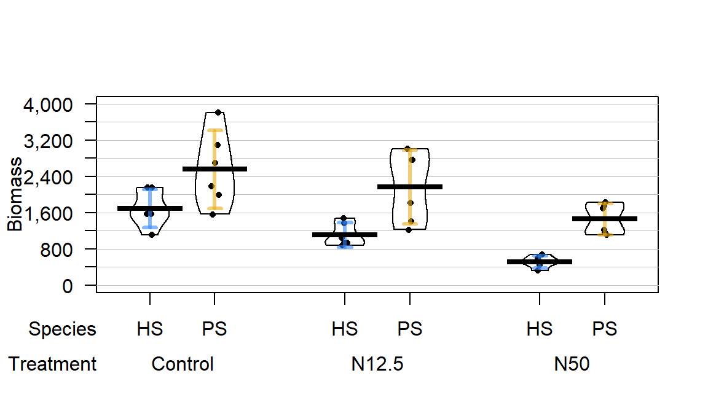
<p class="caption">(\#fig:Figure9-2)(ref:fig9-2)</p>
</div>

In a 16-year experiment, @Gundale2013 studied the impacts
of Nitrogen (``N``) additions on the mass of two feather moss species 
(*Pleurozium schreberi* (``PS``) and *Hylocomium* (``HS``)) in the Svartberget
Experimental Forest in Sweden. They used a randomized block design: here this 
means that within each of 6 blocks (pre-specified areas that were divided into 
three experimental units or plots of area 0.1 hectare), one of the three 
treatments were randomly applied. ***Randomized block designs*** involve
randomization of levels within blocks or groups as opposed to ***completely
randomized designs*** where each ***experimental unit*** (the subject or plot
that will be measured) could be randomly assigned to any treatment. This is
done in agricultural studies to control for systematic differences across the
fields by making sure each treatment level is used in each area or ***block***
of the field. 

\indent The three treatments involved different levels of N applied immediately after
snow melt, *Control* (no additional N -- just the naturally deposited 
amount), 12.5 kg N $\text{ha}^{-1}\text{yr}^{-1}$ (*N12.5*), and 
50 kg N $\text{ha}^{-1}\text{yr}^{-1}$ (*N50*). The researchers were 
interested in whether the treatments would have differential impacts on the 
two species of moss growth. They measured a variety of other
variables, but here we focus on the estimated *biomass* per hectare (mg/ha) of
the *species* (*PS* or *HS*), both measured for each plot within each block,
considering differences across the *treatments* (*Control*, *N12.5*, or *N50*).
The beanplot in Figure \@ref(fig:Figure9-2) provides some initial information
about the responses. Initially there seem to be some differences in the
combinations of groups and some differences in variability in the different
groups, especially with much more variability in the *control* treatment level
and more variability in the *PS* responses than for the *HS* responses. 


```r
gdn <- read_csv("http://www.math.montana.edu/courses/s217/documents/gundalebachnordin_2.csv")
gdn$Species <- factor(gdn$Species)
gdn$Treatment <- factor(gdn$Treatment)
require(beanplot)
beanplot(Massperha~Species+Treatment, data=gdn, side = "b", 
         col=list("white","lightgreen"), xlab="Treatment", ylab="Biomass")
legend("topright", bty="n", c("HS", "PS"), fill=c("white","lightgreen"))
```

\indent The Two-WAY ANOVA model that contains a *species* by *treatment* interaction is
of interest (this has a quantitative response variable of *biomass* and two
categorical predictors of *species* and *treatment*)^[The researchers did not
do this analysis so never directly addressed this research question although
they did discuss it in general ways.]. We can make an interaction plot to 
focus on the observed patterns of the means across the combinations of levels
as provided in Figure \@ref(fig:Figure9-3). The interaction
plot suggests a relatively additive pattern of differences between *PS* and 
*HS* across the three treatment levels. However, the variability seems to be 
quite different based on this plot as well. 

(ref:fig9-3) Interaction plot of biomass responses by treatment and species. 

<div class="figure">
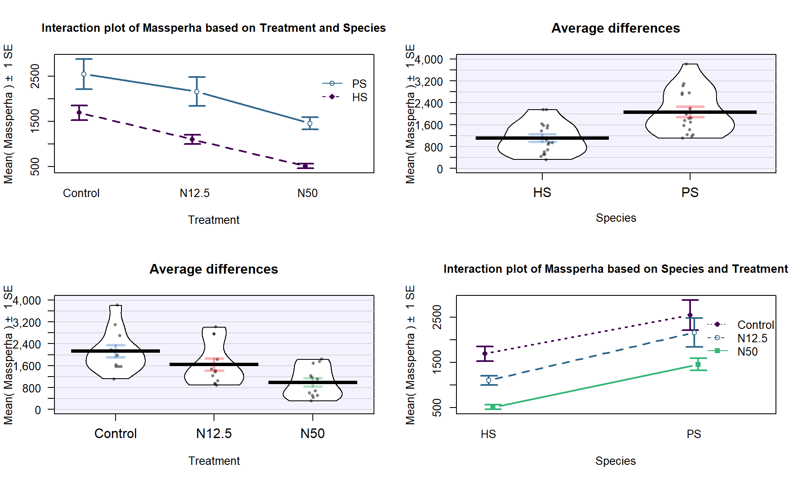
<p class="caption">(\#fig:Figure9-3)(ref:fig9-3)</p>
</div>


```r
source("http://www.math.montana.edu/courses/s217/documents/intplot.R")
intplot(Massperha~Species*Treatment, data=gdn, col=c(1,2), lwd=2)
```

Based on the initial plots, we are going to be concerned about the equal
variance assumption initially. We can fit the interaction model and explore
the diagnostic plots to verify that we have a problem. 

(ref:fig9-4) Diagnostic plots of treatment by species interaction model for
Biomass.


```r
m1 <- lm(Massperha~Species*Treatment, data=gdn)
summary(m1)
```

```
## 
## Call:
## lm(formula = Massperha ~ Species * Treatment, data = gdn)
## 
## Residuals:
##    Min     1Q Median     3Q    Max 
## -992.6 -252.2  -64.6  308.0 1252.9 
## 
## Coefficients:
##                          Estimate Std. Error t value Pr(>|t|)
## (Intercept)               1694.80     211.86   8.000 6.27e-09
## SpeciesPS                  859.88     299.62   2.870  0.00745
## TreatmentN12.5            -588.26     299.62  -1.963  0.05893
## TreatmentN50             -1182.91     299.62  -3.948  0.00044
## SpeciesPS:TreatmentN12.5   199.42     423.72   0.471  0.64130
## SpeciesPS:TreatmentN50      88.29     423.72   0.208  0.83636
## 
## Residual standard error: 519 on 30 degrees of freedom
## Multiple R-squared:  0.6661,	Adjusted R-squared:  0.6104 
## F-statistic: 11.97 on 5 and 30 DF,  p-value: 2.009e-06
```

```r
par(mfrow=c(2,2), oma=c(0,0,2,0))
plot(m1, sub.caption="Initial Massperha 2-WAY model")
```

<div class="figure">
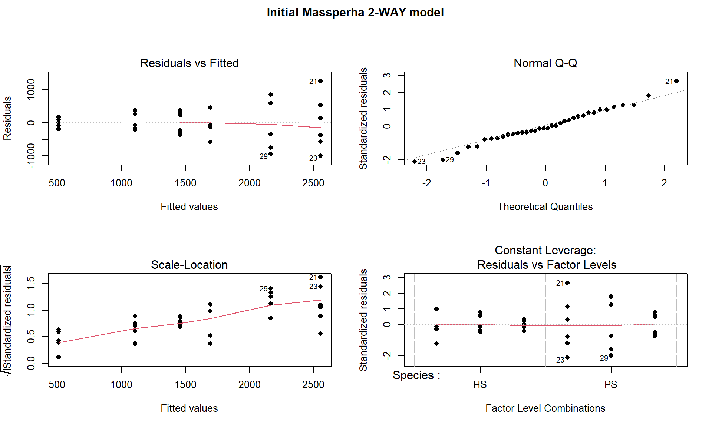
<p class="caption">(\#fig:Figure9-4)(ref:fig9-4)</p>
</div>

There is a clear problem with non-constant variance showing up in a fanning 
shape^[Instructors in this class often get asked what a problem with 
non-constant variance actually looks like -- this is it!]
in the Residuals versus Fitted and Scale-Location plots in Figure 
\@ref(fig:Figure9-4). Interestingly, the normality assumption is not an issue
so hopefully we will not worsen this result by using a transformation to try to
address the non-constant variance issue. The independence assumption is
violated in two ways for this model by this study design -- the blocks create
clusters or groups of observations and the block should be accounted for (they
did this in their models by adding *block* as a categorical variable to their
models). Using blocked designs and accounting for the blocks in the model will
typically give more precise inferences for the effects of interest, the
treatments randomized within the blocks. Additionally, **there are two
measurements on each plot** within block, one for *SP* and one for *HS* and
these might be related (for example, high *HS* biomass might be associated with
high *SP*) so putting both observations into a model **violates the
independence assumption** at a second level. It takes more advanced statistical
models (called linear mixed models) to see how to fully deal with
this, for now it is important to recognize the issues. The more complicated
models provide similar results here and include the *treatment* by *species*
interaction we are going to explore, they just add to this basic model to
account for these other issues. 

\indent Remember that **before using a *log*-transformation, you always must check
that the responses are strictly greater than 0**:


```r
summary(gdn$Massperha)
```

```
##    Min. 1st Qu.  Median    Mean 3rd Qu.    Max. 
##   319.1  1015.1  1521.8  1582.3  2026.6  3807.6
```

The minimum is 319.1 so it is safe to apply the natural log-transformation to
the response variable (*Biomass*) and repeat the previous plots:

(ref:fig9-5) Beanplot and interaction plot of the log-Biomass responses by 
treatment and species.


```r
gdn$logMassperha <- log(gdn$Massperha)
par(mfrow=c(1,2))
beanplot(logMassperha~Species+Treatment, data=gdn, side = "b",
         col= list("white","lightgreen"), xlab="Treatment", 
         ylab="log-Biomass", main="(a)")
legend("topright", bty="n", c("HS","PS"), fill=c("white","lightgreen"))
intplot(logMassperha~Species*Treatment, data=gdn, col=c(1,2), lwd=2, main="(b)")
```

<div class="figure">
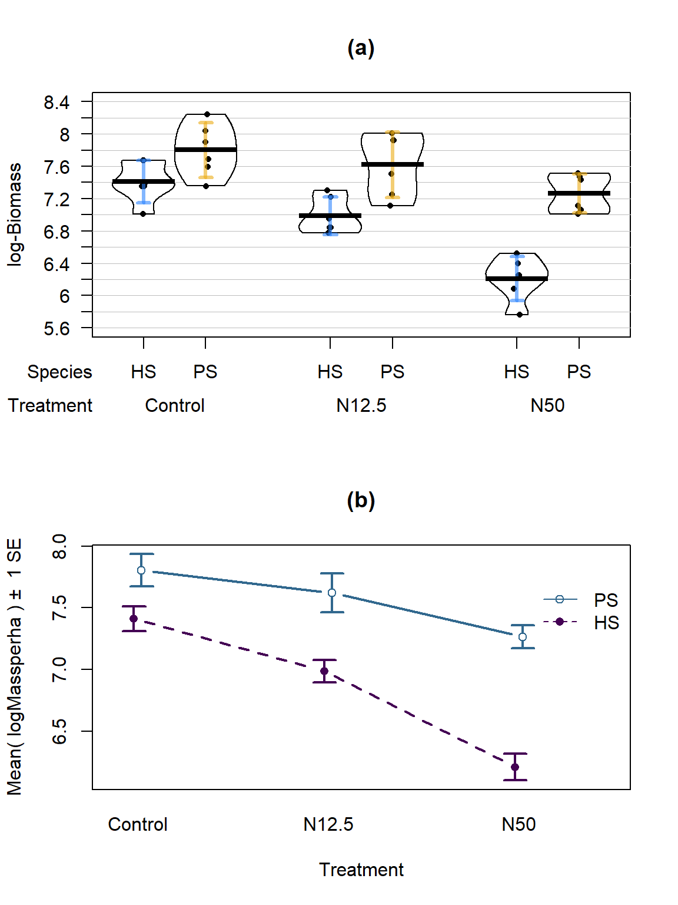
<p class="caption">(\#fig:Figure9-5)(ref:fig9-5)</p>
</div>

The variability in the beanplot in Figure \@ref(fig:Figure9-5)(a) appears to be
more consistent across the groups but the lines appear to be a little less 
parallel in the interaction plot Figure \@ref(fig:Figure9-5)(b) for
the log-scale response. That is not problematic but suggests that we may now
have an interaction present -- it is hard to tell visually sometimes. Again, 
fitting the interaction model and exploring the diagnostics is the best way to
assess the success of the transformation applied. 

\indent The log(Mass per ha) version of the response variable has little issue with
changing variability present in the residuals in Figure \@ref(fig:Figure9-6)
with much more similar variation in the residuals across the fitted values. 
The normality assumption is leaning toward a slight violation with too little
variability in the right tail and so maybe a little bit of a left skew. This
is only a minor issue and fixes the other big issue (clear non-constant 
variance), so this model is at least closer to giving us trustworthy 
inferences than the original model. The model presents moderate evidence of a 
*Species* by *Treatment* interaction ($F(2,30)=4.2$, p-value$=0.026$). This
suggests that the effects on the log-biomass of the treatments differ between
the two species. The mean log-biomass is lower for *HS* than *PS* with the impacts of increased nitrogen causing *HS* mean log-biomass to decrease more rapidly than for *PS*. In other words, increasing
nitrogen has more of an impact on the resulting log-biomass for *HS* than for 
*PS*. The highest mean log-biomass rates were observed under the control 
conditions for both species making nitrogen appear to inhibit growth of these
species. 

(ref:fig9-6) Diagnostic plots of treatment by species interaction model for
log-Biomass. 


```r
m2 <- lm(logMassperha~Species*Treatment, data=gdn)
summary(m2)
```

```
## 
## Call:
## lm(formula = logMassperha ~ Species * Treatment, data = gdn)
## 
## Residuals:
##      Min       1Q   Median       3Q      Max 
## -0.51138 -0.16821 -0.02663  0.23925  0.44190 
## 
## Coefficients:
##                          Estimate Std. Error t value Pr(>|t|)
## (Intercept)                7.4108     0.1160  63.902  < 2e-16
## SpeciesPS                  0.3921     0.1640   2.391  0.02329
## TreatmentN12.5            -0.4228     0.1640  -2.578  0.01510
## TreatmentN50              -1.1999     0.1640  -7.316 3.79e-08
## SpeciesPS:TreatmentN12.5   0.2413     0.2319   1.040  0.30645
## SpeciesPS:TreatmentN50     0.6616     0.2319   2.853  0.00778
## 
## Residual standard error: 0.2841 on 30 degrees of freedom
## Multiple R-squared:  0.7998,	Adjusted R-squared:  0.7664 
## F-statistic: 23.96 on 5 and 30 DF,  p-value: 1.204e-09
```

```r
require(car)
Anova(m2)
```

```
## Anova Table (Type II tests)
## 
## Response: logMassperha
##                   Sum Sq Df F value    Pr(>F)
## Species           4.3233  1  53.577 3.755e-08
## Treatment         4.6725  2  28.952 9.923e-08
## Species:Treatment 0.6727  2   4.168   0.02528
## Residuals         2.4208 30
```

```r
par(mfrow=c(2,2), oma=c(0,0,2,0))
plot(m2, sub.caption="log-Massperha 2-WAY model")
```

<div class="figure">
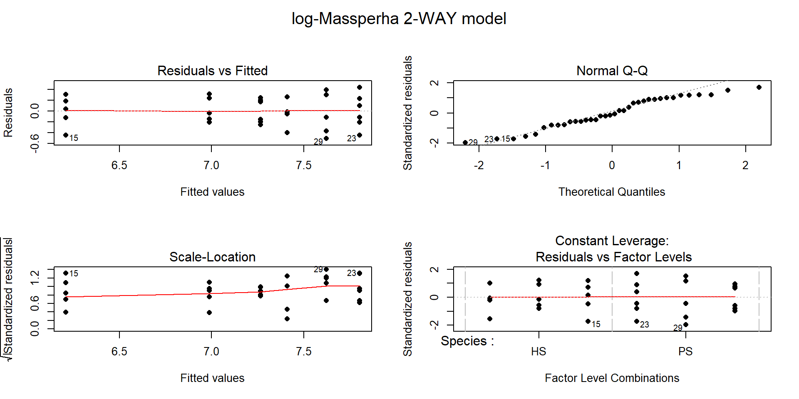
<p class="caption">(\#fig:Figure9-6)(ref:fig9-6)</p>
</div>

\indent The researchers actually applied a $\log(y+1)$ transformation to all the 
variables. This was used because one of their many variables had a value of 0
and so they added 1 to avoid analyzing a $-\infty$ response. This was not 
needed for most of their variables because most did not attain the value 
of 0. Adding a small value to observations and then log-transforming is a 
common but completely arbitrary practice and the choice of the added value can
impact the results. Sometimes considering a square-root transformation can 
accomplish similar benefits as the log-transform and be applied safely to 
responses that include 0s. Or more complicated statistical models can be used
that allow 0s in responses and still account for the violations of the linear 
model assumptions -- see a statistician or continue exploring more advanced
statistical methods for ideas in this direction. 

\indent The term-plot in Figure \@ref(fig:Figure9-7) provides another display of the
results with some information on the results for each combination of the 
species and treatments. Finding evidence that the treatments caused different
results for the different species is a good first start. And it appears that 
there are some clear differences among certain combinations such as the mean
for *PS-Control* is clearly larger than for *HS*-*N50*. The researchers were 
probably really interested in whether the *N12.5* results differed from 
*Control* for *HS* and whether the *species* differed at *Control* sites. As 
part of performing all pair-wise comparisons, we can assess those sorts of 
detailed questions. This sort of follow-up could be considered in any
Two-Way ANOVA model but will be most interesting in situations where there are
important interactions. 

(ref:fig9-7) Term-plot of the interaction model for log-biomass.


```r
require(effects)
plot(allEffects(m2), multiline=T, ci.style="bars")
```

<div class="figure">
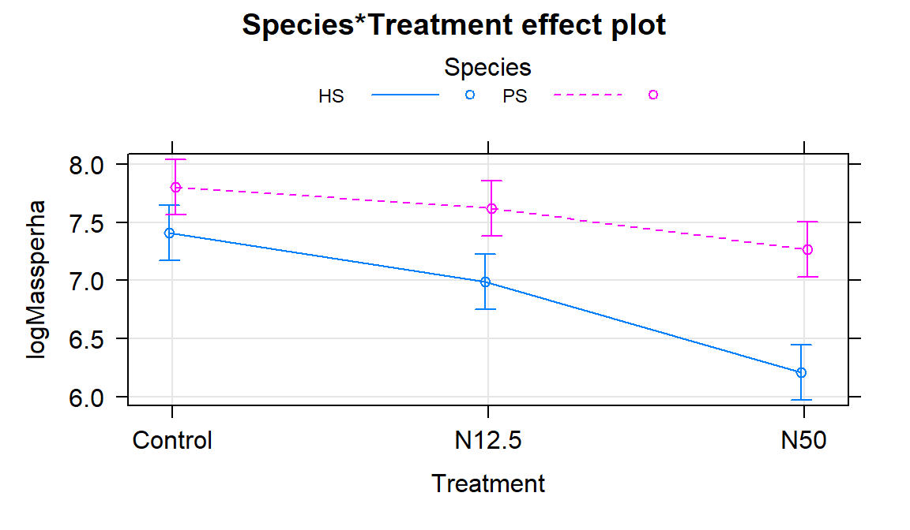
<p class="caption">(\#fig:Figure9-7)(ref:fig9-7)</p>
</div>

**Follow-up Pairwise Comparisons:**

\indent Given strong evidence of an interaction, many researchers would like more
details about the source of the differences. We can re-fit the model with a 
unique mean for each combination of the two predictor variables, fitting a 
One-Way ANOVA model (here with six levels) and using Tukey's HSD to provide 
safe inferences for differences among pairs of the true means. There are six 
groups corresponding to all combinations of *Species* (*HS*, *PS*) and
treatment levels (*Control*, *N12.5*, and *N50*) provided in the new 
variable ``SpTrt`` by the ``interaction`` function with new levels of 
*HS.Control*, *PS.Control*, *HS.N12.5*, *PS.N12.5*, *HS.N50*, and *PS.N50*. The
One-Way ANOVA $F$-test ($F(5,30)=23.96$, p-value $<0.0001$) suggests that there
is strong evidence of some difference in the true mean log-biomass among the six
treatment/species combinations. Note that the One-Way ANOVA table contains the test for
at least one of those means being different from the others; the interaction
test above was testing a more refined hypothesis -- does the effect of
treatment differ between the two species? With a small p-value from the overall
One-Way ANOVA test, the pair-wise comparisons should be of interest. 


```r
#Create new variable:
gdn$SpTrt <- interaction(gdn$Species, gdn$Treatment)
levels(gdn$SpTrt)
```

```
## [1] "HS.Control" "PS.Control" "HS.N12.5"   "PS.N12.5"   "HS.N50"    
## [6] "PS.N50"
```

```r
newm2 <- lm(logMassperha~SpTrt, data=gdn)
Anova(newm2)
```

```
## Anova Table (Type II tests)
## 
## Response: logMassperha
##           Sum Sq Df F value    Pr(>F)
## SpTrt     9.6685  5  23.963 1.204e-09
## Residuals 2.4208 30
```

```r
require(multcomp)
PWnewm2 <- glht(newm2, linfct=mcp(SpTrt="Tukey"))
confint(PWnewm2)
```

```
## 
## 	 Simultaneous Confidence Intervals
## 
## Multiple Comparisons of Means: Tukey Contrasts
## 
## 
## Fit: lm(formula = logMassperha ~ SpTrt, data = gdn)
## 
## Quantile = 3.043
## 95% family-wise confidence level
##  
## 
## Linear Hypotheses:
##                              Estimate lwr      upr     
## PS.Control - HS.Control == 0  0.39210 -0.10698  0.89118
## HS.N12.5 - HS.Control == 0   -0.42277 -0.92185  0.07630
## PS.N12.5 - HS.Control == 0    0.21064 -0.28843  0.70972
## HS.N50 - HS.Control == 0     -1.19994 -1.69901 -0.70086
## PS.N50 - HS.Control == 0     -0.14620 -0.64528  0.35288
## HS.N12.5 - PS.Control == 0   -0.81487 -1.31395 -0.31580
## PS.N12.5 - PS.Control == 0   -0.18146 -0.68053  0.31762
## HS.N50 - PS.Control == 0     -1.59204 -2.09112 -1.09296
## PS.N50 - PS.Control == 0     -0.53830 -1.03738 -0.03923
## PS.N12.5 - HS.N12.5 == 0      0.63342  0.13434  1.13249
## HS.N50 - HS.N12.5 == 0       -0.77717 -1.27624 -0.27809
## PS.N50 - HS.N12.5 == 0        0.27657 -0.22250  0.77565
## HS.N50 - PS.N12.5 == 0       -1.41058 -1.90966 -0.91151
## PS.N50 - PS.N12.5 == 0       -0.35685 -0.85592  0.14223
## PS.N50 - HS.N50 == 0          1.05374  0.55466  1.55281
```

We can also generate the Compact Letter Display (CLD) to help us group up the
results. 


```r
cld(PWnewm2)
```

```
## HS.Control PS.Control   HS.N12.5   PS.N12.5     HS.N50     PS.N50 
##       "bd"        "d"        "b"       "cd"        "a"       "bc"
```

And we can add the CLD to an interaction plot to create Figure 
\@ref(fig:Figure9-8). Researchers often use displays like this to simplify the
presentation of pair-wise comparisons. Sometimes researchers add bars or stars
to provide the same information about pairs that are or are not detectably
different. The following code creates the plot of these results using our 
``intplot`` function and the ``cld=T`` option. 

(ref:fig9-8) Interaction plot for log-biomass with CLD from Tukey's HSD for all
pairwise comparisons.


```r
intplot(logMassperha~Species*Treatment, cld=T, cldshift=0.15,
        cldcol=c(2,3,4,5,6,8), data=gdn, lwd=2, 
        main="Interaction with CLD from Tukey's HSD on One-Way ANOVA")
```

<div class="figure">
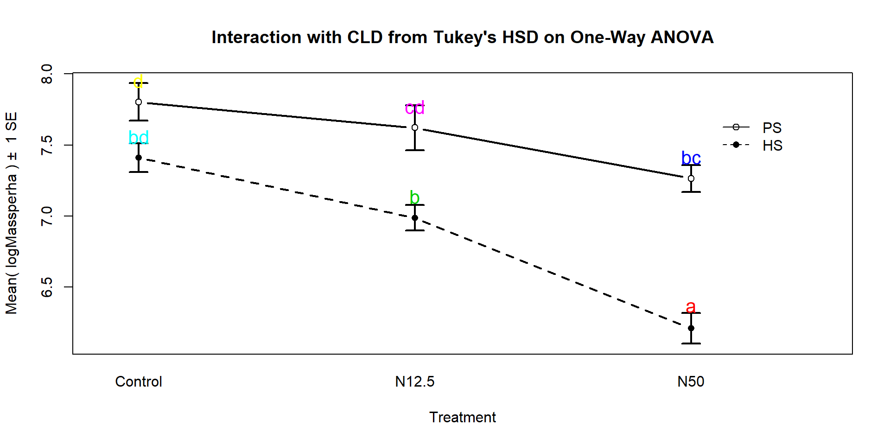
<p class="caption">(\#fig:Figure9-8)(ref:fig9-8)</p>
</div>

\indent These results suggest that *HS-N50* is detectably different from all the other
groups (letter "a"). The rest of the story is more complicated since many of
the sets contain overlapping groups in terms of detectable differences. Some 
specific aspects of those results are most interesting. The mean log-biomasses
were not detectably different between the (they share a "d"). In other words,
without treatment, there is little to no evidence of a difference in how much of the two
species are present in the sites. For *N12.5* and *N50* treatments, there are
detectable differences between the *Species*. These comparisons are probably of
the most interest initially and suggest that the treatments have a different
impact on the two species, remembering that in the control treatments, the
results for the two species were not detectably different. Further explorations
of the sizes of the differences that can be extracted from selected confidence
intervals in the Tukey's HSD results printed above. Because these results are for the log-scale responses, we could exponentiate coefficients for groups that are deviations from the baseline category and interpret those as multiplicative changes in the median relative to the baseline group, but at the end of this amount of material, I thought that might stop you from reading on any further...

\sectionmark{Ants learn to rely on more informative attributes}

## Ants learn to rely on more informative attributes during decision-making	{#section9-3}

\sectionmark{Ants learn to rely on more informative attributes}

In @Sasaki2013, a set of ant colonies were randomly assigned to one
of two treatments to study whether the ants could be "trained" to have a
preference for or against certain attributes for potential nest sites. The
colonies were either randomly assigned to experience the repeated choice of two
identical colony sites except for having an inferior light or entrance size
attribute. Then the ants were allowed to choose between two nests, one that had
a large entrance but was dark and the other that had a small entrance but was
bright. 54 of the 60 colonies that were randomly assigned to one of the two
treatments completed the experiment by making a choice between the two types of
sites. The data set and some processing code follows. 

\indent The first question of interest is what type of analysis is appropriate here.
Once we recognize that there are two categorical variables being considered
(*Treatment* group with two levels and *After* choice with two levels
*SmallBright* or *LargeDark* for what the colonies selected), then this is recognized as being within our
Chi-square testing framework. The random assignment of colonies (the subjects 
here) to treatment levels tells us that the ***Chi-square Homogeneity test***
is appropriate here and that we can make causal statements if we find evidence
of differences in the patterns of responses. 

(ref:fig9-9) Stacked bar chart for Ant Colony results.


```r
sasakipratt <- read_csv("http://www.math.montana.edu/courses/s217/documents/sasakipratt.csv")
sasakipratt$group <- factor(sasakipratt$group)
levels(sasakipratt$group) <- c("Light","Entrance")
sasakipratt$after <- factor(sasakipratt$after)
levels(sasakipratt$after) <- c("SmallBright","LargeDark")
sasakipratt$before <- factor(sasakipratt$before)
levels(sasakipratt$before) <- c("SmallBright","LargeDark")
plot(after~group, data=sasakipratt)
```

<div class="figure">
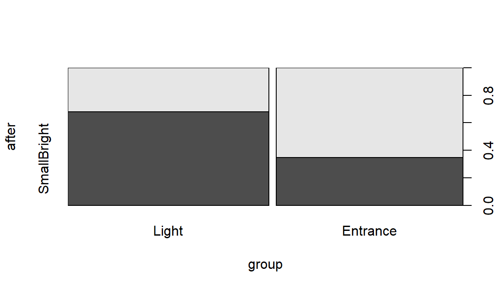
<p class="caption">(\#fig:Figure9-9)(ref:fig9-9)</p>
</div>


```r
require(mosaic)
tally(~group+after, data=sasakipratt)
```

```
##           after
## group      SmallBright LargeDark
##   Light             19         9
##   Entrance           9        17
```

```r
table1 <- tally(~group+after, data=sasakipratt, margins=F)
```

The null hypothesis of interest here is that there is no difference in the
distribution of responses on *After* -- the rates of their choice of den types
-- between the two treatment *groups* in the population of all ant colonies
like those studied. The alternative is that there is some difference in the
distributions of *After* between the *groups* in the population. 

\indent To use the Chi-square distribution to find a p-value for the $X^2$ statistic,
we need all the expected cell counts to be larger than 5, so we should check 
that. Note that in the following, the ``correct=F`` option is used to keep the
function from slightly modifying the statistic used that occurs when overall 
sample sizes are small. 


```r
chisq.test(table1, correct=F)$expected
```

```
##           after
## group      SmallBright LargeDark
##   Light       14.51852  13.48148
##   Entrance    13.48148  12.51852
```

Our expected cell count condition is met, so we can proceed to explore the 
results of the test:


```r
chisq.test(table1, correct=F)
```

```
## 
## 	Pearson's Chi-squared test
## 
## data:  table1
## X-squared = 5.9671, df = 1, p-value = 0.01458
```

The $X^2$ statistic is 5.97 which, if our assumptions are met, should 
approximately follow a Chi-squared distribution with $(R-1)*(C-1)=1$ degrees of
freedom under the null hypothesis. The p-value is 0.015, suggesting that there
is moderate to strong evidence against the null hypothesis. We can conclude that there is moderate evidence of a
difference in the distribution of the responses between the two treated groups
in the population of all ant colonies that could have been treated. Because of
the random assignment, we can say that the treatments caused differences in the
colony choices. These results cannot be extended to ants beyond those being
studied by these researchers because they were not randomly selected. 

\indent Further exploration of the standardized residuals can provide more insights in
some situations, although here they are similar for all the cells:


```r
chisq.test(table1, correct=F)$residuals
```

```
##           after
## group      SmallBright LargeDark
##   Light       1.176144 -1.220542
##   Entrance   -1.220542  1.266616
```

When all the standardized residual contributions are similar, that suggests
that there are differences in all the cells from what we would expect if the
null hypothesis were true. Basically, that means that what we observed is a bit
larger than expected for the *Light* treatment group in the *SmallBright*
choice and lower than expected in *LargeDark* -- those treated ants preferred
the small and bright den. And for the *Entrance* treated group, they preferred
the large entrance, dark den at a higher rate than expected if the null is 
true and lower than expected in the small entrance, bright location. 

\indent The researchers extended this basic result a little further using a statistical
model called ***logistic regression***, which involves using something like a
linear model but with a categorical response variable (well -- it actually only
works for a two-category response variable). They also had measured which of
the two types of dens that each colony chose before treatment and controlled
for that choice. So the actual model used in their paper contained two
predictor variables -- the randomized treatment received that we explored here
and the prior choice of den type. The interpretation of their results related
to the same treatment effect, but they were able to discuss it after adjusting
for the colonies previous selection. Their conclusions were similar to those
found with our simpler analysis. Logistic regression models are a special case
of what are called *generalized linear models* and are a topic for the next level
of statistics if you continue exploring.

\sectionmark{understanding vertebrate diversification in deep time}

## Multi-variate models are essential for understanding vertebrate diversification in deep time	{#section9-4}

\sectionmark{understanding vertebrate diversification in deep time}

@Benson2012 published a paleontology study that considered
modeling the diversity of *Sauropodomorphs* across $n=26$ "stage-level" time
bins. Diversity is measured by the count of the number of different species
that have been found in a particular level of fossils. Specifically, the counts
in the *Sauropodomorphs* group were obtained for stages between *Carnian* and
*Maastrichtian*, with the first three stages in the *Triassic*, the next ten in
the *Jurassic*, and the last eleven in the *Cretaceous*. They were concerned 
about variation in sampling
efforts and the ability of paleontologists to find fossils across different
stages creating a false impression of the changes in biodiversity (counts of species) over time.
They first wanted to see if the species counts were related to factors such as
the count of dinosaur-bearing-formations (*DBF*) and the count of
dinosaur-bearing-collections (*DBC*) that have been identified for each period.
The thought is that if there are more formations or collections of fossils from
certain stages, the diversity might be better counted (more found of those
available to find) and those stages with less information available might be
under-counted. They also measured the length of each stage (*Duration*) but did
not consider it in their models since they want to reflect the diversity and
longer stages would likely have higher diversity. 

\indent Their main goal was to develop a model that would **control for** the effects
of sampling efforts and allow them to perform inferences for whether the
diversity was different between the *Triassic/Jurassic* (grouped together) and
considered models that included two different versions of sampling effort
variables and one for the comparisons of periods (an indicator variable 
*TJK*=0 if the observation is in *Triassic* or *Jurassic* or 1 if in 
*Cretaceous*). They *log-e* transformed all their quantitative variables
because the untransformed variables created diagnostic issues including
influential points. They explored a model just based on the *DBC*
predictor^[This was not even close to their top AIC model so they made an odd
choice.] and they analyzed the residuals from that model to see if the
biodiversity was different in the *Cretaceous* or before, finding a 
"p-value **>=** 0.0001" (I think they meant < 0.0001^[I had students read this
paper in a class and one decided that this was a reasonable way to report small
p-values -- it is WRONG. We are interested in how small a p-value might be and
saying it is over a value is never useful, especially if you say it is larger than a tiny number.]). They were comparing the MLR
models you learned to some extended regression models that incorporated a 
correction for correlation in the responses over time, but we can proceed with
fitting some of their MLR models and using an AIC comparison similar to what
they used. There are some obvious flaws in their analysis and results that we
will avoid^[All too often, I read journal articles that have under-utilized, 
under-reported, mis-applied, or mis-interpreted statistical methods and
results. One of the reasons that I wanted to write this book was to help more
people move from basic statistical knowledge to correct use of intermediate
statistical methods and beginning to see the potential in more advanced
statistical methods. It has taken me many years of being a statistician just to
feel armed for battle when confronted with new applications and two stat
courses are not enough to get you there, but you have to start somewhere. You
are only maybe two or three hundred hours into your 10,000 hours required for mastery. 
This book is intended get you some solid fundamentals to build on or a
few intermediate tools to use if this is your last statistics training
experience.]. 

\indent First, we start with a plot of the log-diversity vs the log-dinosaur bearing
collections by period. We can see fairly strong positive relationships between
the log amounts of collections and species found with potentially similar
slopes for the two periods but what look like different intercepts. Especially
for *TJK* level 1 (*Cretaceous* period) observations, we might need to worry
about a curving relationship. Note that a similar plot can also be made using
the formations version of the quantitative predictor variable and that the
research questions involve whether *DBF* or *DBC* are better predictor
variables. 

(ref:fig9-10) Scatterplot of log-biodiversity vs log-DBCs by TJK (TJK=1 for *Cretaceous*).

<div class="figure">
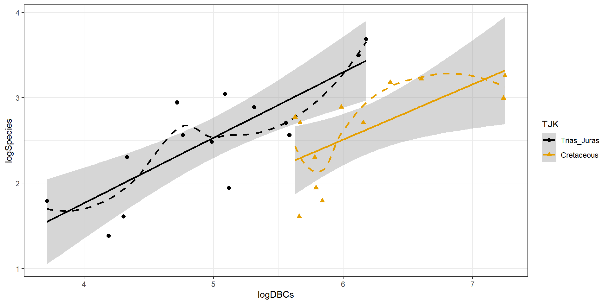
<p class="caption">(\#fig:Figure9-10)(ref:fig9-10)</p>
</div>

\indent The following results will allow us to explore models similar to theirs. One
"full" model they considered is:

$$\log{(\text{count})}_i=\beta_0 + \beta_1\cdot\log{(\text{DBC})}_i 
+ \beta_2I_{\text{TJK},i} + \varepsilon_i$$

which was compared to 

$$\log{(\text{count})}_i=\beta_0 + \beta_1\cdot\log{(\text{DBF})}_i 
+ \beta_2I_{\text{TJK},i} + \varepsilon_i$$

as well as the simpler models that each suggests:

$$\begin{array}{rl}
\log{(\text{count})}_i &=\beta_0 + \beta_1\cdot\log{(\text{DBC})}_i 
+ \varepsilon_i, \\
\log{(\text{count})}_i &=\beta_0 + \beta_1\cdot\log{(\text{DBF})}_i
+ \varepsilon_i, \\
\log{(\text{count})}_i &=\beta_0 + \beta_2I_{\text{TJK},i} 
+ \varepsilon_i, \text{ and} \\
\log{(\text{count})}_i &=\beta_0 + \varepsilon_i.  \\
\end{array}$$

Both versions of the models (based on *DBF* or *DBC*) start with an MLR model
with a quantitative variable and two slopes. We can obtain some of the needed
model selection results from the first full model using:


```r
bd1 <- lm(logSpecies~logDBCs+TJK, data=bm)
require(MuMIn)
options(na.action = "na.fail")
dredge(bd1, rank="AIC", 
       extra=c("R^2", adjRsq=function(x) summary(x)$adj.r.squared))
```

```
## Global model call: lm(formula = logSpecies ~ logDBCs + TJK, data = bm)
## ---
## Model selection table 
##   (Intrc)  lgDBC TJK      R^2   adjRsq df  logLik  AIC delta weight
## 4 -1.0890 0.7243   + 0.580900  0.54440  4 -12.652 33.3  0.00  0.987
## 2  0.1988 0.4283     0.369100  0.34280  3 -17.969 41.9  8.63  0.013
## 1  2.5690            0.000000  0.00000  2 -23.956 51.9 18.61  0.000
## 3  2.5300          + 0.004823 -0.03664  3 -23.893 53.8 20.48  0.000
## Models ranked by AIC(x)
```

And from the second model:


```r
bd2 <- lm(logSpecies~logDBFs+TJK, data=bm)
dredge(bd2, rank="AIC",
       extra=c("R^2", adjRsq=function(x) summary(x)$adj.r.squared))
```

```
## Global model call: lm(formula = logSpecies ~ logDBFs + TJK, data = bm)
## ---
## Model selection table 
##   (Intrc)  lgDBF TJK      R^2   adjRsq df  logLik  AIC delta weight
## 4 -2.4100 1.3710   + 0.519900  0.47810  4 -14.418 36.8  0.00  0.995
## 2  0.5964 0.4882     0.209800  0.17690  3 -20.895 47.8 10.95  0.004
## 1  2.5690            0.000000  0.00000  2 -23.956 51.9 15.08  0.001
## 3  2.5300          + 0.004823 -0.03664  3 -23.893 53.8 16.95  0.000
## Models ranked by AIC(x)
```

The top AIC model is 
$\log{(\text{count})}_i=\beta_0 + \beta_1\cdot\log{(\text{DBC})}_i + \beta_2I_{\text{TJK},i} + \varepsilon_i$ 
with an AIC of 33.3. The next best
model was $\log{(\text{count})}_i=\beta_0 + \beta_1\cdot\log{(\text{DBF})}_i + \beta_2I_{\text{TJK},i} + \varepsilon_i$ 
with an AIC of 36.8, so 3.5 AIC units worse than the top model. We put these
two runs of results together in Table \@ref(tab:Table9-1), re-computing all the
AICs based on the top model from the first full model considered. 

(ref:tab9-1) Model comparision table.


------------------------------------------------------------------------------------------------------------------------------------------------------------------------------------------------
**Model**&nbsp;&nbsp;&nbsp;&nbsp;&nbsp;&nbsp;&nbsp;&nbsp;&nbsp;&nbsp;&nbsp;&nbsp;&nbsp;&nbsp;&nbsp;&nbsp;     **R^2^**   **adj R^2^**&nbsp;   **df**   **logLik**&nbsp;   **AIC**   $\BD$**AIC**
----------------------------------------------------------------------------------------------------------- ---------- -------------------- -------- ------------------ --------- --------------
$\log(\text{count})_i=\beta_0                                                                                   0.5809               0.5444        4            -12.652      33.3              0
+                                                                                                                                                                                               
\beta_1\cdot\log(\text{DBC})_i                                                                                                                                                                  
+ \beta_2I_{\text{TJK},i} +                                                                                                                                                                     
\varepsilon_i$                                                                                                                                                                                  

$\log(\text{count})_i=\beta_0                                                                                   0.5199               0.4781        4            -14.418      36.8            3.5
+                                                                                                                                                                                               
\beta_1\cdot\log(\text{DBF})_i                                                                                                                                                                  
+ \beta_2I_{\text{TJK},i} +                                                                                                                                                                     
\varepsilon_i$                                                                                                                                                                                  

$\log(\text{count})_i=\beta_0                                                                                   0.3691               0.3428        3            -17.969      41.9            8.6
+                                                                                                                                                                                               
\beta_1\cdot\log(\text{DBC})_i                                                                                                                                                                  
+ \varepsilon_i$                                                                                                                                                                                

$\log(\text{count})_i=\beta_0                                                                                   0.2098               0.1769        3            -20.895      47.8           14.5
+                                                                                                                                                                                               
\beta_1\cdot\log(\text{DBF})_i                                                                                                                                                                  
+ \varepsilon_i$                                                                                                                                                                                

$\log(\text{count})_i=\beta_0                                                                                        0                    0        2            -23.956      51.9           18.6
+ \varepsilon_i$                                                                                                                                                                                

$\log(\text{count})_i=\beta_0                                                                                   0.0048              -0.0366        3            -23.893      53.8           20.5
+ \beta_2I_{\text{TJK},i} +                                                                                                                                                                     
\varepsilon_i$                                                                                                                                                                                  
------------------------------------------------------------------------------------------------------------------------------------------------------------------------------------------------

Table: (\#tab:Table9-1) (ref:tab9-1)


Table \@ref(tab:Table9-1) suggests some interesting results. By itself, $TJK$ leads to the worst performing model on the AIC measure, ranking below a model with nothing in it
(mean-only) and 20.5 AIC units worse than the top model. But the two top models
distinctly benefit from the inclusion of *TJK*. This suggests that after
controlling for the sampling effort, either through *DBC* or *DBF*, the
differences in the stages captured by *TJK* can be more clearly observed. 

\indent So the top model in our (correct) results^[They also had an error in their AIC
results that is difficult to explain here but was due to an un-careful usage of
the results from the more advanced models that account for autocorrelation,
which seems to provide the proper ranking of models (*that they ignored*) but
did not provide the correct differences among models.] suggests that 
*log(DBC)* is important as well as different intercepts for the two periods. We can interrogate
this model further but we should check the diagnostics (Figure
\@ref(fig:Figure9-11)) and consider our model
assumptions first as AICs are not valid if the model assumptions are not met. 

(ref:fig9-11) Diagnostic plots for the top AIC model.


```r
par(mfrow=c(2,2), oma=c(0,0,2,0))
plot(bd1)
```

<div class="figure">
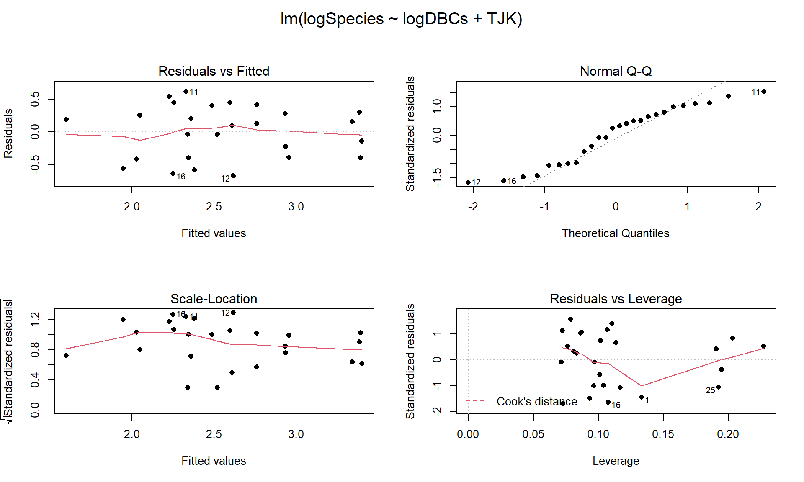
<p class="caption">(\#fig:Figure9-11)(ref:fig9-11)</p>
</div>

\indent The constant variance and assessment of influence do not suggest any real
problems with those assumptions. The normality assumption is possibly violated but shows lighter
tails than expected from a normal distribution and so should cause few
problems with inferences (we would be looking for an answer of "yes, there is a
violation of the normality assumption but, for a bonus point, that problem is 
minor because the pattern is not the problematic type of violation 
because..."). The other assumption that **is violated for all our models** is
that the observations are independent. Between neighboring stages in time,
there would likely be some sort of relationship in the biodiversity so
we should not assume that the observations are independent (this is a
***time series*** of observations). The authors acknowledged this issue but
unskillfully attempted to deal with it. Because an interaction was not 
considered in any of the models, there also is an assumption that the results
are parallel enough for the two groups. The scatterplot in Figure 
\@ref(fig:Figure9-10) suggests that using parallel lines for the two
groups is probably reasonable but a full assessment really should also explore
that fully to verify that there is no support for an interaction. 


\indent Ignoring the violation of the independence assumption, we are otherwise ok to
explore the model more and see what it tells us about biodiversity of
*Sauropodomorphs*. The top model is estimated to be
$\log{(\widehat{\text{count}})}_i=-1.089 + 0.724\cdot\log{(\text{DBC})}_i -0.75I_{\text{TJK},i}$. 
This suggests that for the early observations (*TJK*=0), the model is
$\log{(\widehat{\text{count}})}_i=-1.089 + 0.724\cdot\log{(\text{DBC})}_i$
and for the Cretaceous period (*TJK*=1), the model is
$\log{(\widehat{\text{count}})}_i=-1.089 + -0.75+0.724\cdot\log{(\text{DBC})}_i$
which simplifies to $\log{(\widehat{\text{count}})}_i=-1.84 + 0.724\cdot\log{(\text{DBC})}_i$. This suggests that the sampling efforts
have the same impacts on all observations and having an increase in *logDBCs*
is associated with increases in the mean *log-biodiversity*. Specifically, for 
a 1 log-count increase in the *log-DBCs*, we expect, on average, to have a 
0.724 log-count change in the mean log-biodiversity, after accounting for 
different intercepts for the two periods considered. We could also translate 
this to the original count scale but will leave it as is, because their real
question of interest involves the differences between the periods. The change 
in the y-intercepts of -0.76 suggests that the Cretaceous has a lower average
log-biodiversity by 0.75 log-count, after controlling for the log-sampling 
effort. This suggests that the *Cretaceous* had a lower corrected mean
log-Sauropodomorph biodiversity $\require{enclose} (t_{23}=-3.41;\enclose{horizontalstrike}{\text{p-value}=0.0024})$ than the combined
results for the Triassic and Jurassic. On the original count scale, this 
suggests $\exp(-0.76)=0.47$ times (53% drop in) the median biodiversity count 
per stage for Cretaceous versus the prior time period, after correcting for
log-sampling effort in each stage. 


```r
summary(bd1)
```

```
## 
## Call:
## lm(formula = logSpecies ~ logDBCs + TJK, data = bm)
## 
## Residuals:
##     Min      1Q  Median      3Q     Max 
## -0.6721 -0.3955  0.1149  0.2999  0.6158 
## 
## Coefficients:
##             Estimate Std. Error t value Pr(>|t|)
## (Intercept)  -1.0887     0.6533  -1.666   0.1092
## logDBCs       0.7243     0.1288   5.622 1.01e-05
## TJK1         -0.7598     0.2229  -3.409   0.0024
## 
## Residual standard error: 0.4185 on 23 degrees of freedom
## Multiple R-squared:  0.5809,	Adjusted R-squared:  0.5444 
## F-statistic: 15.94 on 2 and 23 DF,  p-value: 4.54e-05
```

\indent Their study shows some interesting contrasts between methods. They tried to use
AIC-based model selection methods across all the models but then used p-values
to really make their final conclusions. This presents a philosophical
inconsistency that bothers some more than others but should bother everyone. 
One thought is whether they needed to use AICs at all since they wanted to use
p-values? The one reason they might have preferred to use AICs is that it allows
the direct comparison of

$$\log{(\text{count})}_i=\beta_0 + \beta_1\log{(\text{DBC})}_i + \beta_2I_{\text{TJK},i} + \varepsilon_i$$

to 

$$\log{(\text{count})}_i=\beta_0 + \beta_1\cdot\log{(\text{DBF})}_i + \beta_2I_{\text{TJK},i} + \varepsilon_i,$$

exploring whether *DBC* or *DBF* is "better" with *TJK* in the model. There
is no hypothesis test to compare these two models because one is not ***nested***
in the other -- **it is not possible to get from one model to the other by 
setting one or more slope coefficients to 0 so we can't test our way from one
model to the other one**. The AICs suggest that the model with *DBC* and *TJK* is
better than the model with *DBF* and *TJK*, so that helps us make that decision.
After that step, we could rely on $t$-tests or ANOVA $F$-tests to decide whether
further refinement is suggested/possible for the model with *DBC* and *TJK*. This
would provide the direct inferences that they probably want and are trying to
obtain from AICs along with p-values in their paper.

\indent Finally, their results would actually be more valid if they had used a set of
statistical methods designed for modeling responses that are counts of events
or things, especially those whose measurements change as a function of sampling
effort; models called ***Poisson rate models*** would be ideal for their
application. The other aspect of the biodiversity that they measured
for each stage was the duration of the stage. They never incorporated that
information and it makes sense given their interests in comparing biodiversity
across stages, not understanding why more or less biodiversity might occur. But
other researchers might want to estimate the biodiversity after also
controlling for the length of time that the stage lasted and the sampling
efforts involved in detecting the biodiversity of each stage, models that are
only a few steps away from those considered here. In general, this study
presents some of the pitfalls of attempting to use advanced statistical methods
as well as hinting at the benefits. The statistical models are the only way to
access the results of interest; inaccurate usage of statistical models can
provide inaccurate conclusions. They seemed to mostly get the right answers
despite a suite of errors in their work. 

\sectionmark{didgeridoos and sleepiness}

## What do didgeridoos really do about sleepiness?	{#section9-5}

\sectionmark{didgeridoos and sleepiness}

In the practice problems at the end of Chapter 4, a study (Puhan et al. (2005), available at http://www.bmj.com/content/332/7536/266) related to a pre-post, two group comparison of the sleepiness ratings of subjects. They obtained $n$=25 volunteers and they randomized the subjects to either get a lesson or be placed on a waiting list for lessons. They constrained the randomization based on the high/low apnoea and high/low on the Epworth scale of the subjects in their initial observations to make sure they balanced the types of subjects going into the treatment and control groups. They measured the subjects' Epworth value (daytime sleepiness, higher is more sleepy) initially and after four months, where only the treated subjects (those who took lessons) had any intervention. We are interested in whether the mean Epworth scale values changed differently over the four months in the group that got didgeridoo lessons than it did in the control group (that got no lessons). Each subject was measured twice (so the total sample size in the data set is 50) in the data set provided that is available at http://www.math.montana.edu/courses/s217/documents/epworthdata.csv.

\indent The data set was not initially provided by the researchers, but they did provide a plot very similar to Figure
\@ref(fig:Figure9-12). Since this is last section of the book, I am going to use a new package to make the plot, `qplot` from the `ggplot2` package, that violates one of the rules used to this point - it doesn't have a formula interface. If you continue much further in learning to use R, you will see the benefits of some other functions and styles of functions. You will also likely run into the `ggplot2` package, which is part of the "tidyverse" and has been developed to implement sophisticated graphics. For more on this, you can visit https://ggplot2.tidyverse.org/ and the related book by Hadley Wickham, who now works for R-studio. We could have used `ggplot2` to make every graph in the book, but elected to focus on the simpler formula interface that few of these functions use. For now, I am going to use it to make Figure
\@ref(fig:Figure9-12) with the `qplot` function that allows me to display a line for each subject over the two time points (pre and post) of observation and indicate which group the subjects were assigned to. This allows us to see the variation at a given time across subjects and changes over time, which is critical here as this shows clearly why we had a violation of the independence assumption in these data. In the plot, you can see that there are not clear differences in the two groups at the "Pre" time but that treated group seems to have most of the lines go down to lower sleepiness ratings and that this is not happening much for the subjects in the control group.

(ref:fig9-12) Plot of Epworth responses for each subject, initially and after four months, based on treatment groups with one line for each subject connecting observations made over time.


```r
require(readr)
epworthdata <- 
read_csv("http://www.math.montana.edu/courses/s217/documents/epworthdata.csv")
epworthdata$Time <- factor(epworthdata$Time)
levels(epworthdata$Time) <- c("Pre" , "Post")
epworthdata$Group <- factor(epworthdata$Group)
levels(epworthdata$Group) <- c("Control" , "Didgeridoo")

require(ggplot2)
require(ggthemes)
require(viridis)
qplot(x = Time, y = Epworth, data = epworthdata, 
      group = Subject, colour = Group, geom = c("line",
      "point"))+theme_bw()+scale_color_viridis(discrete=TRUE) 
```

<div class="figure">
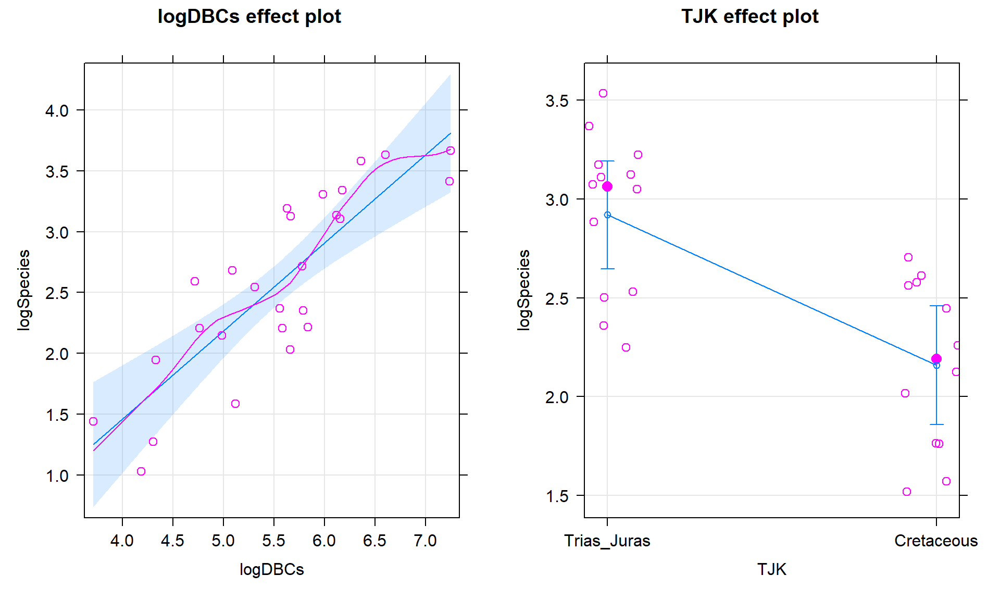
<p class="caption">(\#fig:Figure9-12)(ref:fig9-12)</p>
</div>

\indent This plot seems to contradict the result from the following Two-Way ANOVA (that is a repeat of what you would have seen had you done the practice problem earlier in the book and the related interaction plot) -- there is little to no evidence against the null hypothesis of no interaction between Time and Treatment group on Epworth scale ratings (F(1,46)=1.37, p-value=0.248 as seen in Table 9.2). But this model assumes all the observations are independent and so does not account for the repeated measures on the same subjects. It ends up that if we account for systematic differences in subjects, we can (sometimes) find the differences we are interested in more clearly.


```r
require(car)
lm_int <- lm(Epworth ~ Time*Group,data=epworthdata)
Anova(lm_int)
```

(ref:tab9-2) ANOVA table from Two-Way ANOVA interaction model.


                  Sum Sq   Df     F value      Pr(>F)
-----------  -----------  ---  ----------  ----------
Time          120.745800    1   5.6530102   0.0216381
Group           8.651378    1   0.4050354   0.5276545
Time:Group     29.264947    1   1.3701101   0.2478214
Residuals     982.539675   46                        

\indent If the issue is failing to account for differences in subjects, then why not add "Subject" to the model? There are two things to consider. First, we would need to make sure that "Subject" is a factor variable as the "Subject" variable is initially numerical from 1 to 25. Second, we have to deal with having a factor variable with 25 levels (so 24 indicator variables!). This is a big number and would make writing out the model and interpreting the term-plot for Subject extremely challenging. Fortunately, we are not too concerned about how much higher or lower an individual is than a baseline subject, but we do need to account for it in the model. This sort of "repeated measures" modeling is more often handled by a more complex set of extended regression models that are called mixed effects models and are designed to handle this sort of grouping variable with many levels.

\indent But if we put the Subject factor variable into the previous model, we can use Type II ANOVA tests to test for an interaction between Time and Group (our primary research question) after controlling for subject-to-subject variation. There is a warning message about **aliasing** that occurs when you do this which means that it is not possible to estimate all the $\beta$s in this model (and why we more typically used mixed models to do this sort of thing). Despite this, the test for "Time:Group" in Table 9.3 is correct and now accounts for the repeated measures on the subject. It provides F(1,23)=5.43 with a p-value of 0.029, suggesting that there is moderate evidence for retaining that interaction in the model. This is a notably different result from what we observed in the Two-Way ANOVA interaction model that didn't account for repeated measures on the subjects. 


```r
epworthdata$Subject <- factor(epworthdata$Subject)
lm_int_wsub <- lm(Epworth ~ Time * Group + Subject,data=epworthdata)
Anova(lm_int_wsub)
```

(ref:tab9-3) ANOVA table from Two-Way ANOVA interaction model.


                 Sum Sq   Df     F value      Pr(>F)
-----------  ----------  ---  ----------  ----------
Time          120.74580    1   22.410088   0.0000904
Group                      0                        
Subject       858.61542   23    6.928550   0.0000087
Time:Group     29.26495    1    5.431494   0.0289074
Residuals     123.92425   23                        

\indent With this result, we would usually explore the term-plots from this model to get a sense of the pattern of the changes over time in the treatment and control groups. That aliasing issue means that the "effects" function also has some issues. To see the effects plots, we need to use a mixed effects model from the "nlme" package. This model is beyond the scope of this material, but it provides the same F-statistic for the interaction (F(1,23)=5.43) and the term-plots can now be produced (Figure \@ref(fig:Figure9-14)). In that plot, we again see that the didgeridoo group mean for "Post" is noticeably lower than in the "Pre" and that the changes in the control group were minimal over the four months. This difference in the changes over time was present in the initial graphical exploration but we needed to account for variation in subjects to be able to detect this difference. While these results rely on more complex models than we have time to discuss here, hopefully the similarity of the results of interest should resonate with the methods we have been exploring while hinting at more possibilities if you learn more statistical methods.

(ref:fig9-14) Term-plot of Time by Group interaction, results are from model that accounts for subject-to-subject variation in a mixed model.


```r
require(nlme)
lme_int <- lme(Epworth ~ Time * Group, random= ~1|Subject, data=epworthdata)
anova(lme_int)
require(effects)
plot(allEffects(lme_int),multiline=T,ci.style="bars")
```


               numDF   denDF       F-value     p-value
------------  ------  ------  ------------  ----------
(Intercept)        1      23   132.8135357   0.0000000
Time               1      23    22.4101426   0.0000903
Group              1      23     0.2317466   0.6347803
Time:Group         1      23     5.4315068   0.0289072

<div class="figure">

<p class="caption">(\#fig:Figure9-14)(ref:fig9-14)</p>
</div>


## General summary	{#section9-6}

As we wrap up, it is important to remember that these tools are limited by the
quality of the data collected. If you are ever involved in applying these
statistical models, whether in a research or industrial setting, make sure that
the research questions are discussed before data collection. And before data
collection is started, make sure that the methods will provide results that can
address the research questions. And, finally, make sure someone involved in the
project knows how to perform the appropriate statistical analysis. One way to
make sure you know how to analyze a data set and, often, clarify the research
questions and data collection needs, is to make a data set that resembles the one you want to collect and analyze
it. This can highlight the sorts of questions the research can address and potentially expose issues before the study starts. With this sort of preparation, many issues can be avoided. Remember to 
think about reasons why assumptions of your proposed method might be violated.

\indent You are now **armed** and a bit **dangerous** with statistical methods. If
you go to use them, remember the fundamentals and find the story in the data. 
After deciding on any research questions of interest, graph the data and make
sure that the statistical methods will give you results that make some sense
based on the graphical results. In the MLR results, it is possible that graphs
will not be able to completely tell you the story, but all the other methods
should follow the pictures you see. Even when (or especially when) you use
sophisticated statistical methods, graphical presentations are critical to
helping others understand the results. We have discussed examples that involve
displaying categorical and quantitative variables and even some displays that
bridge both types of variables. We hope you have enjoyed this material and been
able to continue to develop your interests in statistics. You will see it in
many future situations both in courses in your area of study and outside of academia to try to address problems that need answers. You are also prepared to take more advanced
statistics courses -- if you want to discuss the next options, we are happy to
provide additional information about the best next steps in learning
statistics. 
